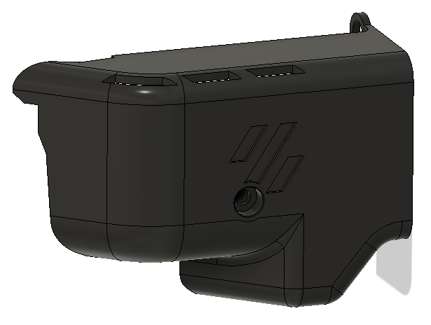
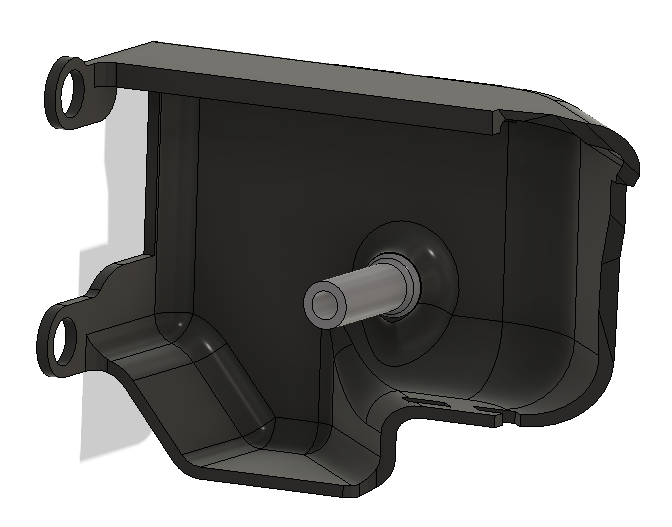

# LGX stealthburner connector cover

This is a remix of [craxoor's Afterburner PCB Cover](https://github.com/craxoor/VoronMods/tree/master/PCB%20Cover) designed to work with the Stealthburner and Bondtech's LGX Extruder. 

