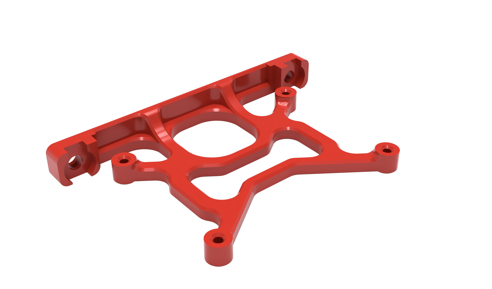
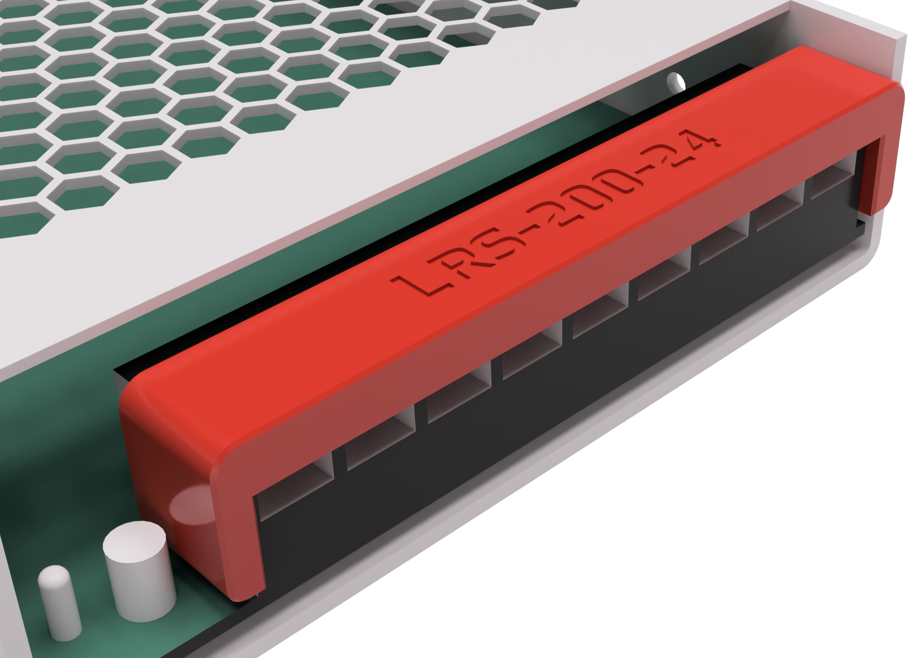
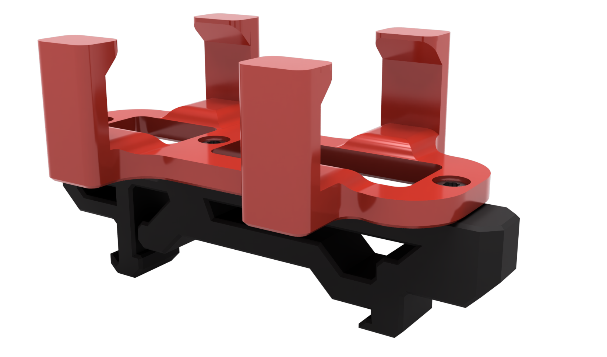

<h1 align="center">Samwiseg0 Mods Index:</h1>
<table align="center">
  <tr>
    <td align="center"><a href="./4channel_relay_under_deck_mount">4 Channel Relay Under Deck Mount </a></td>
    <td align="center"><a href="./ab_plug_microfit_1x4">AB Plug (Microfit 1x4) </a></td>
   </tr>
   <tr>
    <td align="center"><a href="./corner_cable_hide">Corner Cable Hide/Cover </a></td>
    <td align="center"><a href="./esp8266_nodemcu_din_mount">ESP8266 NodeMCU Din Mount </a></td>
  </tr>
     <tr>
    <td align="center"><a href="./extrusion_thermistor_mount">Extrusion/Chamber Thermistor Mount </a></td>
    <td align="center"><a href="./lrs_screw_terminal_cover">LRS PSU Screw Terminal Cover </a></td>
  </tr>
     <tr>
    <td align="center"><a href="./microfit_2x3_skirt_connector_adxl">Microfit 2x3 Skirt Connector (ADXL) </a></td>
    <td align="center"><a href="./voyager_gtx_din_mount">Corsair Flash Voyager GTX Din Mount </a></td>
  </tr>
  </table>
