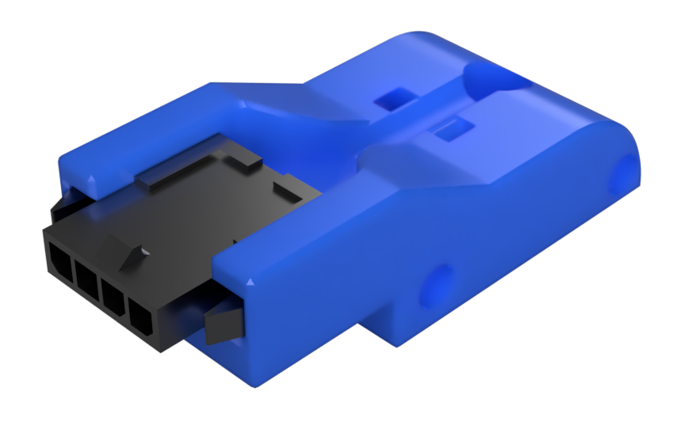

# Voron 2.4 AB Plug (Microfit 1x4)
 This mod is to add a plug to the gantry to connect the A & B motors. There are 2 diferent designs. One that supports a Microfit 3.0 1x4 with panel mount ears and the other is _without_ panel mount ears.

 Both these plug types have been found on the Lineo harneses. Check which one came with your harness before printing.

 **Pro tip: If you would like the screws to be facing the rear of the printer you can mirror the model in your slicer.**

 Thanks to [Rama#6392](https://discord.com/users/627740419559653387) for the [orginal mods](https://github.com/Ramalama2/Voron-2-Mods)!

### Printing
  * Default voron settings
  * No supports needed

### BOM

Size | Qty
--- | ---
M2x8 or M2x10 (Self Tapping Screws) | 2

### [Microfit 3.0 1x4](https://www.molex.com/molex/products/part-detail/crimp_housings/0436400401)

### [Microfit 3.0 1x4 with Panel Mount Ears](https://www.molex.com/molex/products/part-detail/crimp_housings/0436400400)

