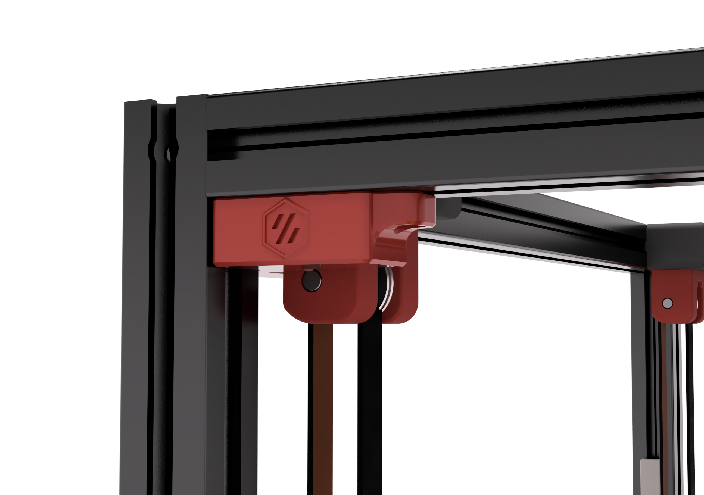
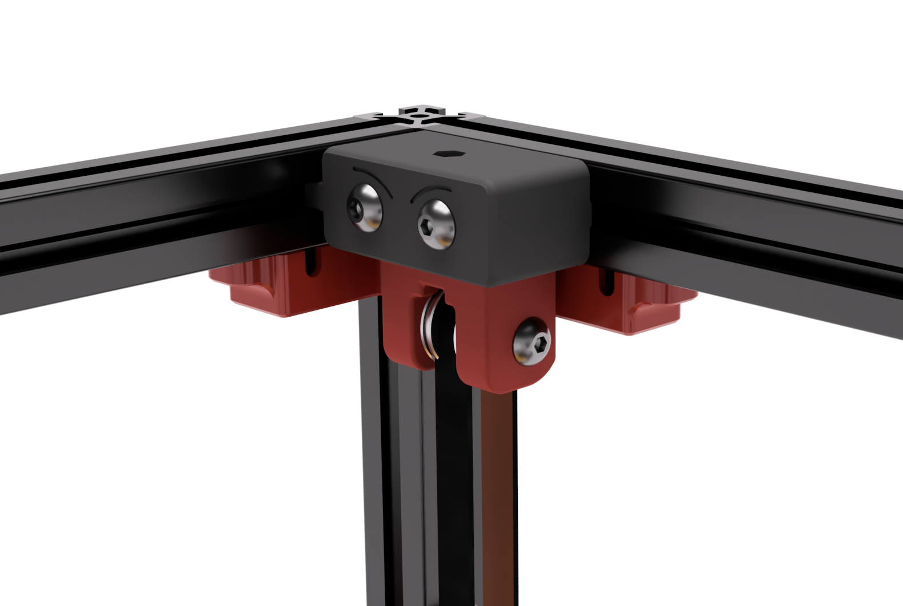
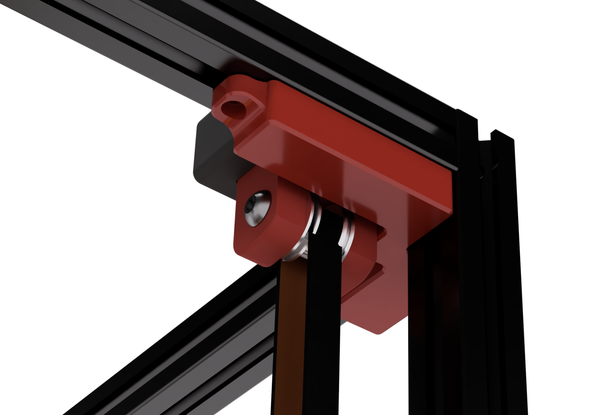

# Top Corner Cable Hide/Cover (LED Wires)
Designed to hide cables that are running around the top corners of 2.4 extrusions behind the z idlers.

They are large enough to fit 3 pin microfit connectors.

There maybe some small loss in z. Don't forget to check your clearances after installing.

 **Pro tip: It may take some fiddling to get the wires to fit. You will know they are in place when it sits flush to the extrusions without wobbling. Also disable 'Thin Walls/Detect Thin walls' so the mounting ears print cleanly.**

### Printing
  * Default voron settings
  * No supports needed

### BOM

Size | Qty
--- | ---
M3x8 | 8
M3 T-Nut | 8

