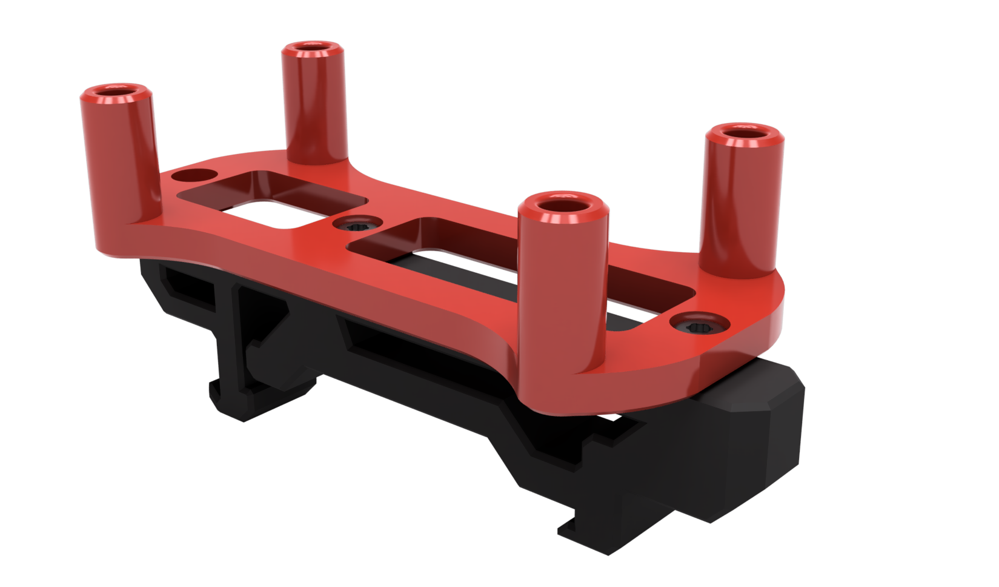
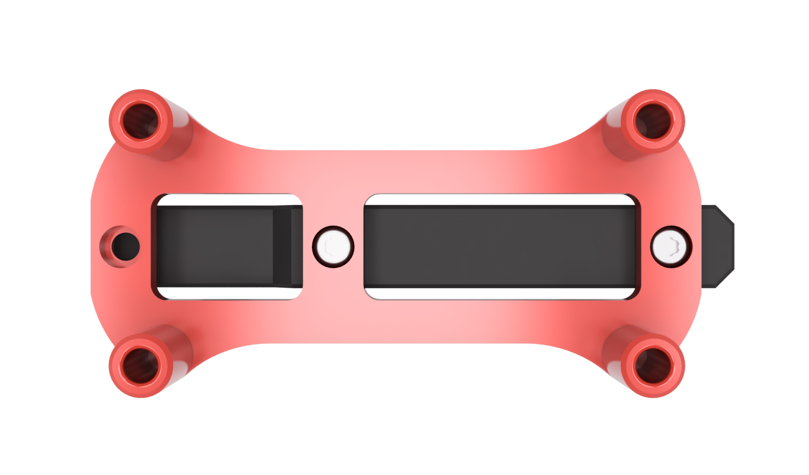

# ESP8266 NodeMCU Din Mount
Designed to hold an [ESP8266 NodeMCU](https://components101.com/development-boards/nodemcu-esp8266-pinout-features-and-datasheet). ESPs are commonly used to control LEDs using the [WLED project](https://kno.wled.ge/basics/getting-started/). The ESP can be mounted in either direction.

The model included can be mounted to the original 2.4 din clip or the newer Trident din clip.

### Printing
  * Default voron settings
  * No supports needed

### BOM

Size | Qty
--- | ---
M3x8 | 4
M2x10 | 2
[Trident PCB Din Clip](https://github.com/VoronDesign/Voron-Trident/blob/f871f117cdf2a3b3881c3bc176f0a8eb04e42057/STLs/ElectronicsBay/pcb_din_clip_v2_x5.stl) | 1

