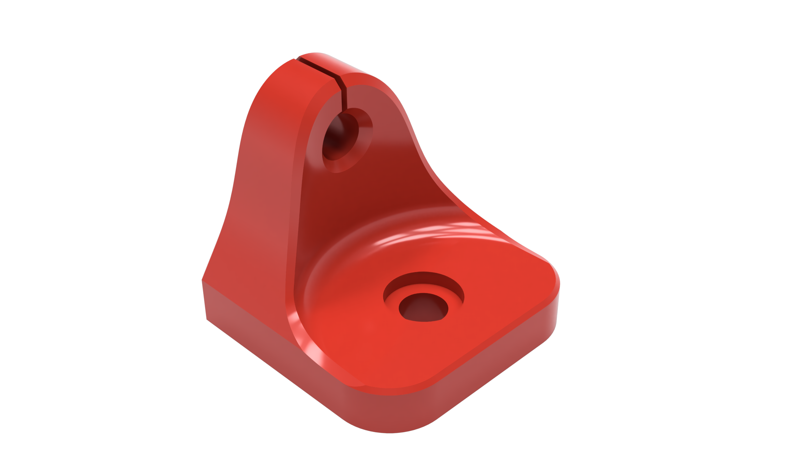

# Extrusion/Chamber Thermistor Mount
Designed to mount a NTC100K Thermistor Sensor to 2020 extrusions.

### Printing
  * Default voron settings
  * No supports needed

### BOM

Size | Qty
--- | ---
[NTC100K Thermistor](https://www.amazon.com/gp/product/B07QDQXDQ5) | 1
M3x8 | 1
M3 T-Nut | 1

