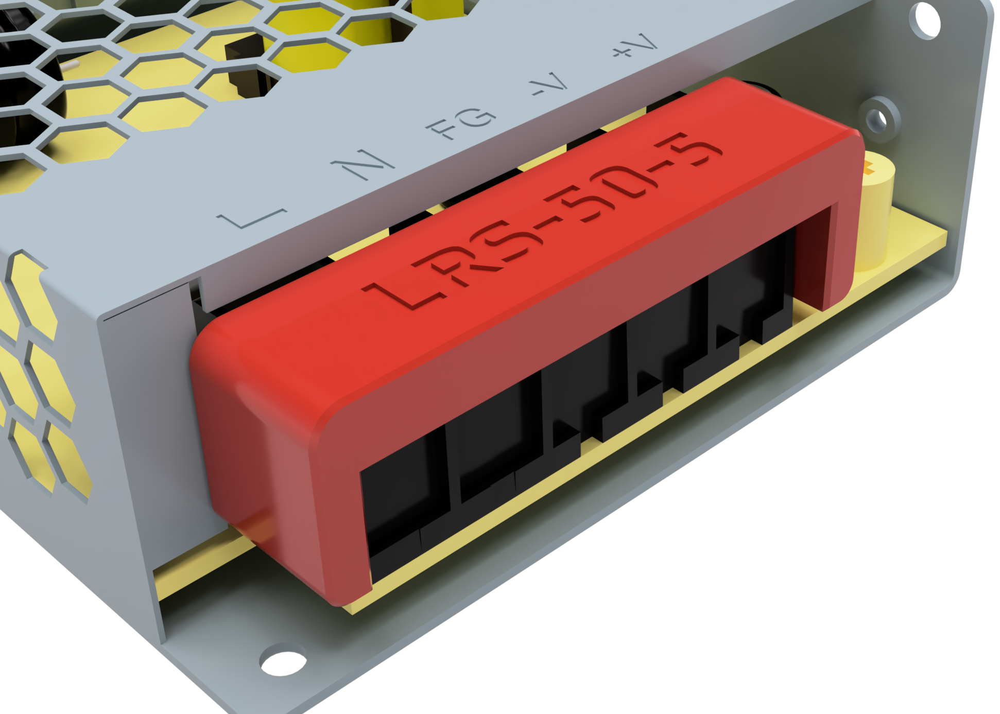
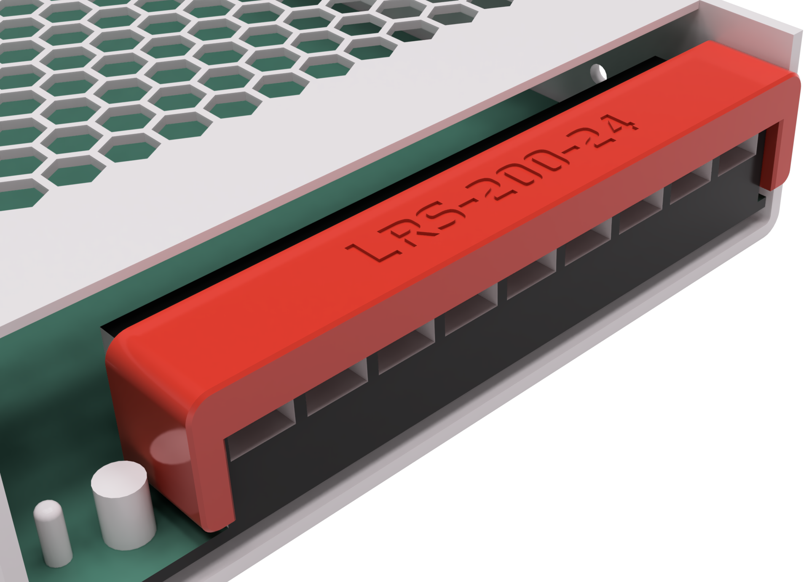

# LRS Screw Terminal Cover
Designed to cover the screw terminals for several LRS style PSUs. Other Meanwell PSU may work. Feel free to ping me in discord to add to the compatibility list below.

 **Pro tip: These are very snug to the point it will bow. This is intentional as it was designed to take some effort to take off.**

### Printing
  * Default voron settings
  * No supports needed

### Compatibility List

* LRS-50
* LRS-200

