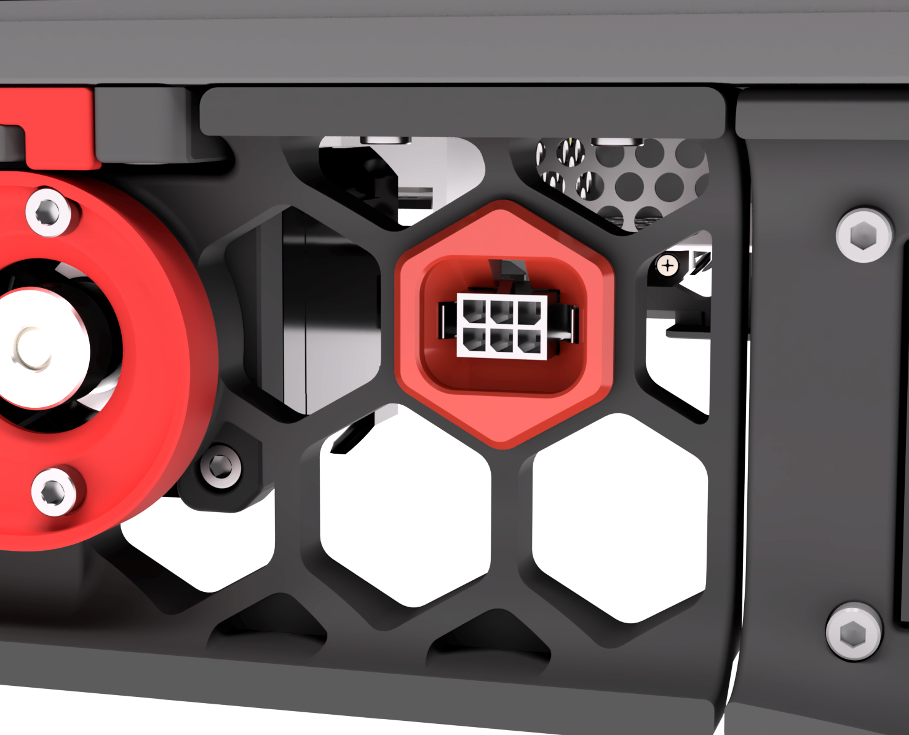
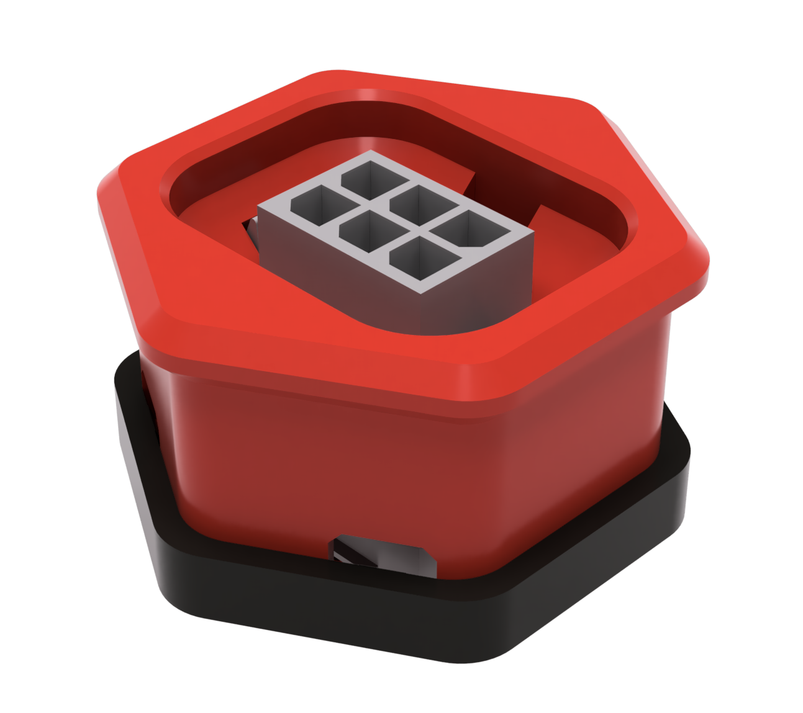

# Microfit 2x3 Skirt Connector (ADXL)
Mod for a Microfit 2x3 connector to be mounted in the bestagons. Typically used for ADXL but can be used as a general connector for anything outside the printer.

 **Pro tip: I found that adding some hot-glue while installing it into the skirt makes it a bit more robust for unplugging and plugging in.**

This is originally based off of [this mod](https://github.com/Barcode-Labs/VORON_MODS/tree/main/INPUT_SHAPER_SKIRT_CONNECTOR). It was modified to not require supports and have a bit tighter fit onto the connector.

### Printing
  * Default voron settings
  * No supports needed

### BOM

Size | Qty
--- | ---
[Microfit 0430200608](https://www.digikey.com/en/products/detail/molex/0430200608/4481507) | 1
[Microfit 0430250600](https://www.digikey.com/en/products/detail/molex/0430250600/252498) | 1

