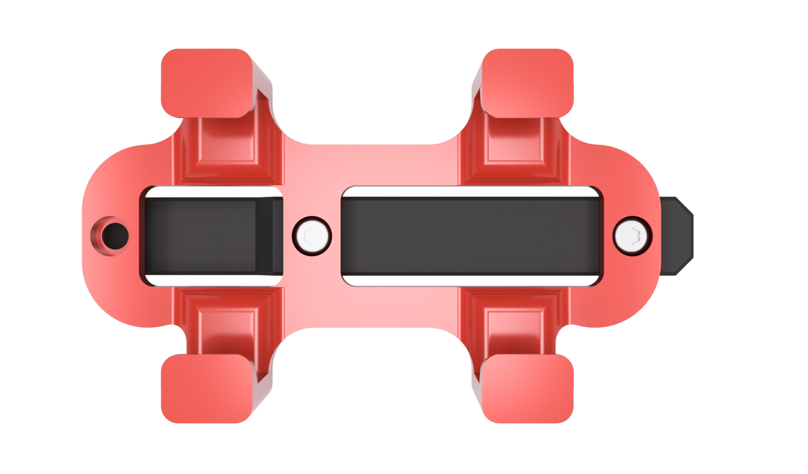
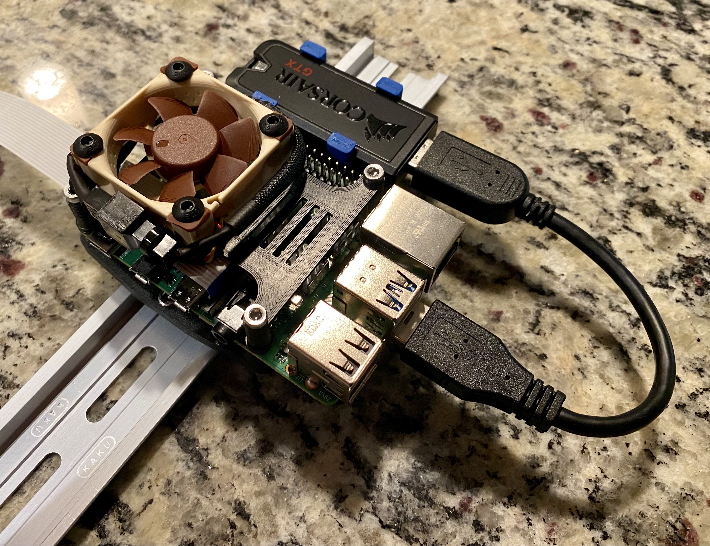

# Corsair Flash Voyager GTX Din Mount
Din carrier for a Corsair Flash Voyager GTX. To be able to plug in the USB drive you can purchase a small USB extension cable located in the BOM below.

The model included can be mounted to the original 2.4 din clip or the newer Trident din clip.

### Printing
  * Default voron settings
  * No supports needed

### BOM

Size | Qty
--- | ---
M2x10 | 2
[Trident PCB Din Clip](https://github.com/VoronDesign/Voron-Trident/blob/f871f117cdf2a3b3881c3bc176f0a8eb04e42057/STLs/ElectronicsBay/pcb_din_clip_v2_x5.stl) | 1
[Corsair Flash Voyager GTX](https://www.amazon.com/Corsair-Flash-Voyager-128GB-Premium/dp/B079NVJPKV) | 1
[.5ft USB extension (Optional)](https://www.amazon.com/gp/product/B00S2N2Q4U/) | 1

