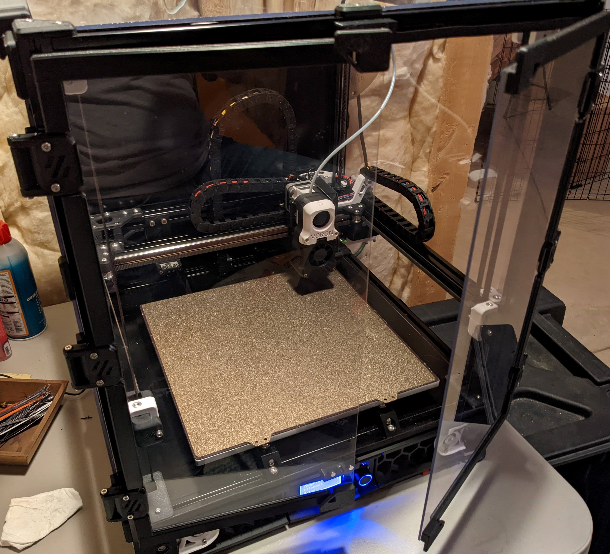
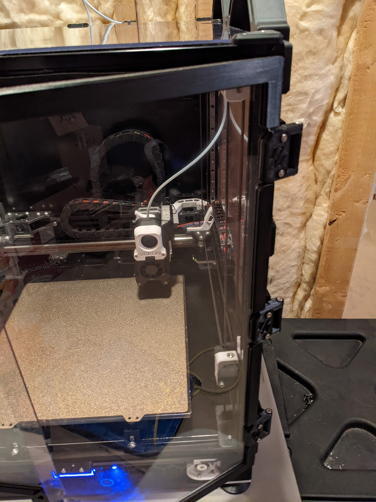
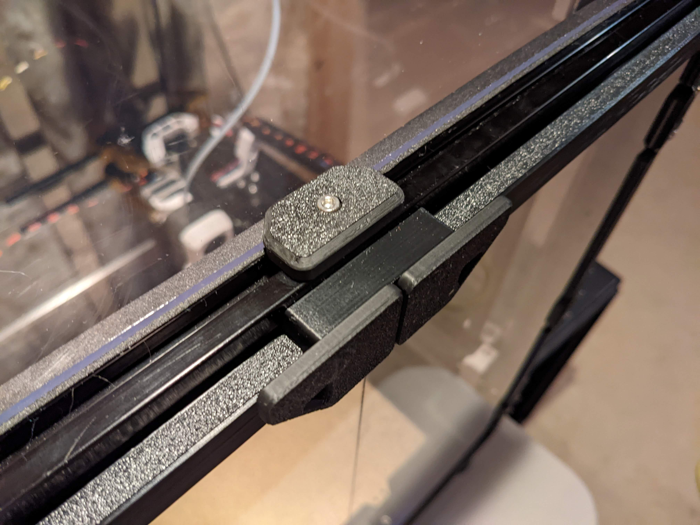

# V2.4 Clip-On Door Frames #

 This design builds on [Alexander-T-Moss](../../AlexanderT-Moss/270-Clamping-Hinges) 270 degree hinges by adding a clip-on frame around the front doors to provide better sealing and stiffining of the front door panels.  
 
 The clips consist of three types of components - angle_frame_1,  angle_frame_2, and straight_frame.  Each door will need a one of each angle_frames, with one on the top of the door and one on the bottom of the door.  For the left door, angle_frame_1 goes on the bottom of the door and angle_frame_2 goes on top of the door.  For the right door, angle_frame_1 goes on the top of the door and angle_frame_2 goes on the bottom or the door.
 
 A long and short version of the straight_frame is provided depending on if you have two or three hinges installed on each door.  If you have three hinges installed for each door, you will need to print out two short straight_frames for each door.  

If you use the stock V2.4 magnetic door latch, extended_door_latch is provided which moves the frame magnets out closer to the handle magnets.

### Important Notice ###

These are currently sized for the 300x300x300mm V2.4 build.  If anyone is interested, I can make them for the 250 and 300mm sizes as well.

### Kind-Of Important Notice ###

 The parts are not symmetrical - there is a 'thick' side and a 'thin' side.  The thin side goes towards the frame.

 ## BOM ##
 **Printed Parts**
 ```
 angle_frame_1_x2.stl           [x2]
 angle_frame_2_x2.stl           [x1]
 straight_frame_short_x4.stl    [x4] (If you use three hinges per door, x0 otherwise)
 straight_frame_long_x2.stl     [x2] (If you use two hinges per door, x0 otherwise)
 extended_door_latch_x2.stl     [x2] (If using the stock V2.4 door latch, x0 otherwise)
 ```
 
 ## Printing ##

 I recommend following the default settings for Voron Parts, and none of the parts require support material.
 ```
 Layer Height       : 0.2 mm
 Extrusion Width    : 0.4 mm
 Infill             : 40 %
 Perimeters         : 4
 Solid Top/Bottom   : 5
 Supports           : No
 Brim               : Optional
 ```
 ## Assembly ##

 1. Attach one angle_frame_1 to the bottom of the left door and one angle_frame_1 to the top of the right door.
 2. Attach one angle_frame_2 to the top of the left door and one angle_frame_2 to the bottom of the right door.
 3. If you have three door hinges installed, install two straight_frame_short sections to each door.  If you have two door hinges installed, install one straight_frame_long section to each door.
 4. If you are using the stock V2.4 magnetic door latch, install the magnets into the extended_door_latch and replace the existing door latches with the extended version.
 
  ## Installed On My 2.4 ##

 
 
  
  
  
