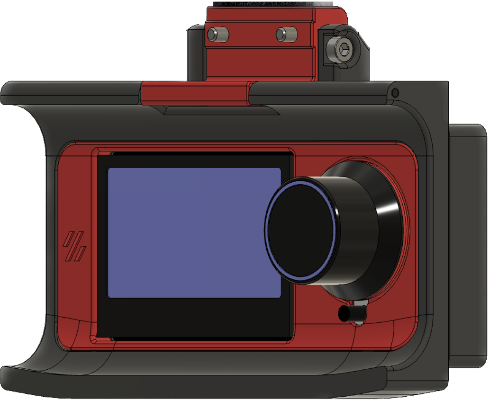
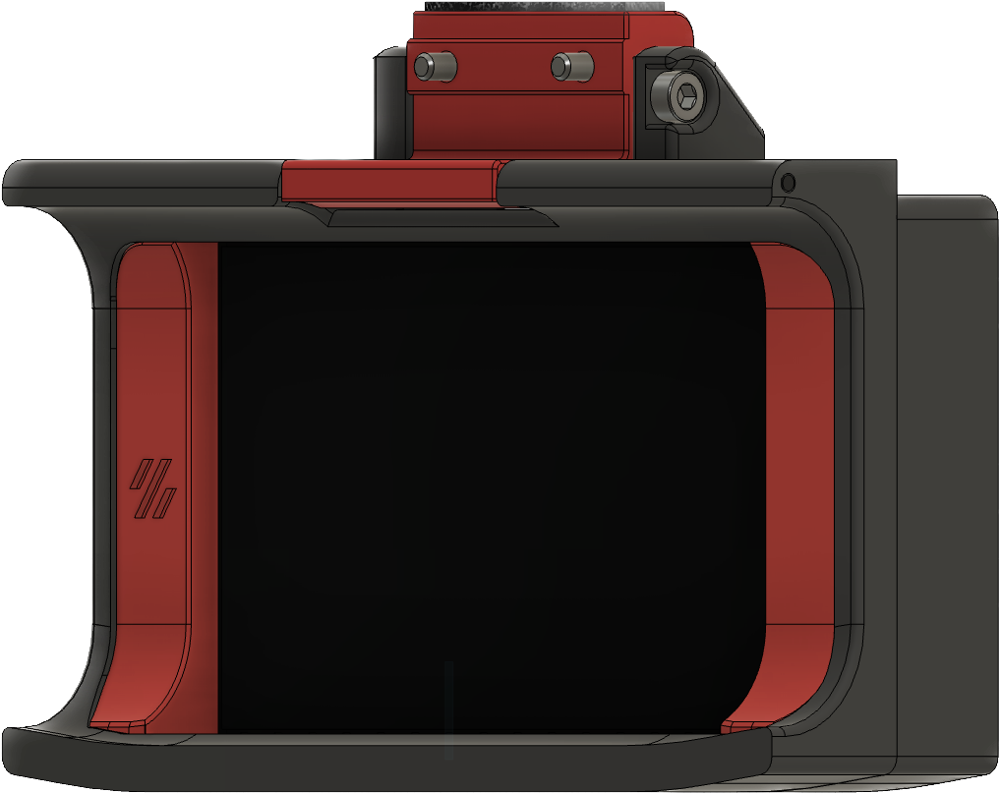
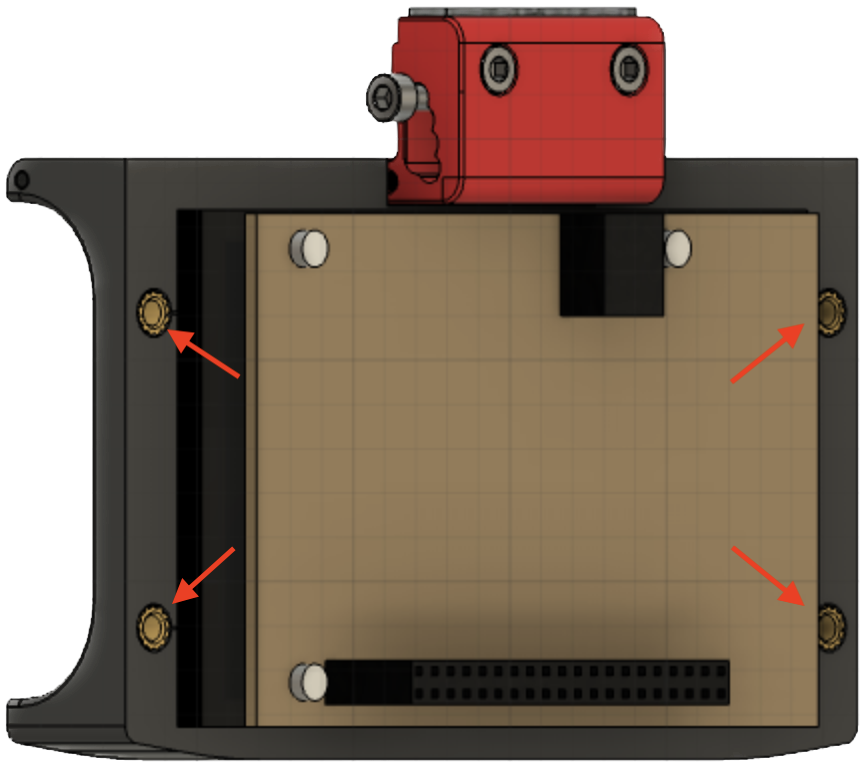
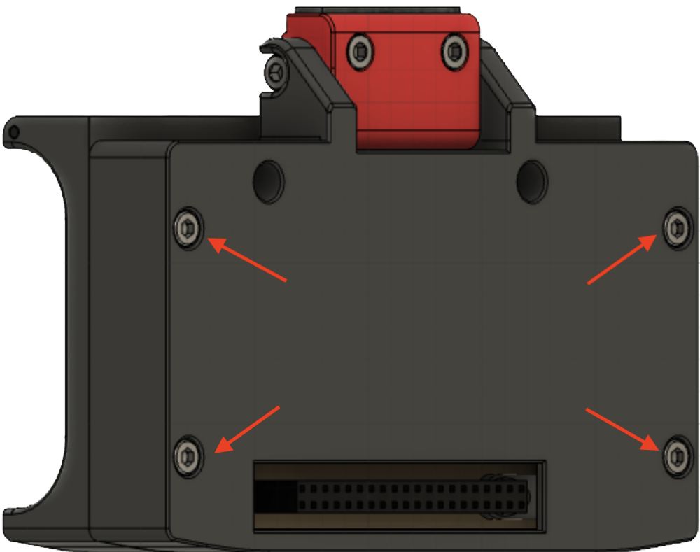

# FYSETC CTP / Pimoroni Hyperpixel Case

Designed by schellek, based on the regular 12864 Voron display case.
|Voron Design for 12864 display|This Mod|
|:-:|:-:|
|  |  |

## License
License: https://github.com/VoronDesign/Voron-2/blob/Voron2.4/LICENSE

Original source: https://github.com/VoronDesign/Voron-2

## Compatiblity
This display case fits the [FYSETC CTP](https://www.aliexpress.com/item/1005002011585873.html) and since this display is a knockoff, it will probably fit the [Pimoroni Hyperpixel](https://shop.pimoroni.com/products/hyperpixel-4)

## Additional hardware

### M3 Threaded Insert (x4)


```
📝 Short threaded inserts are recommended. The longer ones have a little standoff
```

### M3x18 BHCS (x4)


### 40 Pin GPIO Extender Cable


© Pimoroni

https://shop.pimoroni.com/products/40-pin-gpio-extension-cable

### Octodash Rotation

As there is an issue to rotate the display (at least the FYSETC CTP) without a desktop environment on the Raspberry Pi 4 this workaround fixed the issue whereas adding a rotation command as a systemd oneshot didn't work.

- Follow the following [instructions](http://www.lcdwiki.com/How_to_modify_the_display_orientation-CTP(En))
- Add the following statements to `.xinitrc`
```patch
#!/bin/sh

+ export DISPLAY=:0.0

xset s off
xset s noblank
xset -dpms

+ xrandr --output DSI-1 --rotate right

ratpoison&
octodash
```