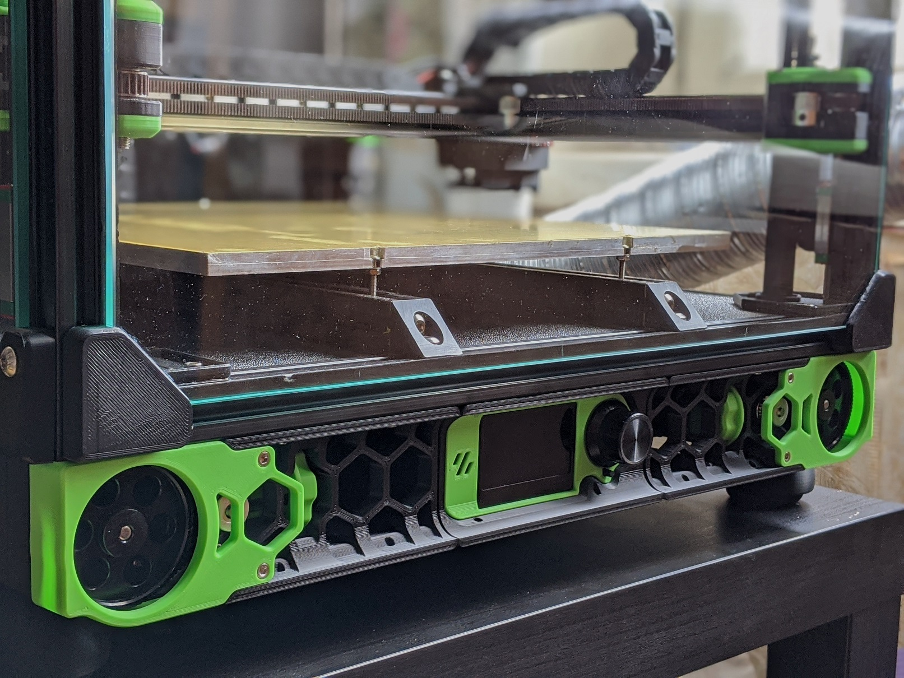
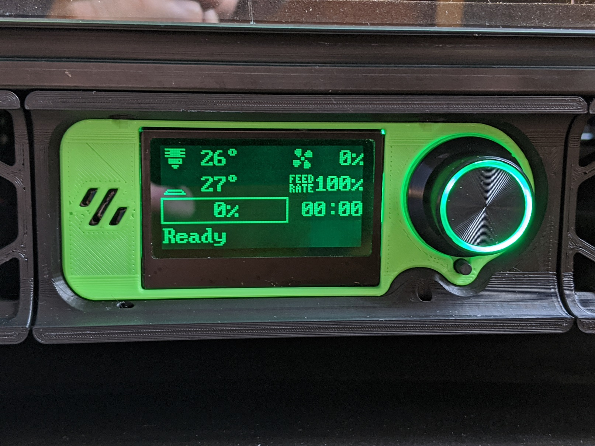
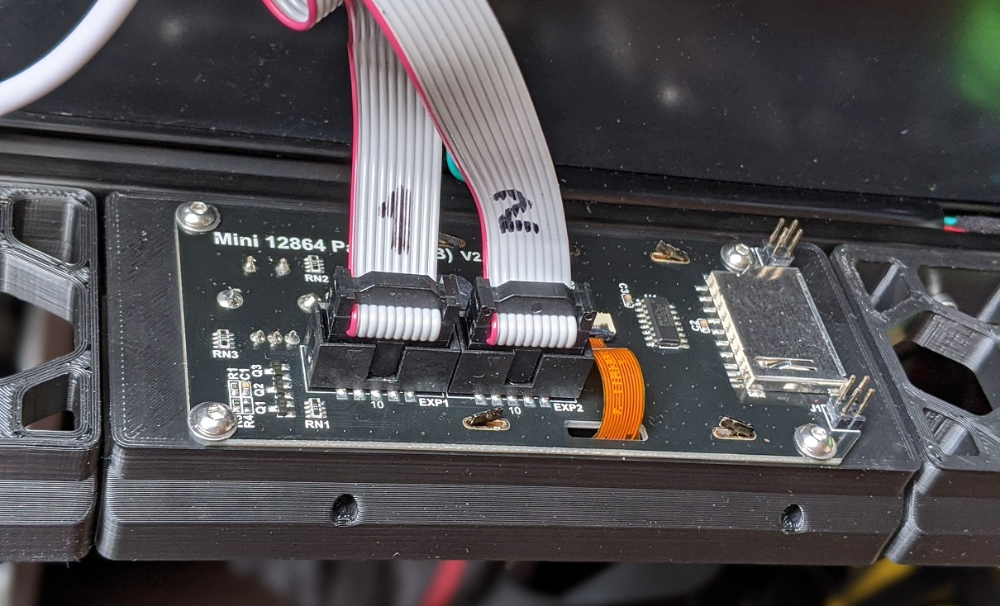
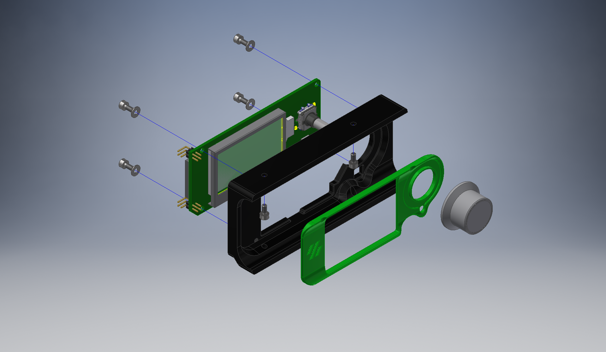

# Minima - Minimalistic mount for Fysetc Mini 12864




## Overview
If you like minimalistic and simple design this mod is for you. Only two printed parts, a couple of M3 screws and you've got a new mount for your Fysetc Mini12864 Display. 

## BOM
* 1x [Fysetc Mini12864 Display](https://www.aliexpress.com/item/32972382466.html)
* 6x M3x6 Socket head screws. 
  * M3x8 SHCS could also be used but you need to use printed spacers instead of washers.
* 4x M3 Washers
* Super-glue or similar

## Printing instructions
The model is easy to print, no special tricks required. Use 0.4mm line with and 0.2 layer height when slicing the model, no cooling needed. Print base part in your main color, cover part in your accent color. New front skirts should also be printed, you can find them in the mod's folder. Choose the ones which will fit your printer. If you use M3x8 screws print 4 spacers and use them instead of washers.

## Installation instructions
1. Glue cover to the base with super-glue.
2. Bolt display board to the base.
3. Install front skirts.
4. Install display mount.
5. Connect display to your controller board with supplied cables. Please note that Fysetc Mini display has reversed EXP1/EXP2 connectors, cables should be rotated if you are going to use it with non-Fysetc controller boards. You can find EXP1/EXP2 connectors pinout [here](https://wiki.fysetc.com/Mini12864_Panel/).



## Klipper configuration
The example below is provided for SKR1.3 boards with display connected to Z-board. Change pin assignments according to your board. Please refer to [klipper documentation](https://github.com/KevinOConnor/klipper/blob/master/config/example-extras.cfg) for further info.
```
[display]
lcd_type: uc1701
cs_pin: z:P1.18
a0_pin: z:P1.19
encoder_pins: ^z:P3.25,^z:P3.26
click_pin: ^!z:P0.28
contrast: 63

```
There are two revisions of Fysetc Mini12864 display:
* Version 2.1 - with Neopixel RGB LED
* Version 2.0 - with ordinary LEDs

Following section should be added to control Version 2.1 backlight:
```
[neopixel my_neopixel]
pin: z:P1.21
chain_count: 3
initial_RED: 0.1
initial_GREEN: 0.5
initial_BLUE: 0.0
color_order_GRB: False
```
To control  Version 2.0 backlight following section should be added:
```
[output_pin display_led_red]
pin: z:P1.21
pwm: True
cycle_time: 0.001
value: 0

[output_pin display_led_green]
pin: z:P1.22
pwm: True
cycle_time: 0.001
value: 1

[output_pin display_led_blue]
pin: z:P1.23
pwm: True
cycle_time: 0.001
value: 0
```

## Questions, Inquires
Please PM me on GitHub or Voron's Discord if you have any questions or inquires.