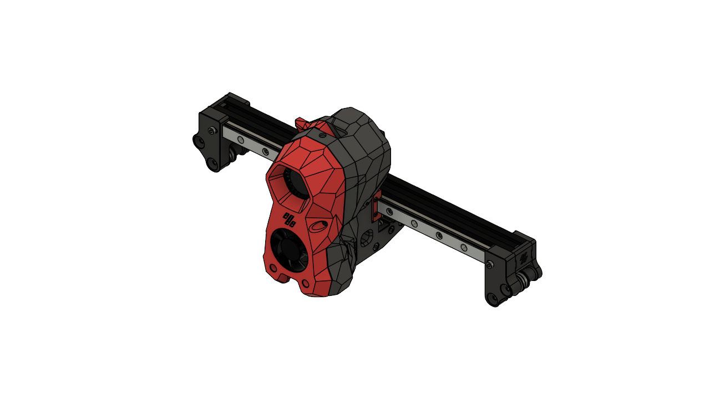
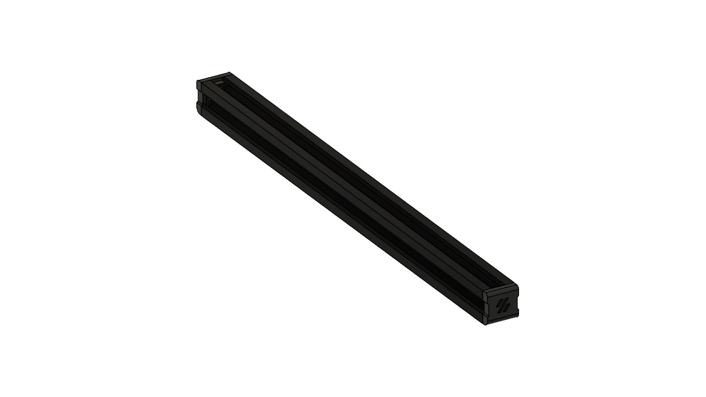

# 300mm X-Extruder Endcap

Endcaps that help using a 300mm X-Extruder 2020 profile. The Enderwire conversion involves chopping the original 320mm profile by 10mm to have a 310mm. This process is not really simple to everybody so I decided to buy a new profile. The problem was that finding a 310mm profile wasn't so simple because many shops had in 300mm and 350mm, so I used the 300 that fits perfectly and build these endcaps to fill the gaps. Anyway they are just for aesthetics and a bit of compactness because the extruder is in any case fixed on their original nuts.

You might want to look at [my fork](https://github.com/sgr33n/VoronUsers/edit/master/printer_mods/sgr33n/300mm_X-Extruder-Endcap/) for more up to date files and code.

## Gallery

