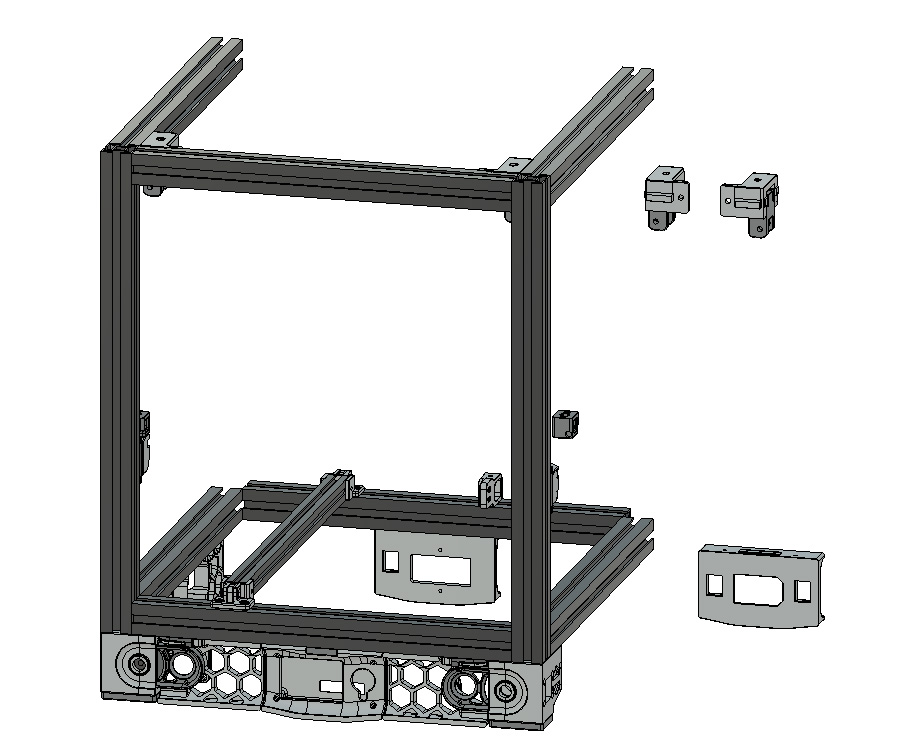

Mod for Voron 2.4. Main frame is made from 3030 profiles and Z axis runs on MGN 12 rails. XY gantry is unchanged.

- Redesigned Z drive a Z idlers.
- Z idlers in 2 versions (with M3 or M4 bolt for tensioning).
- Redesigned Z bearing blocks for MGN 12 rails.
- Mod is designed for 3030 profiles with 8.4 mm groove.
- Included Skirt for 250 mm3 version.
- Holders for enclosure panels not ready yet.

Some hardware changes are necessary:
- X profiles (3030) are the same lenght (370 mm)
- Y profiles (3030) must be 6 mm longer (376 mm)
- Profiles for bed (2020) must be 10 mm longer (380 mm)
- The bearings in Z drive were changed from 3x 625 to 4x F695
- For Z drive you need 24x M3x50 instead M3x40 and M3 nuts
- For Z idlers you need M3x25 (or optional M4x25) instead M3x16
- For Bed profiles holder you need M5x16 or 18 screws and M5 nuts

