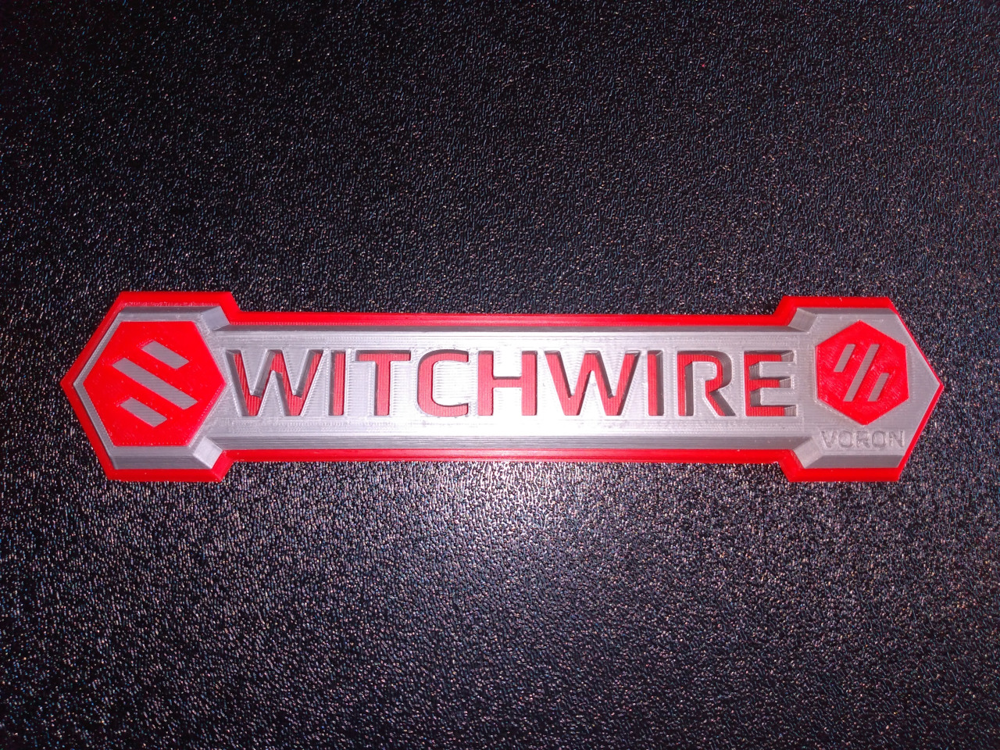
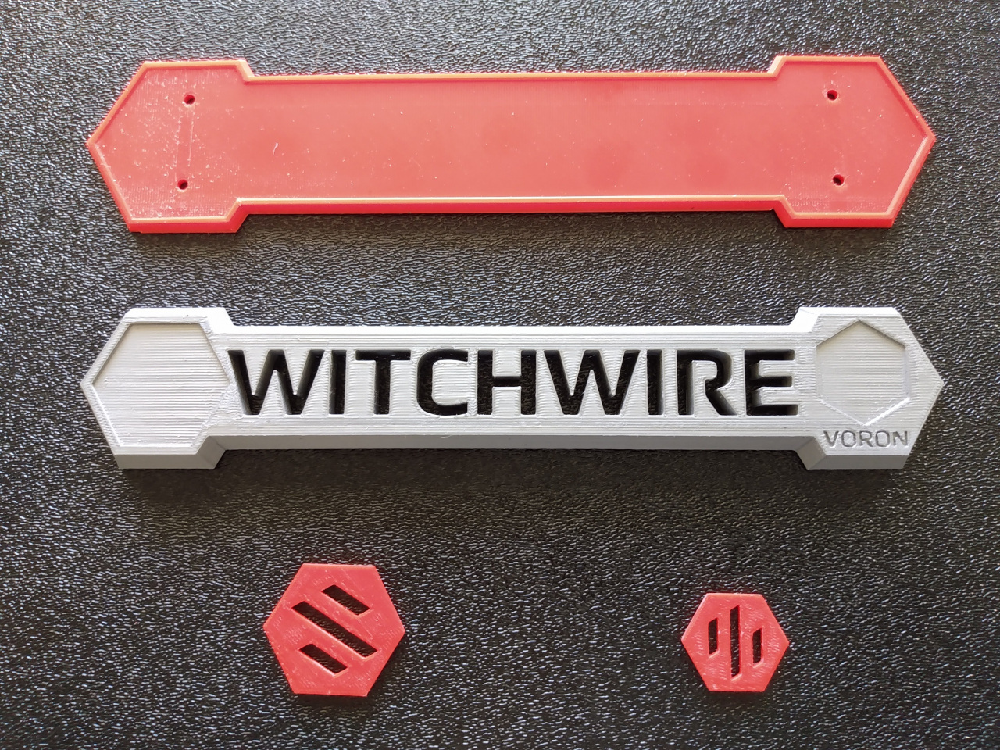
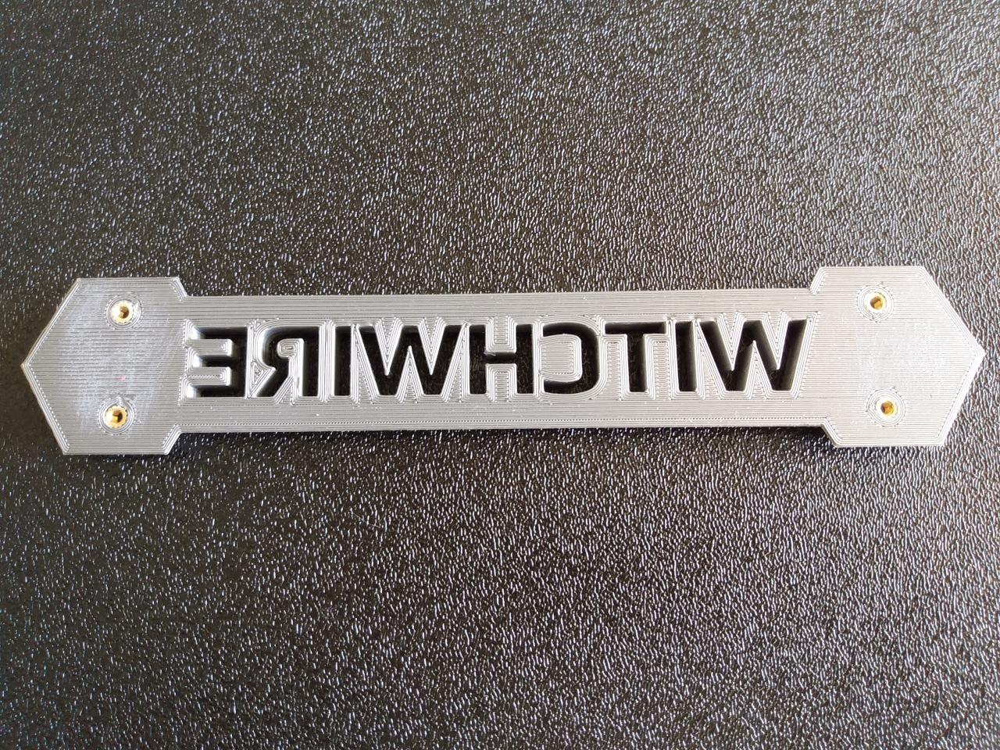
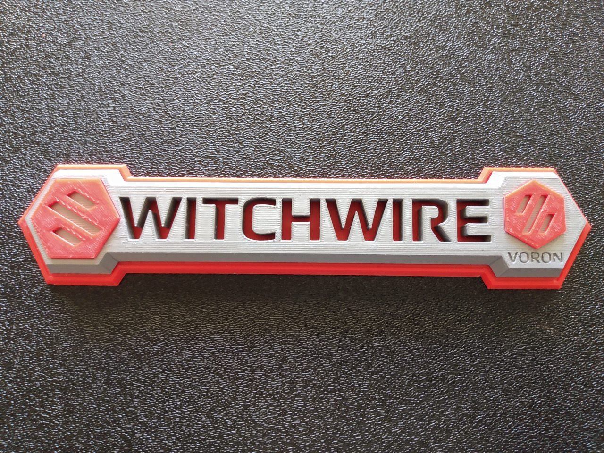
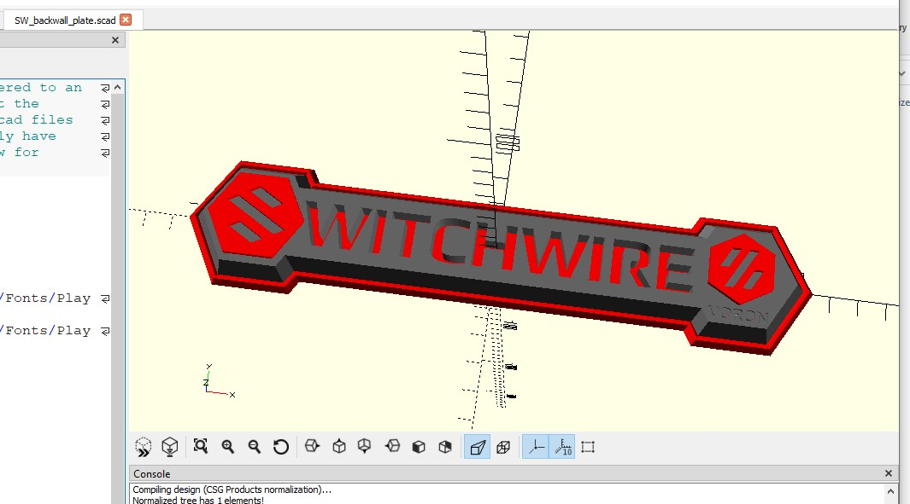

# Switchwire Wall Plate
This mod is for pure aesthetics.  A Voron Switchwire logo plate to install on the back wall of your printer's enclosure.

(Or optionally on the front grill if no enclosure - but only if you're not already using the LCD mount...)

Note: Overall size is about 225x50 (about 10mm thick)

## BOM
* (4) M3x8mm BHCS
* (4) M3xD5.0xH4.0 heat-set inserts

## Directions
1.  Install inserts in the WITCHWIRE_base

2. Use backplate_and_drillguide to drill holes in your back panel

3. Use thin strips of vhb tape, or acetone to affix the badges into respective recesses on the base (no need to affix base to backplate)
    
    Note: badge tolerances are tight - you might need to sand a bit off the edges of the badges.

4. Attach to back panel with (4) M3x8 screws

(Optional: To use on front grill, affix all parts together using vhb tape or acetone and similarly affix the optional nolcd_grill_mount to the center top of the backplate.)

## CAD

OpenSCAD sources are included (it's all I know).  They are sparsely commented - make modifications as you wish.

Tip: If you resize the badges, use hundredths of a mm to adjust.
