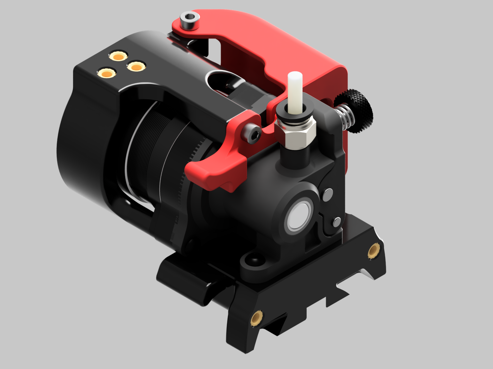
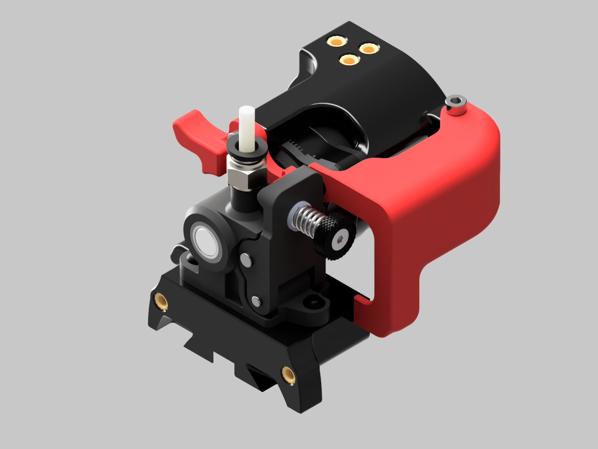
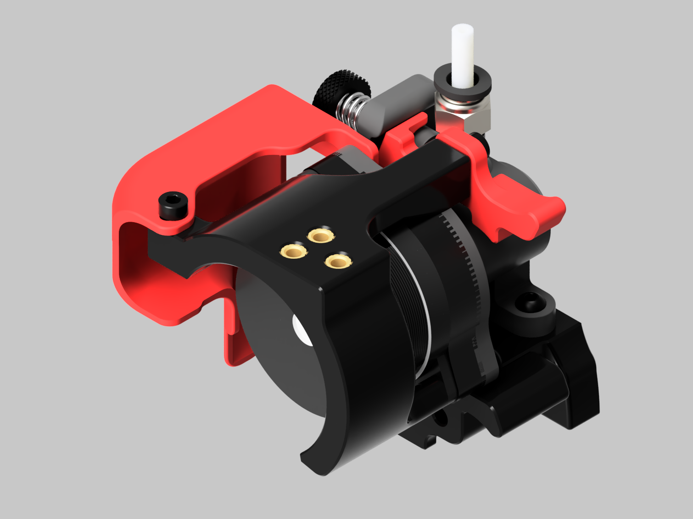
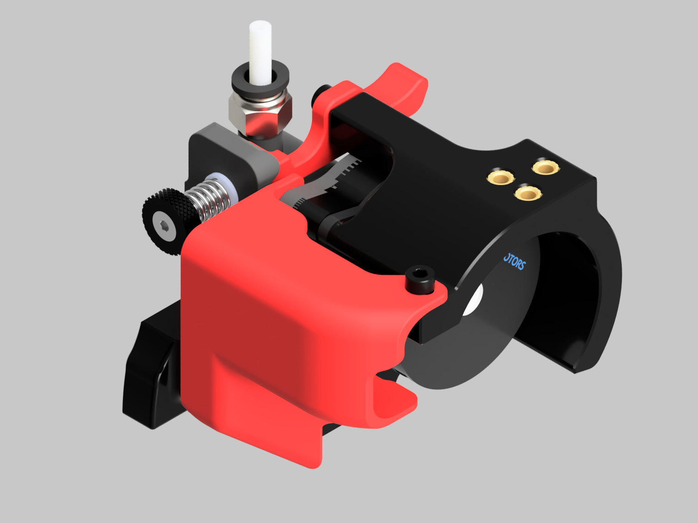

# Orbiter Clockwork Module
This Clockwork module allows the use of the Orbiter v1.5 Extruder in the Voron Afterburner.

## Features
One of the main issues I observed when using the orbiter was a lack of a quick filament release in addition to a lack of a suitable clockwork adapter that would swap an orbiter directly into the Afterburner ecosystem. Many of the issues observed were addressed with this Clockwork Module. This version provides a chain anchor for the Voron 2.4 and the Switchwire, a Cable Cover, and a quick filament release lever.

## Bill of Materials (BOM)

| Quantity | Name                                                                                        | Type      |
|----------|---------------------------------------------------------------------------------------------|-----------|
| 1        | Orbiter v1.5 Extruder [Orbiter Thingiverse link](https://www.thingiverse.com/thing:4725897) | Hardware  |  
| 9        | M3 Heat Set Inserts [McMaster Link](https://www.mcmaster.com/94180A331)                     | Hardware  |  
|          |94180A331 or suitable inserts (Thread Pitch 0.5, Installed Length 3.8mm, Diameter ~5mm)      |           |   
| 1        | M3x8mm SHCS                                                                                 | Hardware  |  
| 1        | M3x16 SHCS                                                                                  | Hardware  | 
| 2        | M3x20 SHCS                                                                                  | Hardware  |
| 1        | PTFE 45mm (Dragon)                                                                          | Hardware  |
| 1        | Clockwork Adaptor - Front                                                                   | Printable |
| 1        | Clockwork Adaptor - Back                                                                    | Printable |
| 1        | Cable/Connector Cover                                                                       | Printable |
| 1        | Filament Quick Release                                                                      | Printable |
| 1        | Chain Anchor (Version for Voron 1.8/Trident/2.4 and Switchwire)                             | Printable |

  
## Assembly Guide
* [Orbiter Clockwork Assembly Guide](./docs/Orbiter_Clockwork_Manual.pdf)

## Orbiter Clockwork Module Images

## Release History
* Version 1.0 
   * Orbiter Clockwork Adaptor has been verified to fit and function on a Voron 2.4 and a Switchwire. Additional testing may be required to fix any minor or major issues that are identified in the future. If you observed any issues, please create an issue so it can be tracked. 
