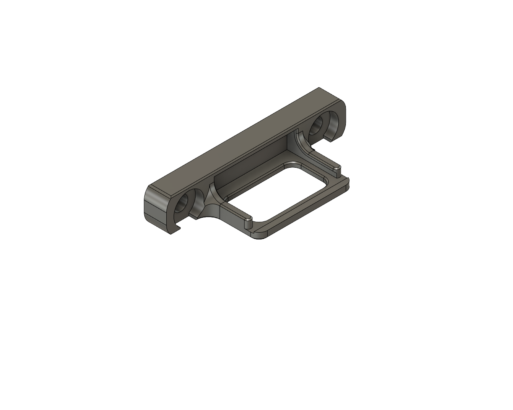
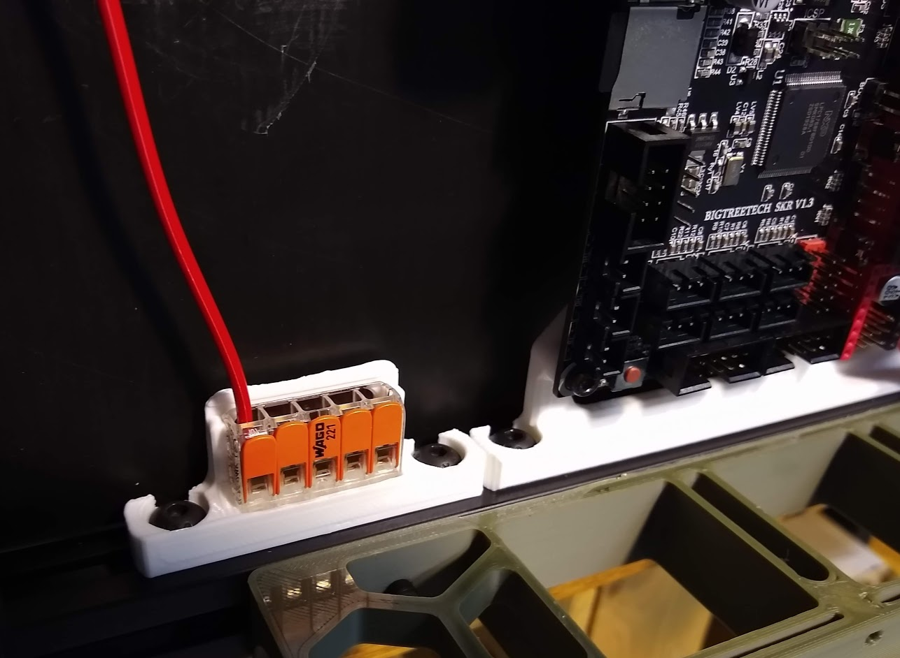

# Wago 221 Mounts

These mounts allow for Wago 221 lever nuts to snap in securely.  The design is inspired from the 221-415x3 version that was part of the Voron 2.2 release.  Currently, this repo consits only of a 221-415x1 mount as that was all I currently needed.

## Hardware required

| Quantity | Description |
|:--------:|-------------|
| 2 | M5x10 BHCS |
| 2 | M5 T-nut |

Wago 221-415x1:

Wago 221-415x1 Installed in a 300x300:

