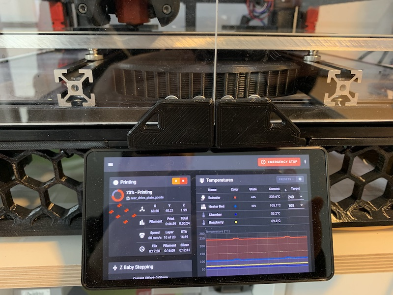
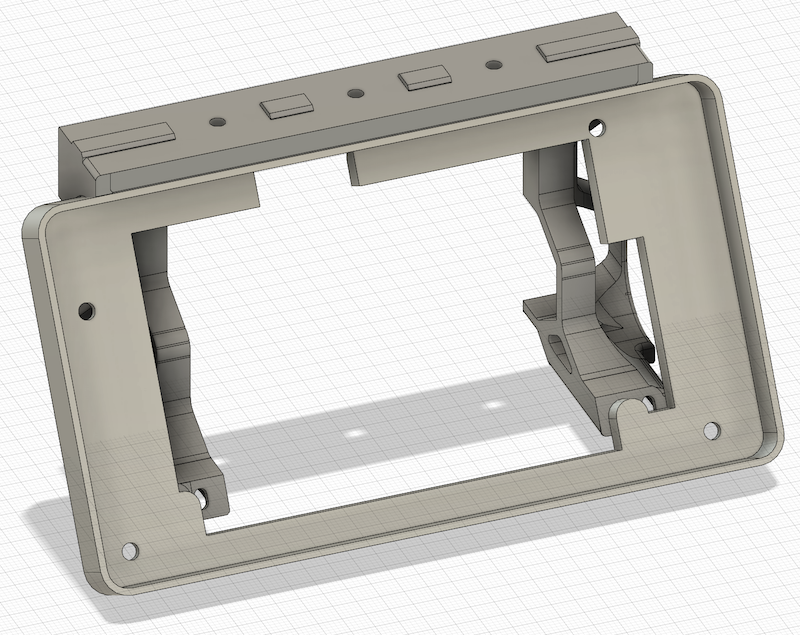
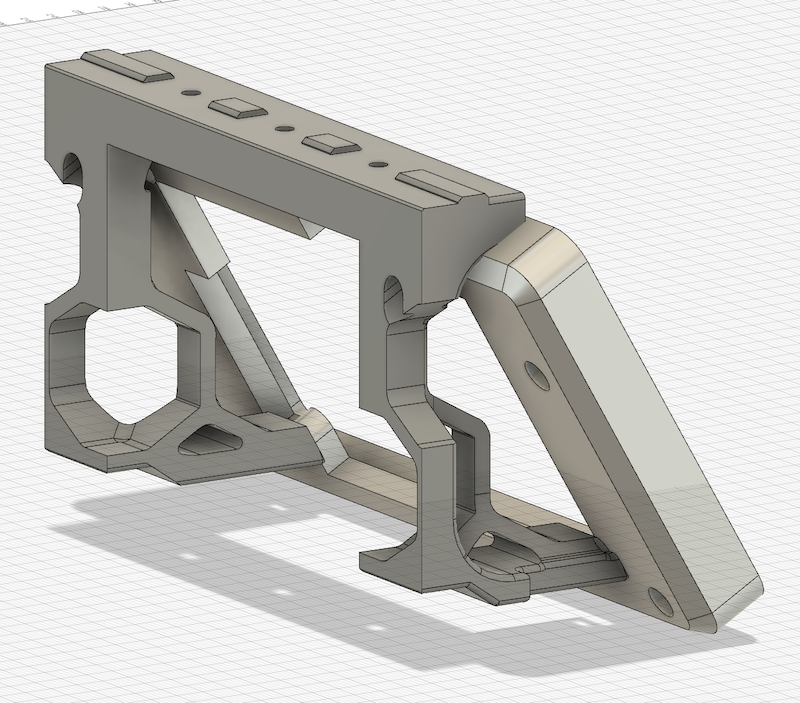

Waveshare 5.5inch HDMI AMOLED Mount
===================================

This replaces the default Klipper display with a [Waveshare 5.5inch HDMI AMOLED display](https://www.waveshare.com/wiki/5.5inch_HDMI_AMOLED) as a skirt to the Voron 2.4.

Required hardware
-----------------

In addition to things you can reuse from the stock build and to the screw included in the display, these items are
required:

- 4x thread inserts M3x5x4 (same as in the Voron 2.4)
- 8x M3x8 SHCS
