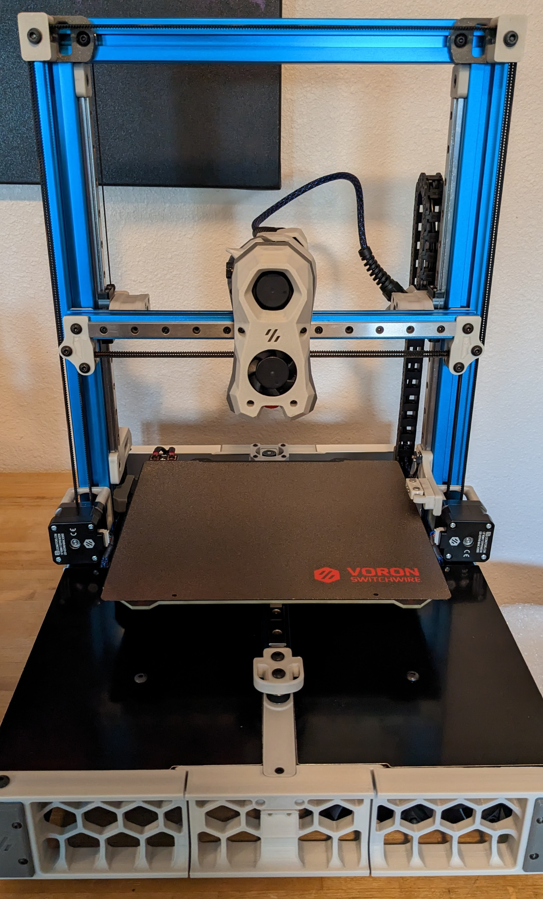
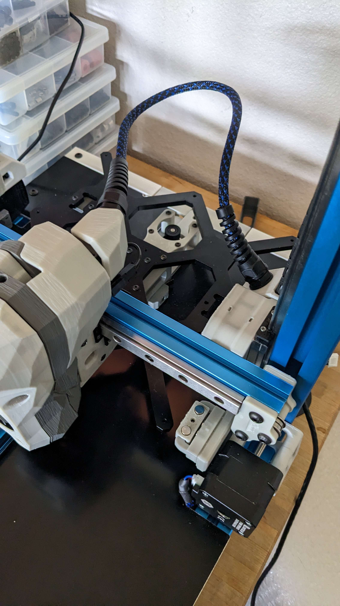

# Voron Stealthburner Umbilical for CAN bus SB2209/SB2240 Toolhead PCBs

## Description
This mod gets rid of the x-gantry cablechain in favor of an umbilical on a Voron Switchwire, while using a BTT SB2209/SB2240 CAN bus toolhead pcb and the cable that comes with the PCB.

These files are designed to subliment/replace BTT's files located here:
https://github.com/bigtreetech/EBB/tree/master/EBB%20SB2240_2209%20CAN/Custom%20Printed%20Parts

## Use
- The BTT "CW2 Cable Bridge" part is reused and what the toolhead.stl mounts to, but the "Printed Part for CAN Cable" is replaced with said toolhead.stl.

- The cablechain stl in this repo is used by mounting it sandwiched between the existing Switchwire cablechain mount and the z-axis cablechain terminus.

- The threading on the parts is m12 so any cable gland with that threading should work, I used cheap pg7 glands with strain relief I found on amazon.

## Notes
- Both the toolchain and cablechain models will require some longer m3 bolts than you currently have.  Not a lot, but areas will need approximately 3mm longer bolts.  

- Both parts will print in place just fine, with no supports or modification needed (tested on 3 different printers).  Recommended slicer settings are congruent with Voron recommendation.

- You will also want to ammend your max z settings in your firmware as this will lessen it slightly.  The main focus was to preserve full x travel and there will be some reduction in z motion!  On my switchwire, my max z is set at 220mm and I have a few mm more if absolutely needed, your milage may vary.

Designed by Stu Campbell, user Stu#7589 on Voron Design Discord