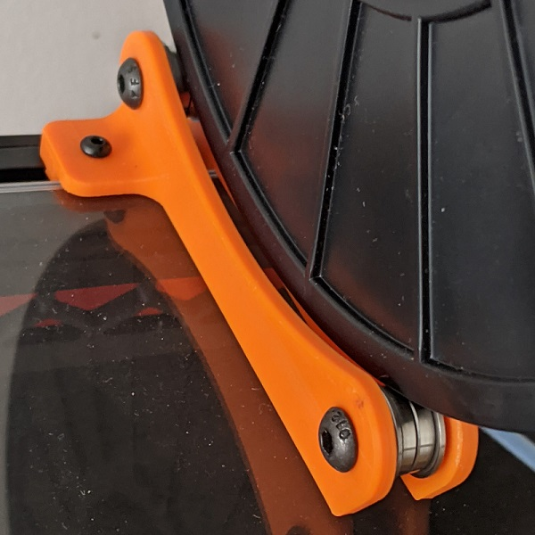

# Tush Spool Holder (remix)

This is a remix of the Tush spool holder to hold the spool on top of the Voron enclosure.

BOM:
8x F695 bearings ( or similar with 5mm ID )
4x M5x16 bolt
8x M5 washers

4x M3x8 bolts
4x T-Slot nuts

