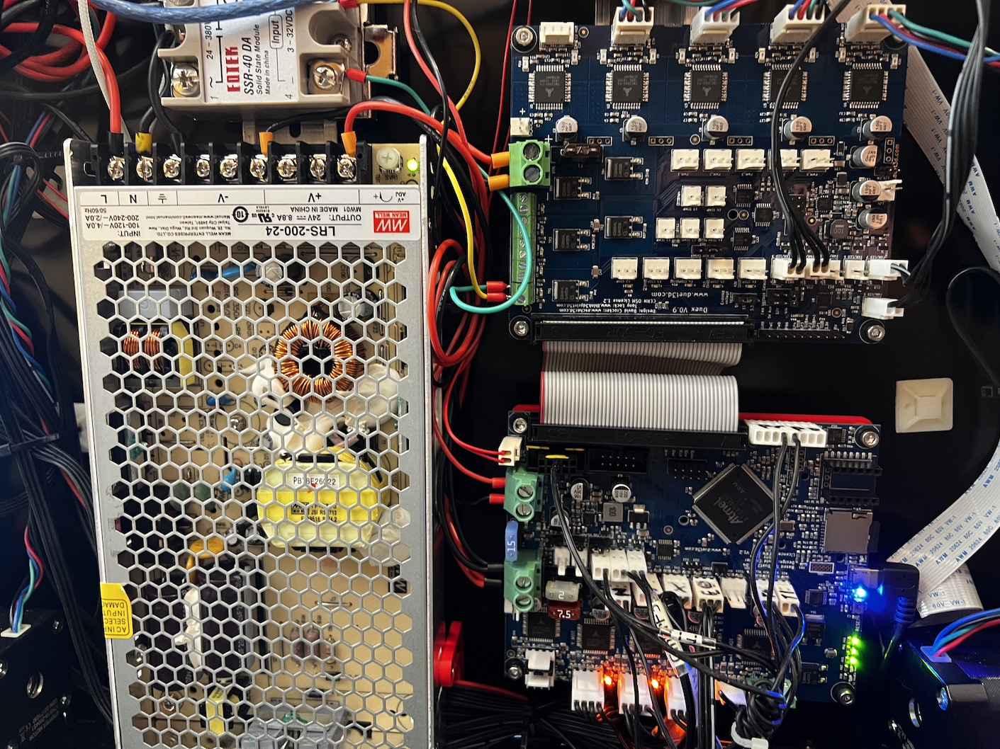

# Duet2 / DueX Side DIN Mount for V2.x 300^3

This is a replacement mount for the stock Voron Duet2/DuetX mounts which orients
the boards so you can connect them via the ribbon cable and fit in a Voron 2.x
300^3 or larger with the stock DIN rail locations.  Not tested on 250^3.

### BOM

* 4x [Voron PCB DIN Clip](https://github.com/VoronDesign/Voron-2/blob/Voron2.4/STLs/Electronics_Bay/pcb_din_clip_x3.stl)
* 8x M3x4mm heat set inserts
* 8x M3-10mm self tapping screws for plastic
* 8x M3-8mm SHCS
* 8x M3 rubber grommets for PCB

### Images

