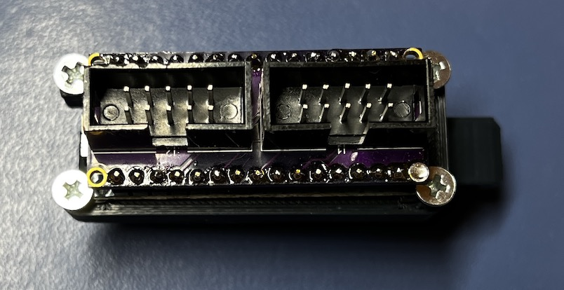
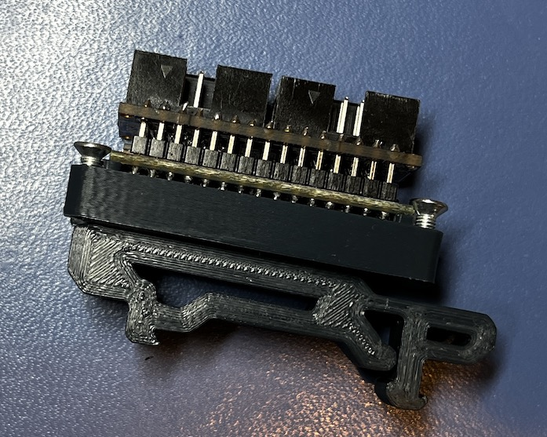

# Nano Display Mount

If you are using the [Voron Nano Display Adapter](
https://github.com/VoronDesign/Voron-Hardware/tree/master/Nano_Display)
you may of wondered how you can mount it.  This little adapter solves that problem
by letting you place it on a DIN rail.

### BOM

 * 1x [Voron PCB DIN Clip](
https://github.com/VoronDesign/Voron-2/blob/Voron2.4/STLs/Electronics_Bay/pcb_din_clip_x3.stl)
 * 2x M2x10 self tapping screw for plastic
 * 4x M3x6 FHCS

### Images
Top:

Side:

