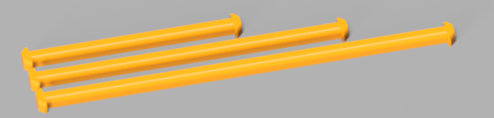

# Z Locks
When installing the gantry into the frame, use Z Locks as helping hands to hold the gantry in place for later build steps. They hold the gantry in place even when flipping the printer and can take pressure on the gantry up or down.

There are three lengths, 100mm, 150mm and 200mm. The 150 length seems to be ideal during a 350 build, gives some room to still fit drivers above and below the gantry.

## Gantry Install
Follow the typical steps in the build manual up to the Gantry Install section. Use the Z Locks instead of the long zip ties.

1. Place the printer on its back
1. Position the gantry inside the frame
1. Twist in the Z Locks, connecting the gantry to the top of the frame
    1. Use pliers to twist in, they're tight to prevent slipping when flipping the printer
    1. They do have a twist direction, note the position of the rounded corners
    1. Use five or six Z Locks
    1. The cable chain bridge will prevent movement along the Y axis if it hits a Z Lock. Something to consider while positioning a Z Lock on the right side of the gantry.

**Important** - Do not forget to remove all Z Locks before printing!

## Bonus Steps
After installing the Z Locks, do not stand up the printer yet. If the build manual was followed, the gantry has the Z belts attached. While the printer is still on its back, fish the Z belts through the Z drives. This is much easier with the printer on its back.

Enjoy!
