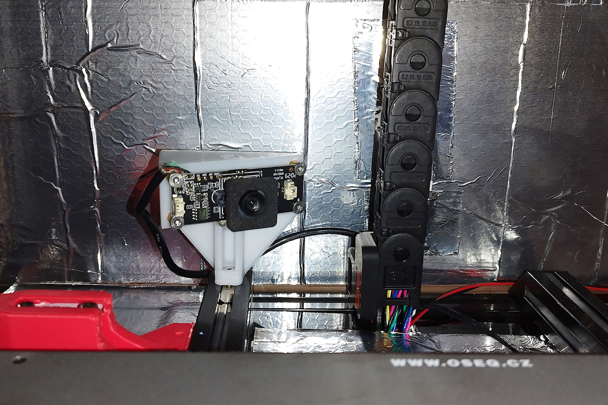

## 2020 Aplic Cam Mount


**2020 Aplic Cam Mount** is a 3D printed part that is used to mount a cheapo *aplic hd camera* (or similar) to the 2020 frame at bed level. The mount is designed to be held in place with a M3 screw and a M3 nut. Additionaly, you need 4x M3 heat inserts, 4x M3 spacers and 4x M3x6 screws for mounting the camera on the mount (pun intended).


You can also invert mount the camera under the gantry, which would work better for monitoring higher layers. *Photo courtesy of _tsimo_ V2.6592*

 mount. Photo courtesy of `_tsimo_` V2.6592")
### Files
* `aplic_cam_mount_voron_2_4_300x300.stl` - The mount STL, angled for the Voron 2.4 300x300mm geometry.
* `aplic_cam_mount_voron_2_4_300x300_shortened.stl` - Shortened version STL,for inverse mounting on a Voron 2.4 300x300mm gantry.
* `aplic_cam_mount.scad` - The OpenSCAD file for the mount (you can modify the parameters for your own printer's geometry).

### Parts
The mount is designed to be used with the following parts: 
```
- 1x 3d printed 2020 Aplic Cam Mount
- 1x Aplic Webcam - 1920x1080P stripped from its plastic case
- 1x M3x10 screw
- 1x M3 2020 T-nut
- 4x M3 heat inserts
- 4x M3x4 spacers
- 4x M3x6 screws
```
### Printing
The mount is printed in the orientation that as is in the STL file. The mount should be printed with the recommended Voron settings (40% infill and 4 perimeters) in ABS/ASA. That said, I've printed mine in PETG and it still holds. No supports or mount needed.


### Credits and license

Copyright 2024, Pavlos Iliopoulos.

    2020 Aplic Cam Mount is free software: you can redistribute it and/or modify it under the terms of the GNU General Public License as published by the Free Software Foundation, either version 3 of the License, or (at your option) any later version.

    2020 Aplic Cam Mount is distributed in the hope that it will be useful, but WITHOUT ANY WARRANTY; without even the implied warranty of MERCHANTABILITY or FITNESS FOR A PARTICULAR PURPOSE. See the GNU General Public License for more details.

    You should have received a copy of the GNU General Public License along with this program. If not, see <https://www.gnu.org/licenses/>. 

The author does not hold any copyright or has any affiliation with aplic and/or its products.
