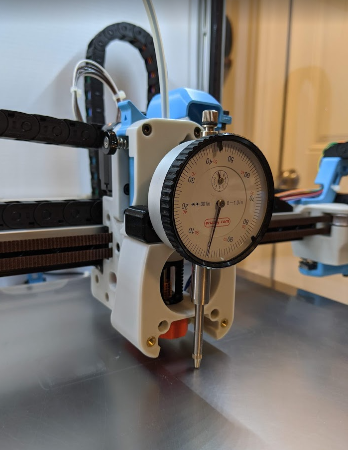
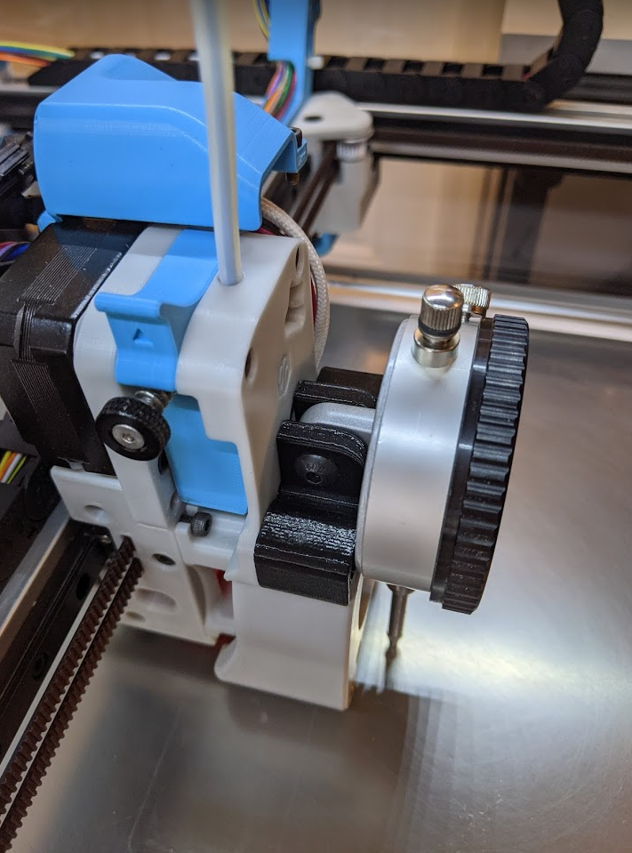

AB dial indicator mount.

Installs in place of fan assembly.

Requires:
- 2x M3x10mm SHCS
- 1x M5x20mm SHCS or BHCS
- 1x M5 nut

For use with common dial indicators. Confirmed compatible with this one:
https://www.grizzly.com/products/grizzly-magnetic-base-dial-indicator-combo/g9849?gclid=Cj0KCQjwi7yCBhDJARIsAMWFScMalpVMwU7VGmgg-EX7v9XqT1Eh7hUQgv2Z1UeLJ0F9gKKqIfKyRJwaAmnLEALw_wcB

Usefull for:
- manual bed mesh
- leveling x rails
- verify QGL
- etc

