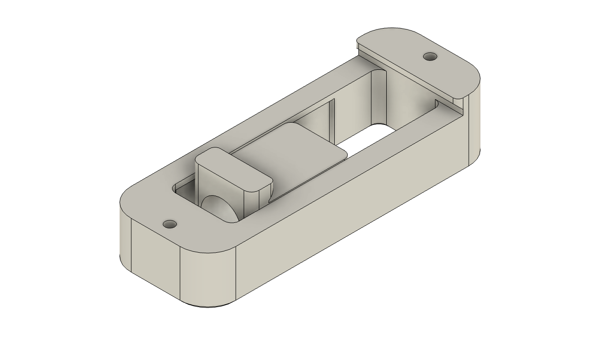

# BEEFY Din

I made these Din clips to replace the Voron "print in place" clips. I had issues, no matter the print settings and/or material, with the items staying in place. These clips are two parts, the main clip and moving shuttle. The only additional piece is the spring. I used yellow and blue bed springs and it clips everything very tight, but still able to remove.

I would not recommend that you use brown/red or other heavier bed springs since it applies too much pressure. 

## Printing

Standard Voron print settings should work well, 0.4mm nozzle with 0.2mm layer height. PETG or ABS recommended. 

## What to print
You will need to print two pieces for one clip.

| Filename |  Use |
| ------------- | ------------- |
| BEEFY_Din-PSU(50mm)-mirrored.stl | 24v PSU (mirrored) M4 screws |
| BEEFY_Din-PSU(50mm).stl  | 24v PSU M4 screws  |
| BEEFY_Din(55mm).stl | 5v PSU M3 screws |
| BEEFY_Din-shuttle.stl  | Moving shuttle for all models  |
| BEEFY_Din(standard).stl | Used for Pi and other controllers |

## Assembly

Assemble before installation. Insert spring into shuttle and slide into the groves in the underside of the main body. The holes may need to be drilled out a little to fit. 

.png)

.png)

## Parts needed

This is the spring kit I used. Again I'd stick to the blue or yellow springs for the best result. https://www.amazon.com/gp/product/B081DSZTV6