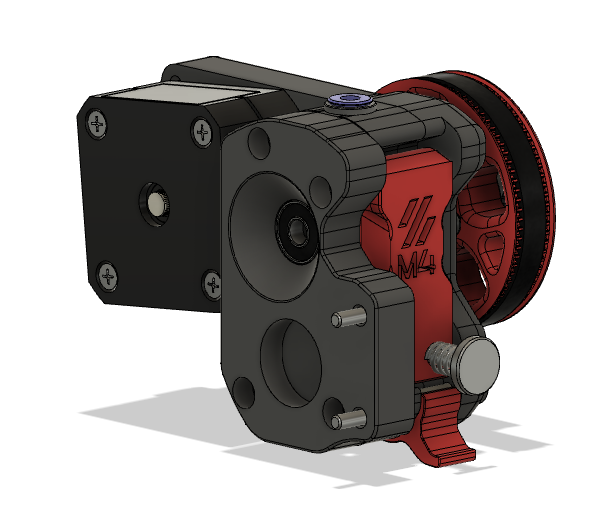
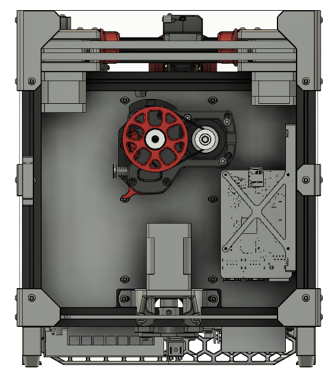
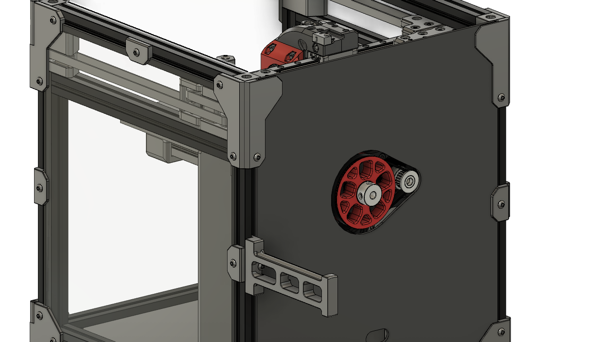
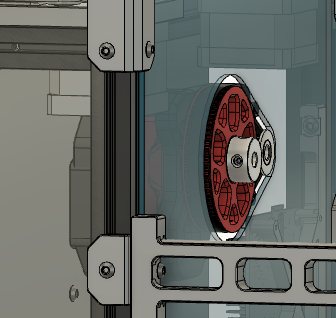

<b>Voron V0 M4 Extruder Mod</b>

Modified End Plate to mount the M4 extruder in the stock location in the Voron V0 at the same height and mounting holes as the Pocketwatch.

<i>Inspired by xbst_'s design. </i>_

<b>Custom parts include:</b>
 - Modified M4 End Plate (mirrored version)
 - DXF and STL for a modified back panel to allow the gears to protrude past the backplate (OPTIONAL)

<b>Requirements:</b> 
 - M4 <u>mirrored</u> printed parts
 - Pancake motor

<b>Tip(s):</b>
 - Relocate Pi to the right side of the printer to allow easier access to the latch and input side of the extruder (see pic)

<b>Additional Pics:</b>

