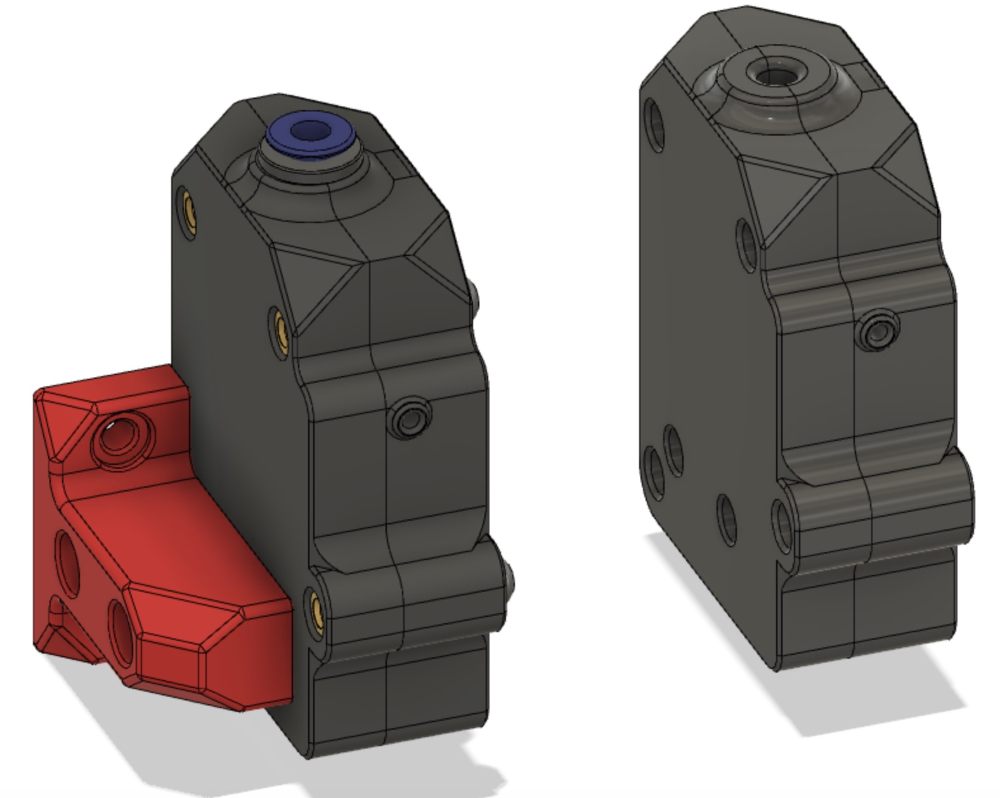
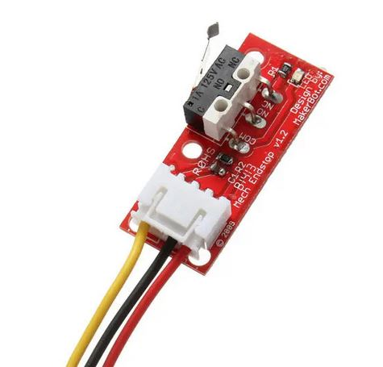
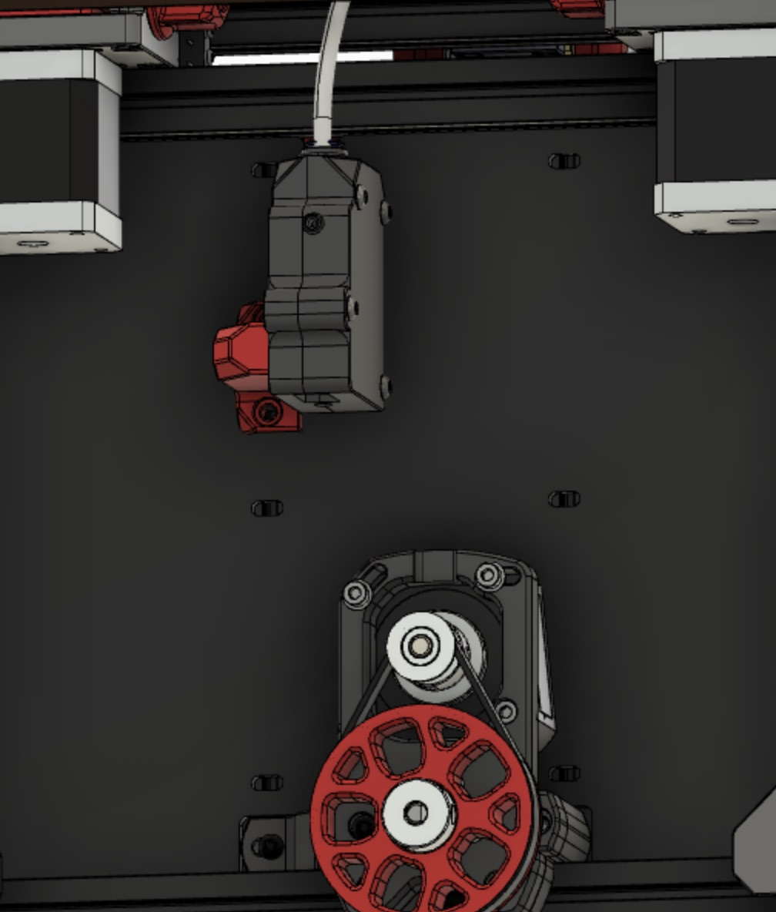
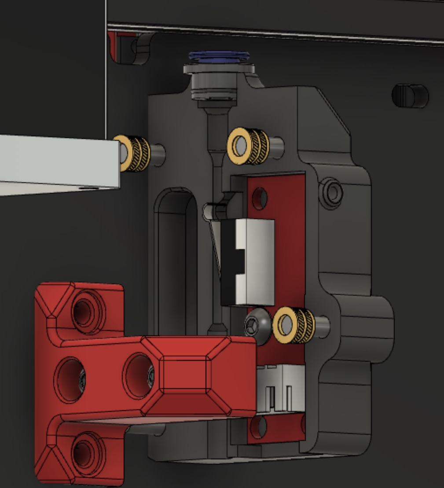

Voron V0 Runout Sensor Case

Created this case for a Makerbot runout sensor board to able to mount in the V0 Pocketwatch location when using a Direct Drive setup.

2 versions available, one with and one without the use of a bowden coupling.

]

]

]

]

]

