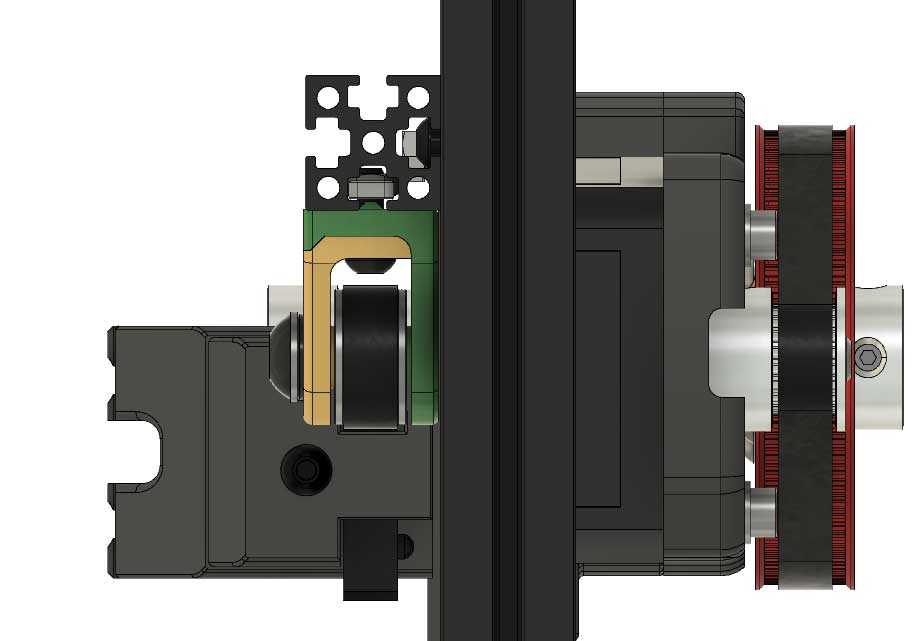
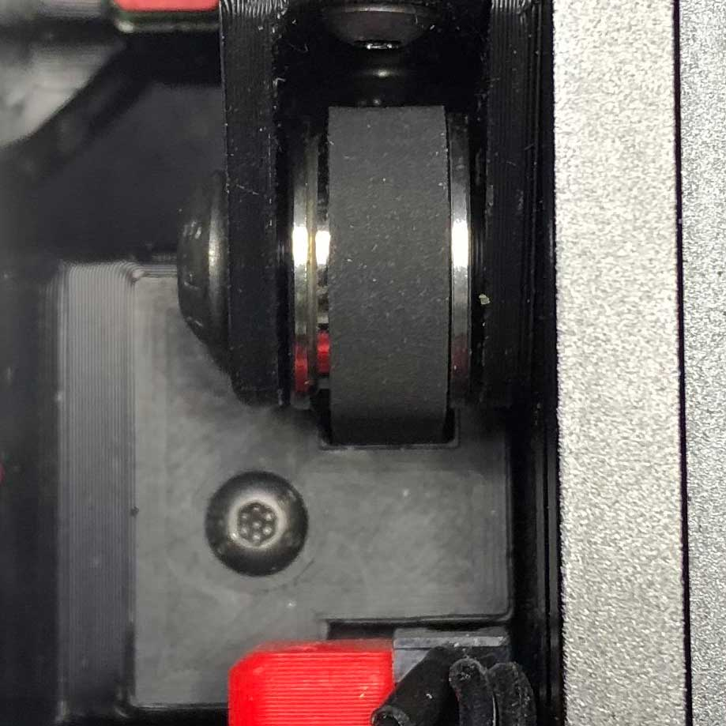

Voron V0 Z Belt mod using a M4 extruder as base.  

<b>This is a beta release. </b> Still testing and some minor design changes may occur.

<b>Design Notes</b>
* Designed to take advantage of the 4:1 gearing to prevent the belted Z / bed from dropping when motors are powered off.
* Created to be a drop-in replacement of the V0 leadscrew with a minimum amount of disassembly.
* Belt intensionally offset to the side, which attaches to and moves the bed, centering the belt.  Additionally, this keeps the end-stop screw in the same stock location to retain the use of the stock Z-end-stop
* Designed the bottom mount to utilize existing M3 nuts already in the 1515 extrusions. I believe affixing the mount to all four exiting mounting points may provide additional frame support and rigidity.
* Bed clamp designed to be accessible with a back panel in place, allowing easier access..if necessary
* Designed to be able to clear and use the back panel. It's very close, but it does clear. <i>(NOTE: Metal 80T gear can be used but may not clear the backpanel)</i>
* An optional bottom panel filler can be found in the STL directory.

# Klipper Stepper Settings:

<b>Old format:</b>
step_distance: .003125

<b>New format:</b>
rotation_distance: 10

# Assembly Order

I found this to be the easiest order to install this mod:

Step 1 - Remove Leadscrew Assembly
> <b>Tip(s)</b> Remove as much as possible from underneith the printer by first removing M5 bolts.  Next lay printer on the front rails exposing back.  Move Pi & Pocketwatch out ofd the way.  Then remove the mid-panel & the rest of the leadscrew assembly and bed mount.

Step 2 - Assemble Top Idler Mount Bracket and install in the printer - Keep mounting screws loose for later belt tensioning. (see Installation notes below)

Step 3 - Secure the drive belt to bed mount OUTSIDE of the printer.
> <b>Tip:</b> Securing the belt outside the printer outside of the printer and not installed on the bed yet.  Installing on the bed first will make it more difficult to attach belt. I found it MUCH easier to secure the bottom belt clamp first using both screws, then remove the one longer screw that holds both clamps.  Top clamp and belt will be secured later. Again this is not the final belt tension so don't worry about getting the tension correct at this step.  Final belt tension will be done later.

> I would also advise testing if the belt can be reliably secured to the bed mount.  You can do this by temporarily installing/clamping the belt (outside the printer) onto the bed mount.  You shouldn't be able to pull the belt from the assembly when all 3 clamp screws are secured.  

Step 4 - Assemble the bottom assembly NOT including the vertical stepper plate and shaft. 

Step 5 - Install partially assembled bottom mount onto the frame. (not including shaft, vertical stepper plate, or gear(s)

Step 6 - Route the drive belt though the top idler and back down to the bed mount.  With the belt feed through the idler and the bed mount top clamp, secure clamp loosely.

Step 7 - Install 20T pinion on the 72mm (or 70mm) shaft.  Install M5 (1mm thick) washer or printed spacer on shart

Step 8 - Install assembled shaft (minus 80T gear) into the bottom bracket and route bottom of the Z belt around the gear.
> <b>Tip:</b> I you can zip tie the shaft temparily where it exits the back of the bottom bracke to hold in place while lining things up.  Zip tie will be removed later.

Step 9 -  install the particially assembled bed belt block to the bed.  Bottom belt clamp should be already secured (Step 3) while the top part of the mount can be installed loosely.

Step 10 - Slightly secure the Top Idler block about 15mm away from the edge.  Pull on the belt at the top bed clamp and snug up.  This is NOT the final belt tension.  Then tighten the top bed clamp.

Step 11 - Slide the top idler block to get the belt tension to the tension you'd like.  This can be adjusted later more after assembly.

Step 12 - Verify the belt is aligned vertically and verify bed moves up and down freely with belt remainin in line.  NOTE remember bottom shaft is not 100% secure at this time

Step 13 - Install mid-panel

Step 14 - Remove temporary zip tie and install the remaining bottom bracket parts (Stepper motor, pinion, vertical bracket, 80T gear asssembly)

Step 15 - Resecure Pi & Pocketwatch

Step 16 - Wire up Stepper motor

Step 17 - Change Klipper settings.

Step 18 - Retension Belt / Top Idler Bracket mount if neccessary.  If this was pretested with the mid-panel removed this should be the only adjustment required.  You shoud not need to adjust tension at the bed mount.

Step 19 - Test and enjoy.

# Disassembly Notes:

### For Existing Leadscrew Builds

The frame will <u>not</u> need to be disassebled.  In order to remove the leadscrew Z assembly and to easily install the belt mount you'll need to remove the mid-panel. 

# Installation Notes

## Important

If you use stacked bearings for the top idler, a washer/spacer needs to be installed between the bearings (see pic).  Additionally there's a new idler mount as a result.  If you printed the idler prior to  25 Jan 2021 12:25 EST, then the idler mount is too narrow for the spaced bearing and you'll need to print the updated top idler mount.

> Included in the STLs are alternative idler pulley mounts for both smooth and toothed idlers.  I have <b>NOT tested</b> any of the smooth or toothed idlers.  Please let me know if you have an issue or something needs to be tweaked.

> <b>NOTE:</b>  It's important for your M5 screw (or M3 screw if using idler w/3mm I.D.) not to protrude past the idler mount. This will allow you to move the idler mount upward clearing the 1515 extrusion allowing more belt tension.

## Important

The larger part of the idler mount (green) should be up against the mid-plate / extrusion, not the smaller half (yellow)

# Initial belt installation and how to tighten Z-Belt:

## Step 1: 

Secure belt at the bed mount first - this <b><i>is not</b></i> the final belt tension. Final belt tension will be done at step 4.

> <b>Tip:</b>  I found it easier to secure the bottom belt first using both screws, then remove the one longer screw that holds both clips, then secure the top.  Again this is not the final belt tension so don't worry about getting the tension correct at this step.  Final belt tension will be done at step 4.

## Step 2:

Slightly loosen idler mount screws

## Step 3: 

Push idler mount up to desired belt tension and hold.  

> <b>NOTE:</b>  It's important for your M5 screw (or M3 screw if using idler w/3mm I.D.) not to protrude past the idler mount. This will allow you to move the idler mount upward clearing the 1515 extrusion allowing more belt tension.

## Step 4:

While pushing up and when you have the belt tension how you want, secure the top screw

## Step 5:

Finally secure the bottom screw.  Yes, the bottom screw can still be access with the belt in the way.  The belt is flexible enough to move/bend over to access the bottom screw on the idler.  I use the ball end of a hex driver.

# Alternative Idler
Alternatively you can use <b>@hartk V0.108</b> Idler which allows tensioning using a single screw at the top.  It's a very nice idler but you'll need to add some M3 nuts on the horizontal 1515 extrusion.  This can be done by either drilling out an access hole and hiding that hole behind his idler assembly or taking the frame apart slightly.  I opted the lazy route with mine LOL.

# Troublshooting:

<b>Clicking noise?</b>  If your z belt is clicking while traveling up and down check alignment of both the z-belt and the M4 belt.  

1. It's super easy to over tighten the M4 belt.  If too tight the belt tension will cause the pulley and M4 gear too slightly bow towards each other causing the belt to rub on the side of the pulley and/or M4 gear causing a clicking sound.  

2. Verify Z belt is inline from bed to idlers.  You can validate top alignment while bed is completely up (Z0) that everthing is lined up.  (see pic)

When in motion the Z assembly should be nice and smooth with no odd sounds, clicking, or other.  See video link below for the amount of noise to expect.

https://www.youtube.com/watch?v=G-tdwrXrc-c

<b>Bed dropping when z motor off?</b> Motor power off, I found that the bed <i>may<i> drop from max height (Z0) maybe 2-3 cm but holds from any distance after that.  I personally don't mind that tiny drop from max height (Z0) as I believe that's a resonable sacrifice to have belted-z benefits.  

# Addtional Pics:

