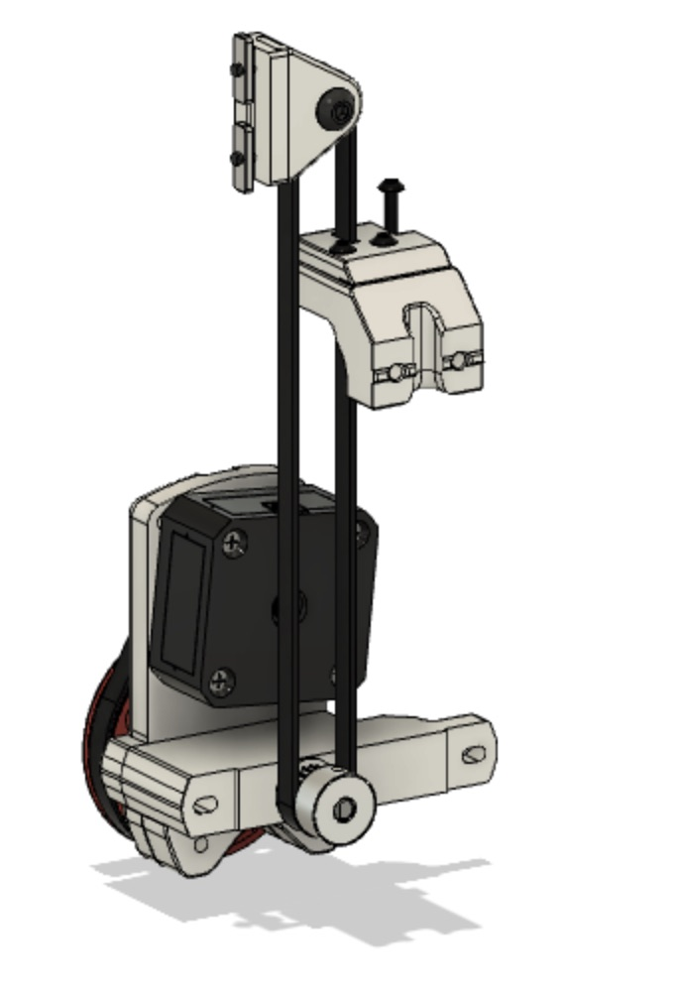

Voron V0 Z Belt mod using a M4 extruder as base. 

NOTE:  This is a beta release.  Still testing and some minor design changes may occurs.

Taking advantage of the 4:1 gearing to prevent the belted Z from dropping when motors are powered off.

