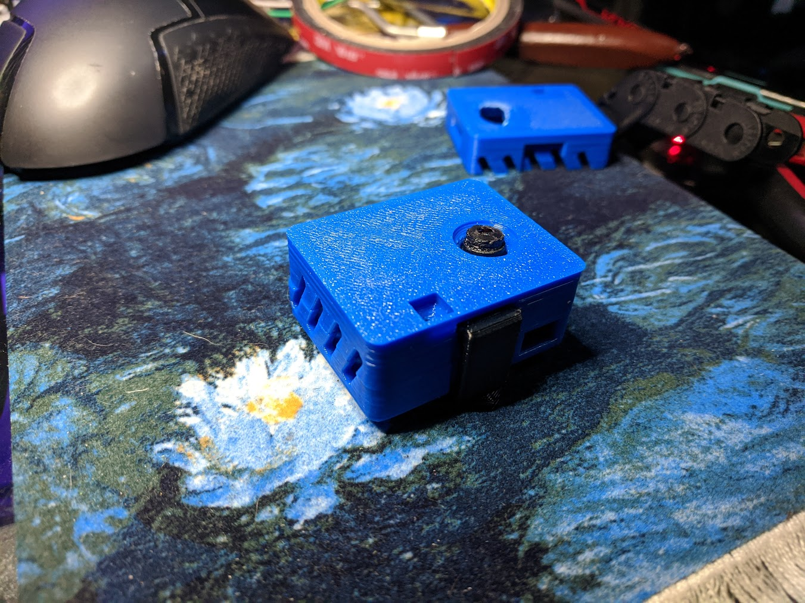

# ESP32-CAM Snap Together Case

This case is designed to be snapped together around your ESP32-CAM. It's a tight fit so no glue is required. I have provided a gap that allows a female JST connector to be soldered to the 5V and GND pins on the board.

All the features of the ESP32-CAM should be available through access ports which are built in to the case.

### BOM
* **ESP32-CAM**
* JST-2 2.5mm Female port (optional)
* JST-2 2.5mm Male port (optional)
* 22AWG or lower wire to 5V supply
* VHB Tape to mount

### Assembly
Print a front, back, and a clip of your choice.
The portrait version is designed to display the logo properly when the camera is in portrait mode. I recommend you print the clip in your accent color.

If you want to mount the female JST connector, solder it to perpendicularly the 5V supply and the GND pin next to it. The JST connector pins sit on the inside of that joint.

### Programming
This isn't intended to be a tutorial on programming the ESP32-Cam, there are many available. Here are some that I found:
* [https://www.instructables.com/Getting-Started-With-ESP32-CAM-Streaming-Video-Usi/](https://www.instructables.com/Getting-Started-With-ESP32-CAM-Streaming-Video-Usi/)
* [https://randomnerdtutorials.com/esp32-cam-video-streaming-web-server-camera-home-assistant/](https://randomnerdtutorials.com/esp32-cam-video-streaming-web-server-camera-home-assistant/)

Following either of these tutorials will result in building an IP camera which will debug message the IP of the camera to you via serial when you get it built. If you don't get a serial debug, you can look at your router administrator console for the device IP.

### Fluidd
The ESP32-CAM can be configured as a MJPEG stream in Fluidd. The url is the IP assigned to the device http://192.168.X.X:81/stream Make sure you get that port :81 specification and the /stream path.
