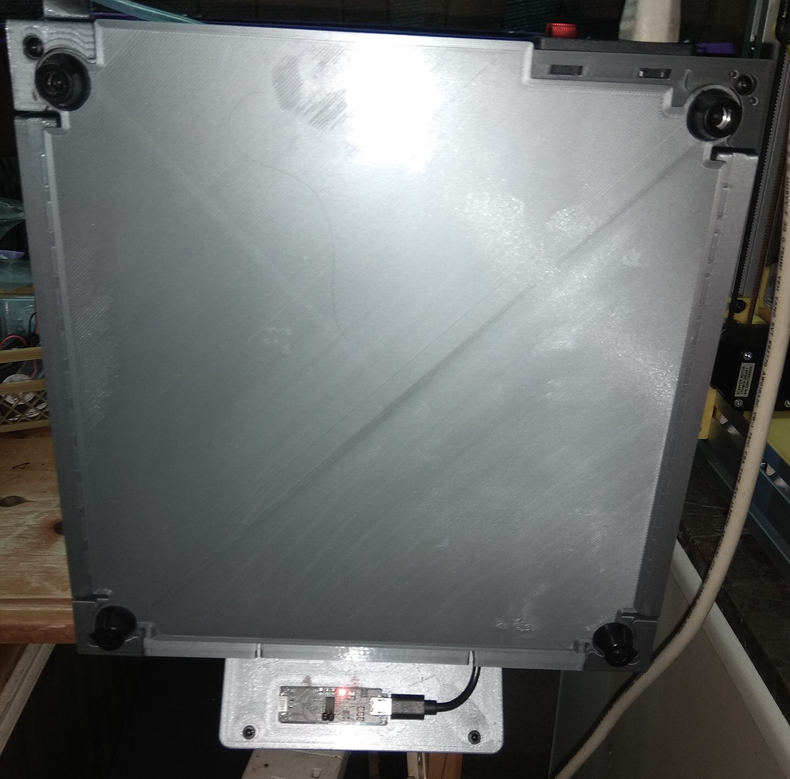

# Bottom panel for the V0.1 mod Trident skirt remix of damian-gdes

Printed in PLA. If printed in ABS maybe to print upscaled 100.5%

BOM:
4 M3x20 BHCS (if heat inserts are used) or 3x M3x20 plus 1x M3x45 -> to replace the srews for the feet
4 M3 5x4 heat inserts (Voron specs)

Preparation (optional):
- enlarge the holes for the feet with a 4.5mm drill
- melt in heat inserts

Mounting the PTFE tube:
Pull the tube from the holer of the corner feet and insert into the hole of the back wall

Thanks to damian-gdes who made my V0.1 nicer
with his mod: https://github.com/VoronDesign/VoronUsers/tree/master/printer_mods/golas/v0-trident-skirt-mix

 Thanks to Steve, Nero 3D and Sanity for all their help and patience and all the others who helped

