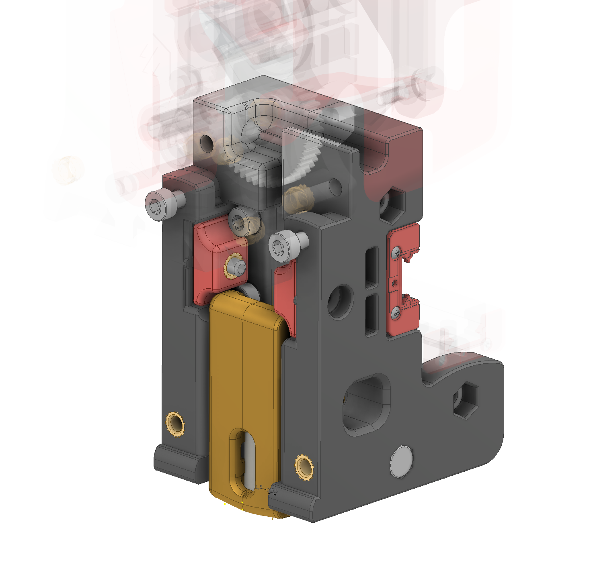
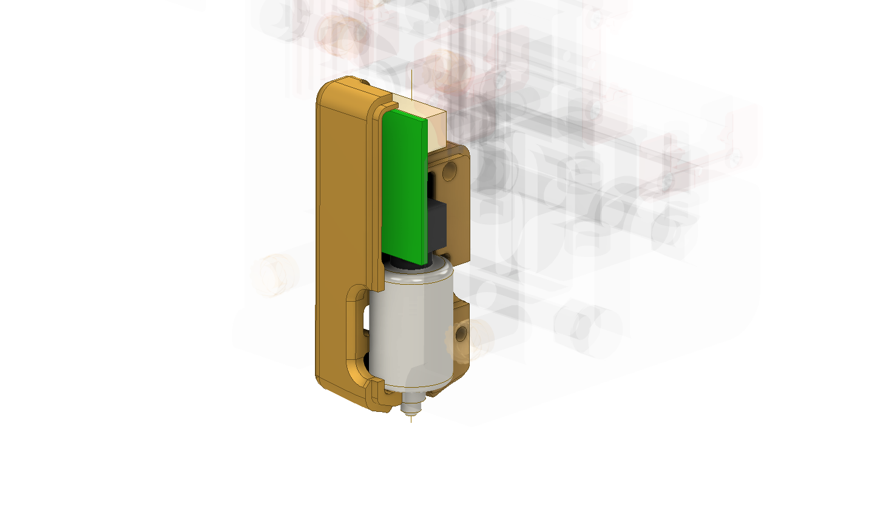
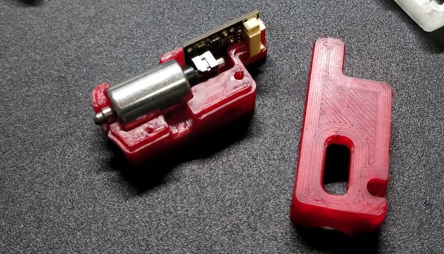

# Creality CR Touch replacement shell

## What?

https://www.youtube.com/watch?v=5Wmlju45Rt4

A replacement shell for the Creality CR Touch probe to fit the Voron 2.4 (tested)

## Why?

Not all print surfaces are compatible with a inductive probe, sometimes its necessary to measure with actual physical contact.
I tried this in the past with genuine BLTouches and knockoffs but they would all either quickly die a heat death, would randomly let go of the probe during printing or not manage to deploy the probe at all.

The CR Touch uses a proper solenoid that is in the retracted state when not powered, so this shouldnt happen anymore.
So far I printed around 50h with the Creality CR Touch without any problems. For me it's way more reliable than a BLTouch.

#### Z Autocalibration

Having a physical probe allows us to auto calibrate the nozzle offset to the probe and bed, similar to the popular Clicky probe. This means we only have to adjust the setup once and don't have to worry about different nozzle heights and bed thicknesses anymore.

## How?

The CRTouch is unfortunately too big to fit in the standard Voron probe space so I design a replacement shell that juuust fits.
It should barely clear the screws that hold the X-carriage to the linear rail carriages.

## BOM

- 1x Creality CR Touch
- 2x M3 Threaded Inserts (Voron 2.4/Trident spec, M3x5x4)
- 2x M3x8 SHCS or BHCS (Voron 2.4/Trident spec)
- 2x M2x10 Self Tapping Screw for Plastics (Voron 2.4/Trident spec)

## Assembly 

Add the threaded inserts to both halves of the housing.
Carefully open the original CR Touch housing and remove the solenoid and PCB.
Insert the solenoid and PCB into the new housing as a unit. Align the PCB with the little cutouts and press down.
Add the second half of the housing, make sure everything is aligned correctly and firmly press the two halves together.
Screw in the self tapping screws.

## Setup and Z Autocalibration Macro

The CR Touch, just like the BLTouch has 5 wires. 2 of those (blue is IO and red is GND on the included harness) are the endstop wires, the other 3 are to control the solenoid (white is GND, black is 5V and yellow is SIGNAL).
For further information please look up some BLTouch installation tutorials.

Attached in the `printer.cfg` is the BLTouch configuration. Make sure to use an up to date klipper installation.

At the time of writing the Calibarte-Z Klipper plugin doesn't work with the BLTouch/CR Touch.
But all thats needed is a small macro added to the `PRINT_START` routine.
This `Z_AUTOCALIBRATE` macro probes the endstop and calculates the Z-offset from nozzle to probe.
It then probes the bed and sets the new Z0 to the nozzle offset with a G92 before printing.

The parameter `variable_switch_pretravel` has to be adjusted once. This is the amount the endstop switch travels before being triggered. Typically around 0.3 to 0.5mm. This is also the value to tune the prefect 1st layer.
Additionally the exact positions of the z-endstop and middle of the bed have to be provided.
Please read the comments in `macro-z-autocalibarte.cfg` for more information.