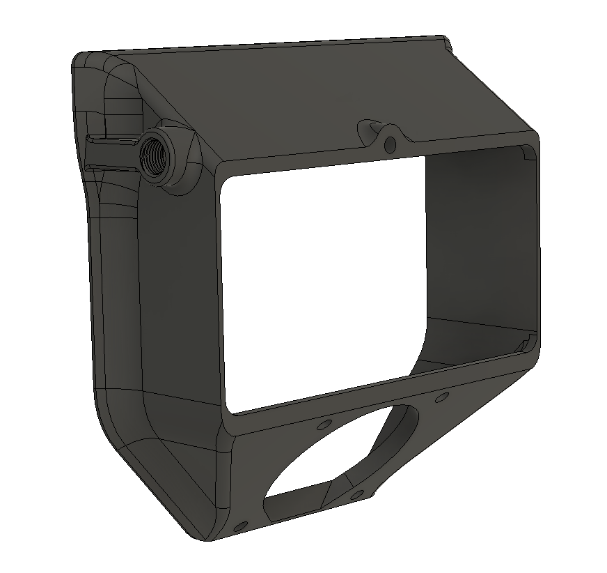

# Exhaust housing with the bowden fitting moved to the side

Moves the bowden fitting on the exhaust housing 90 degrees and to one side of the housing. This allows the printer to stand with its back closer to a wall. The only thing that has been changed from the original is the location of the bowden fitting.

If you want the bowden to be on the other side your printer, just mirror the model in your slicer.
 

