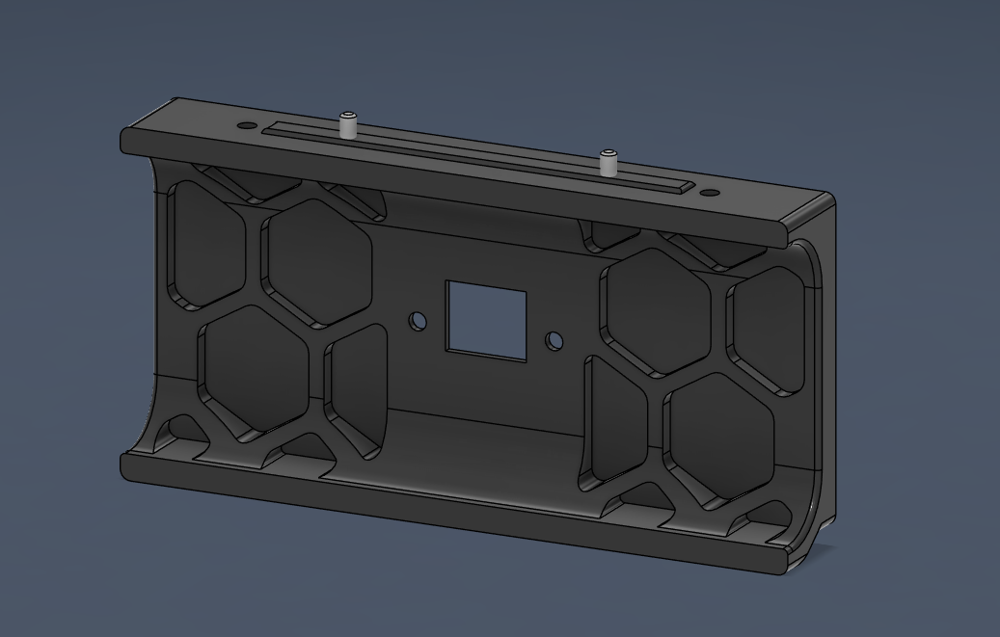
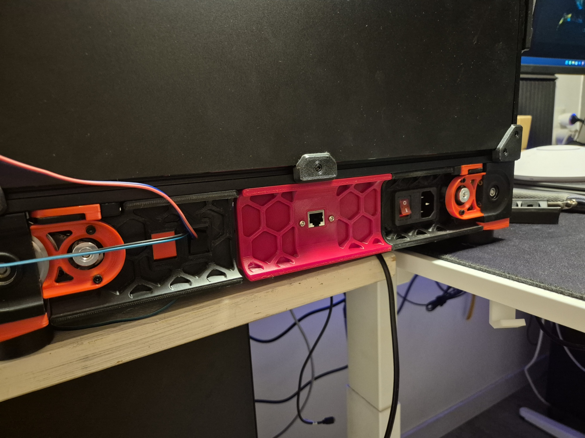
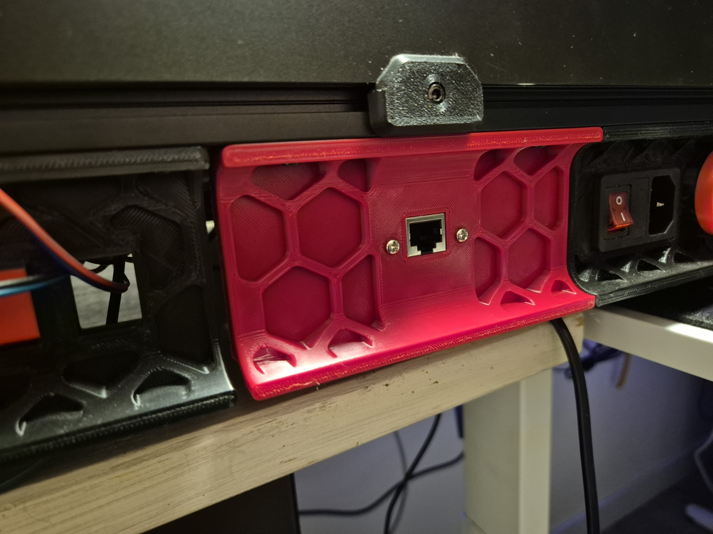

# Ethernet Adapter

A simple Ethernet adapter mount designed to replace the back middle skirt of your Voron printer.

## Required Hardware

- [RJ45 Female to Female Panel Mount Adapter – AliExpress](https://nl.aliexpress.com/item/1005006848823613.html)

## Printing Instructions

- **Printer Profile:** Standard Voron settings  
- **Walls:** 4  
- **Top/Bottom Layers:** 5  
- **Infill:** 40%  
- **Supports:** Optional, but tree supports are recommended for the best surface quality

## Gallery

  

