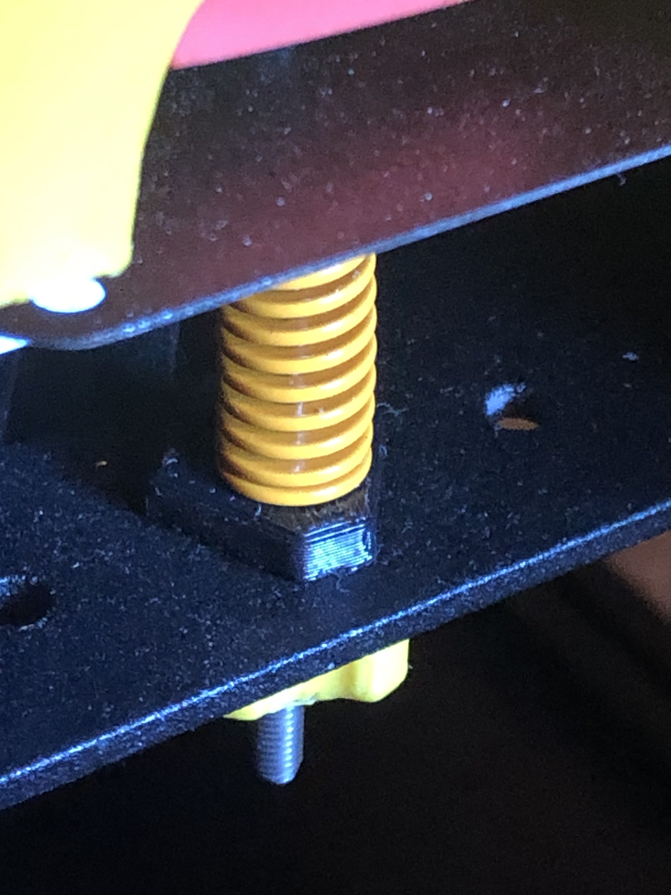

# Shim to increase spring tension with a V0.1 Kirigami bed

I found the tension of my bed springs a bit too loose, and made a 3mm shim to increase the tension. Use ABS or better to print this.

There is a hexagonal and a round version. Functionally they are equivalent, use what you like better.
 

