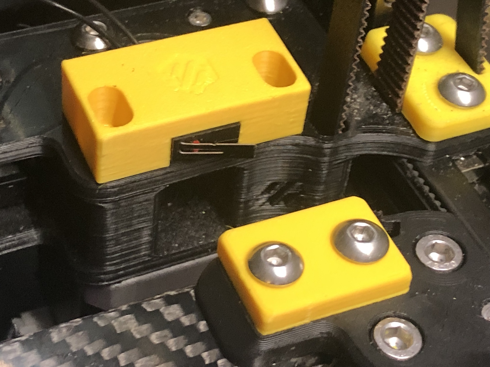

# Y endstop relocation for Voron V2.4, Voron Trident

I installed a CAN-toolboard on my V2.4 and replaced the chains with an umbilical. This mod relocates the Y endstop to the A-motor (rear right), so I can remove the chain on my Y extrusion.

Any standard size microswitch endstop with a latch will work, like Omron D2F-L or compatibles. 

Printing instruction:
The parts are oriented correctly, just print them with Voron standards: 4 perimeters, 40%infill. Actually, a bit less will do, too.

Installation:

Assembly from below to see how parts fit together:

Bracket:
  - Solder wires to the microswitch. Use the outer two pins, the middle one is unused.
  - Fasten the microswitch into the bracket with 2 M2x10 self-tapping screws.
  - Remove the front M3x30 screws that thread from the top of the motor housing down to the stepper motor.
  - Install the bracket on top of the motor housing with two new M3x35 fasteners. The bracket is adjustable, I recommend to mount it flush with the front end of the motor housing as a starting point.

Bumper:
  - Replace the old cable bridge with the bumper. The fastener stays the same. The bottom has the words "BACK" and "FRONT" to help with the orientation.

Test and alignment:

Manually run your gantry to the rear. You should hear a "click" right before the gantry hits the rear wall. If you don't hear a click, adjust the bracket toward the front until it clicks.

In Mainsail, check if your X endstop is triggered when the gantry is at the back, and not triggered when you pull it to the front again.

Front view:

