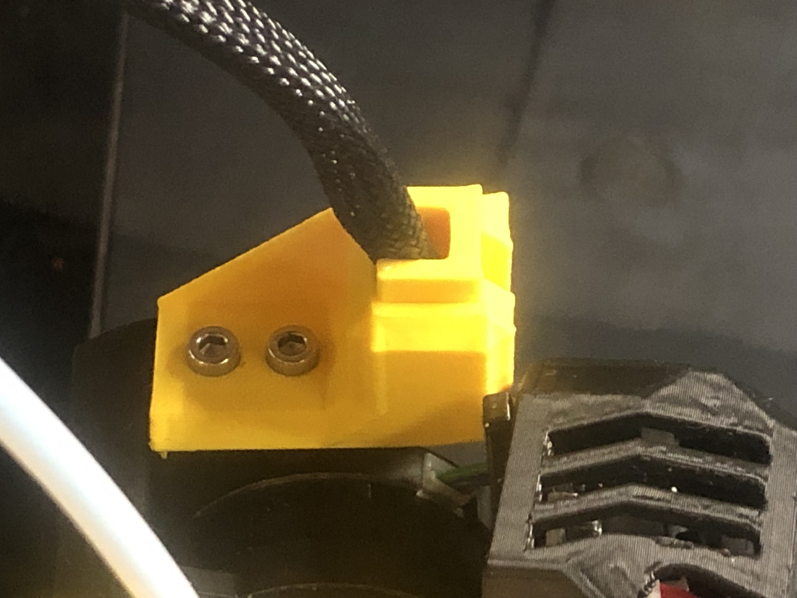
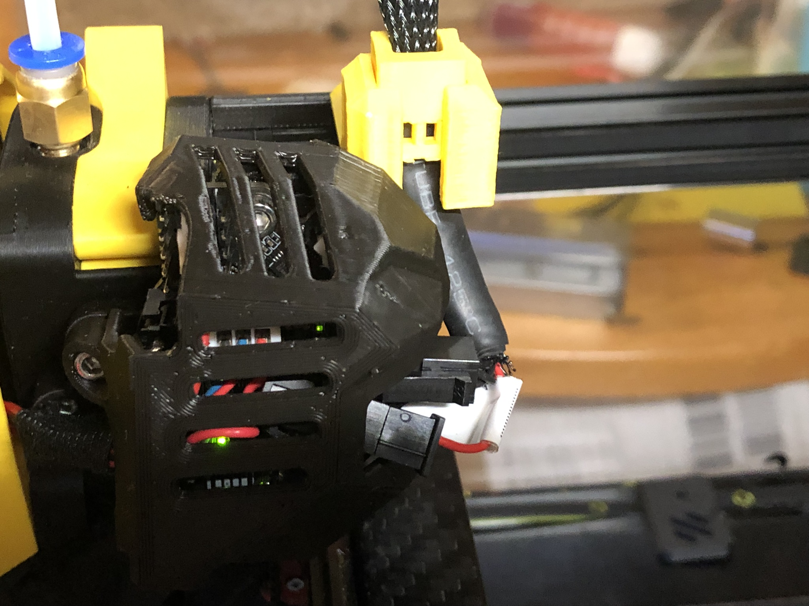

# Guide for an umbilical with top feed, no cable gland required

I added a toolhead board to my Galileo extruder, and the reduced wire-count suggests to move to an umbilical instead of an energy chain. It has been thoroughly tested with my Galileo and should work with Clockwork 1/2 or any extruder that offers the common anchor point for a 2- or 3-hole drag chain.

This mount guides a sleeved wire bundle. My own umbilical enters the chamber at the top, through the exhaust opening, and is supported by a gallows. What I needed and designed, is the matching steady mount on the extruder end.

This has no hardware requirements. Use your old fasteners to attach the guide to the anchor, mine are M3x8. 

I put the wires into a standard polyethylene sleeve to protect them. For the length that runs down to the CAN-board, I used a heat-shrink, but that's general caution, not required for the mount.

The key gets pushed in from the top to steady the umbilical in the guide. One end of the key is a bit thinner to allow easy insertion. If the cable is still too loose with the key, you can zip-tie it to the key, I added slots for that. 

Caution:

When you lock the umbilical with the key, make sure the length towards the CAN-board has a bit of slack. You don't want hard kinks in the cable!

Total perspective:

Front view:

Rear view:

Side view:

