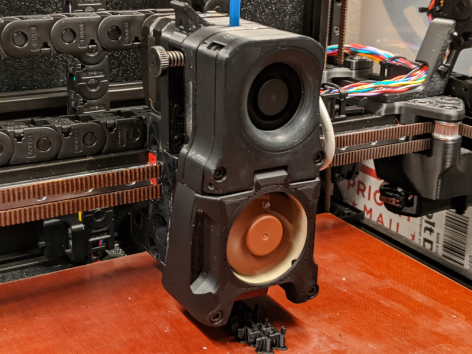

# Slender layer fan for 2.4

## What does it do
* It gives you 7-10mm additional Y travel before hitting your front doors.
* It reduces weight at maximum leverage, and reduces maximum leverage on your linear rail.
* It lets you service your duct without disassembling your print head (did you drop a screw or piece of plastic)
* It looks sick.
* It's quiet and it moves plenty of air.

## BOM
* 6x m3x3.8 heat set inserts
* 2x m3x12
* 2x m3x16
* 2x m3x20
* 2x m3x30
* [The neat little layer fan from 2.2](https://www.digikey.com/product-detail/en/delta-electronics/BFB0412HHA-A117/603-1840-ND/5022816)

## STLs
File | Note
---- | ----
[blower_case.stl](./blower_case.stl) |
[blower_lid.stl](./blower_lid.stl) | 
[duct.stl](./duct.stl) | You might need supports.  I used supporrt from platform only to keep the inside of the duct clean.
[hotend_fan_cover.stl](./hotend_fan_cover.stl) | You might need supports.  I used supports on the duct seal wings to keep them a little nice.

## Assembly
1. You are replacing the front half of your print head.  You'll need to replace the front mosquito mount with the new shroud, so tear it down a bit (leave your clockwork intact, we're not messing with that)
2. Put in the heat set inserts.  2 on top of blower_lid, 2 in the duct and the 2 on the backside of the duct for bolting the hotend case together..
3. K sorry drill out the mount bosses on your neat little layer fan to 3mm, or snip them off.  They're in the way for your screws up top.
4. And while you're disappointed, take a look at your 40mm fan.  The bottom frame edge around the screws might not clear the bolt heads of your 30mm lower shroud mount screws.  I snipped the frame corners a little for clearance but you might have smaller screws.
5. Assemble the front of the print head like you normally would.

## Known Issues
* You might want some really lightweight foam to close your duct better if your print doesn't come out perfectly. (you'll see a little gap and know you want this or you won't see a gap and you won't care)

