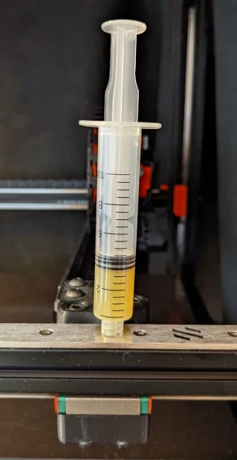
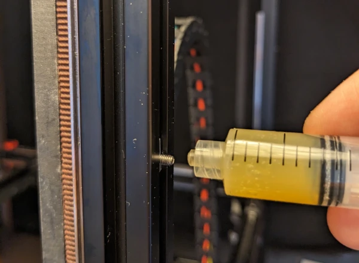
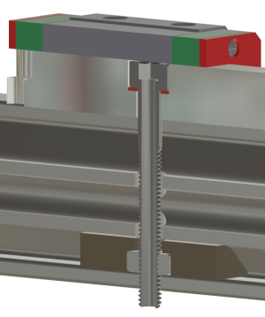
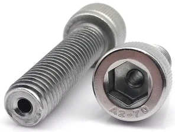
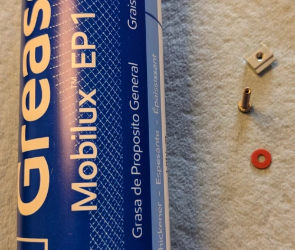
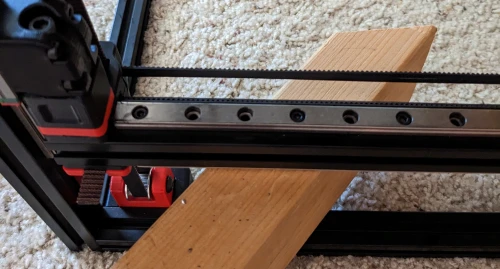
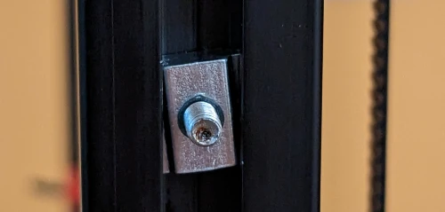
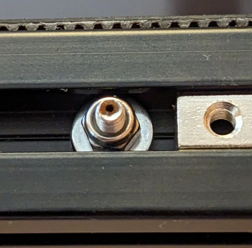

# In Situ Linear Carriage Block Lubrication

With the advent of faster and faster printers, the Voron printers included, the manufacturers recommended greasing intervals becomes increasingly important.

For MGN09 and MGN12 rails, [HIWIN](https://hiwin.us/wp-content/uploads/lubricating_instructions.pdf) recommends greasing the rail after approximately 130 and 160 km (~80 and 100 miles) of movement respectively.  
For MGN07 the distance is 100km (62 miles).

If you used oil instead of grease to lubricate the rails, the distance is reduced by 50% (and for low viscosity grease, greasing intervals are reduced to about 75%).

| Rail  |      Grease       | Low Viscosity Grease |       Oil       |
| ----- | :---------------: | :------------------: | :-------------: |
| MGN07 | 100km (62 miles)  |   75km (47 miles)    | 50km (31 miles) |
| MGN09 | 130km (81 miles)  |   98km (61 miles)    | 75km (47 miles) |
| MGN12 | 160km (100 miles) |   120km (75 miles)   | 85km (53 miles) |

_(with load ratio P/C of 0)_

So I made a modification that makes it possible to regrease the carriage blocks, while still installed in the printer.

## Do I need to worry about this?

Well, I think you might be surprised. But let's dive in.

Klipper unfortunately does not keep statistics on how far each axis has traveled. It only keep track of total print time.  
So we will have to estimate the distance traveled.  
Let assume a leisurely average print speed of 40 mm/s. That equates to 0.144 km/h. I.e. one km is covered in just 7 hours (assuming the axis is in constant movement).  
At 100 mm/s the speed is 0.36 km/h.  
If you print at 100 mm/s average, we can translate the table above to hours of printing
| Rail | Grease | Low Viscosity Grease | Oil |
| :----: | :------: | :--------------------: | :---: |
| MGN07 | 278 hours | 209 hours | 139 hours |
| MGN09 | 361 hours| 270 hours | 181 hours |
| MGN12 | 444 hours | 333 hours | 222 hours |

This is of course an approximation.  
We can approximate that the X and Y axis are moving most of the time, and that the numbers above are less representative for the Z axis.  
And of course, some movement will be in only one axis. But even if we assume that an axis is moving only 80% of the time, the regreasing intervals still come up rather quickly.

## How this mod regreases the carriage blocks

After the mod, one of the normally empty screw holes in the rail, will have a new special "lubrication screw" installed.

This screw goes all the way through the extrusion and out the back by about 2.5mm.

To lubricate a carriage block:

1. first attach the syringe to the screw on the back of the extrusion, by screwing the syringe on the end of the screw.  
   Make sure there is a tight connection between the screw and the syringe, so that grease can be forced through the screw.

2. Hold some kitchen towel on the front of the rail, and push a little grease through the screw. This is to clear out any old grease, dust and grime, before lubricating the block.

3. Next move the printer gantry, so that the carriage block is placed over the head of the screw.

4. Push a little grease through the screw, until you see a little bit of grease come out between the rail and the side of the block.

5. Move the carriage block back and forth a few times to distribute the grease, then wipe off the excess grease from the rail

To see this in action, refer to [this video](https://youtu.be/QBa8QdQRcu8) of testing this lubrication principle.

## Background for the mod

Given that the rails need fairly frequent maintenance, the process of regreasing the rails becomes more relevant.  
The best way to regrease the rails would be to remove the carriage block from the rail.  
This is quite a chore, as removing the block require a rather extensive disassembly of the printer.

So I took note of how LDO recommends to grease the carriage block.  
They [cleverly grease](https://docs.ldomotors.com/guides/rail_grease_guide) the block by injecting grease from the back of the rail, without removing the block.

I went on a hunt for a solution to do this, while the rail was installed in the printer, and made this concept mock-up.

I talked to local machinist that mentioned, that screws already exists with a hole down through them. A quick search later and I came across these screws.

  
They are intended to ventilate a space through the screw, via the hole drilled down the length of the screw.  
I of course am planning to use these to inject grease into the carriage block.

I ordered a set of M3x25 mm screws from [aliExpress](https://www.aliexpress.com/w/wholesale-hollow-hex-m3.html), and made a test to confirm it would work.

In the video linked above, you see the result.

In this first test, I actually applied far more grease than I needed, but it worked extremely well.

To push the grease into the bearing, I used a syringe intended for resin, that I found at a local craft store.  
The opening in the syringe tip, is perfectly sized to use a M3 tap, to make a thread in the tip.  
(Make sure to clear out all plastic shavings from the tapping operation, before adding grease to the syringe).

## Materials

- Mobilux EP1 grease
- A fiber washer under the screw head, (commonly used in PC builds for electrical isolation). I got a variety pack from Amazon that included M3x6x0.5 sized washers that fits perfectly
- A [slide in](https://www.aliexpress.com/w/wholesale-t%2525252dslot-nut-slide-M3.html) t-slot M3 nut
- A 25mm long M3 vented hex nut screw
- [Resin Syringe](https://www.michaels.com/product/american-crafts-color-pour-resin-syringe-10647533)

## New builds

If you are in the process of building your printer, you are in luck. This is the absolute best time to do this mod.

1. Start by loosely installing the rail on the extrusion.
2. Select which hole in the rail you want to use as the "Lubrication Location".
3. Use a center punch to mark the location of the hole in the extrusion below.
4. Remove the rail from extrusion.
5. Drill an over sized hole through the extrusion.  
   The hole is over sized, to retain some adjustability of the rail, and to allow for some material expansion when heated.
6. Slide in the t-slot nut on the reverse side of where the rail will be installed.  
   I DO NOT recommend using the rotating style t-nuts.
7. Install the rail, permanently this time.
8. Install the vented screw with the fiber washer in the selected rail Lubrication Location.  
   **Make sure not to over tighten the vented screw.  
   It only need to be snug enough to seal against the washer.**

## Retrofit

This is a bit more challenging, as we need to be careful of the metal shavings from drilling.  
Moreover the design of the X axis (at least on the 2.4 that I have) does not have space to slide in a t-nut into the back of the extrusion.

I turned the printer on it's side, on it's back, on it's head, basically any which way to make sure the metal shavings didn't fall in the direction of the electronics or the magnetic print surface. I used a block of wood to prop up the gantry when needed.

### Z axis

I started with drilling a hole from the side of the rail, with a drill that fit just right into the hole in the rail. That helps align the drill, so I go straight through the extrusion.  
With that hole is drilled all the way through, I drilled from the opposite side, with a larger drill bit, just to enlarge the hole and allow for some extra expansion/adjustability.

Make sure to try and collect all the metal shavings as you make the holes. I placed the printer on the back/front when drilling the first holes, so that I was drilling straight down, and all metal shavings would fall down on the table, and not down towards the magnetic build plate.

### X and Y axis

I didn't want to completely disassemble the X/Y gantry. So instead of the slide in t-nut, I opted for a steel washer and a nylock nut on those axis. The washer and M3 nut can just pass through the gap in the extrusion and seat against the bottom of the extrusion. Not as nice and easy as the slide in t-nut, but working just the same.

## Why place the t-nut on the reverse side of the extrusion?

The t-nut could be place on the same side of the extrusion as the linear rail. However I opted to place the t-nut on the other side of the extrusion simply to give more support to the screw.

Since the wall of the screw is quite thin, given that a 1 mm hole is drilled down through the 3mm screw, I use the T-nut to help give the screw some mechanical support at the point where the syringe is screwed on to the screw.  
It is virtually impossible to not provide a little bit of transverse (sideways) force when attaching the syringe and pushing the grease through. It is virtually impossible to keep the syringe perfectly still and aligned with the axis of the screw through the operation. So the t-nut just gives the screw that extra little assistance to better withstand that force.

## But what about the side panels and my nice extrusion backers

The screws will protrude about 2.5 mm from the extrusion. This will place the end of screws just below the exterior surface of the side panels.

But of course, you do need to make allowance for the screw in the side panel, so you will need to mark the location and drill a hole in side panel.

Your nice extrusion backers on X and Y axis likewise will need to have hole drilled to allow the screw to pass through.  
If your backers are of the nice stainless steel or titanium variant, then that can be a bit of a challenge.  
But give it time, don't rush the drilling operation, and lubricate the drill bit as you go, and it is perfectly doable.  
I do recommend not to drill those holes in place, but to remove the extrusion backer and drill the holes on nice sturdy and flat surface.

## Cleaning excess grease

There will be excess grease in the screws after greasing the carriage blocks. I haven't yet decided on the strategy I will use to keep dirt and dust from accumulating on the screws.  
But it does need to be addressed before greasing the carriage blocks next time.

Some strategies to combat the accumulation of dust and grime in the excess grease:

1. design and 3d print a plug and screw cover to close of the screw.
2. use a q-tip and a twist tie to clean the screws. Use the Q-tip to clean the hex recess of the screw, and strip the plastic off the twist tie, and use the wire to clean out the hole in the screw.
3. use the empty syringe to create a vacuum and suck the excess grease back out the screw.
4. right before greasing the carriage block again, place a kitchen towel over the screw on the side of the linear rail. Then push some fresh grease through the screw, to clear out any accumulated dirt and grime in the grease that was left behind from last regrease.

I haven't yet decided on the strategy I will deploy, as I have not yet needed to regrease the carriage block after installing this mod. But I think I will do a combination of 2 and 4, clean the screws best I can after lubricating, and push fresh grease though the screw right before next regrease.
