# Gantry Backing Plates

## The theory
Due to different thermal coefficients of linear expansion between steel (rails) and aluminum (extrusions), the Voron V2 gantry forms a sort of giant bimetal temperature sensor element. This causes a warping of the gantry as it heats up with increasing chamber temperature.

## The evidence
While exploring [frame expansion behavior](https://github.com/tanaes/whopping_Voron_mods/tree/main/docs/frame_expansion), a number of us were noticing empirical values several times what we'd predict simply due to linear expansion of the Z extrusions alone. Although plugging those empirical values in to the compensation code has given me great first layers, the difference from expectation was still bothering me. Maybe, I thought, there was some sort of warping happening? Checking out a table of thermal expansion coefficients, I saw that indeed aluminum expands quite a bit more than steel with temperature.

### Bottom X rail increases frame thermal compensation value

After some discussion on Discord, it appeared that people running the BOM double X rail, with an MGN9 rail on the front and bottom of the X extrusion, by and large seemed to be needing higher compensation values than those who only had a single X rail on the front face of the extrusion.

So I tried loosening the screws on the bottom X rail of my V2.4 350, and re-ran the thermal expansion measurment. Wouldn't you know it, my observed compensation factor went from around 2.8 to about 1.5:

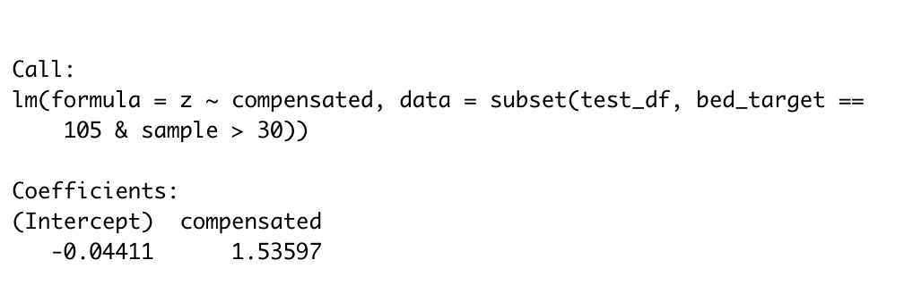

### Bed mesh changes as predicted with frame temperature

To confirm, I decided to go ahead an loosen *all* the rails on both X and Y, heat soak the machine for a couple hours, and then tighten them down; this should ensure that the gantry is as flat as possible when at temperature, but will bow downwards when it is cold as the aluminum contracts more than the steel rail beneath.

And that's indeed what I saw. After hot-tightening the rails, I took a bed mesh while everything was still hot. I then allowed the printer to cool for a couple hours, reheated the bed, and took another mesh while the bed was hot but the frame was still cold.

What I saw was just what we'd predict, with the "hot frame" measurement (left) being quite flat, but the "cold frame" measurement appearing as if the center of the bed were closer to the probe:

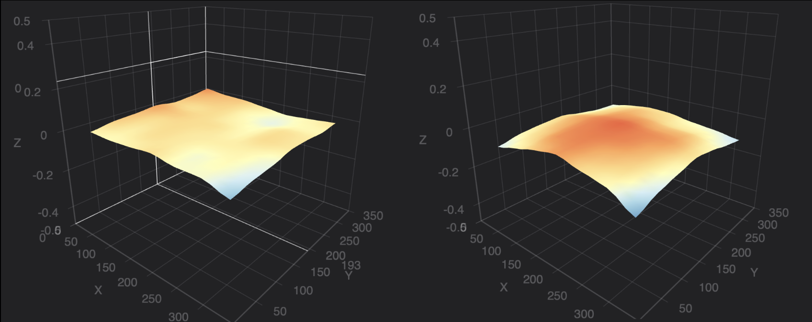

### Shitty modeling is consistent with observation

Finally, I put together a *very simplistic* FEA model in Fusion360. It did the thing with the bendy bendy:

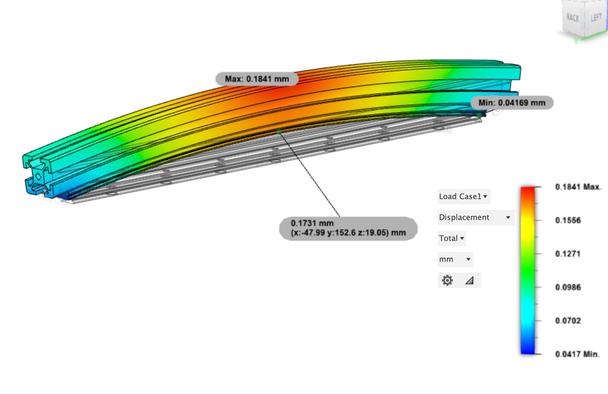

 ***Caveat: I am a biologist, not an engineer!*** I only barely know what I'm doing with this shit. But with the rail material set to 440C stainless and the extrusion to 6061 aluminum, with them bonded at the interface, a temperature delta of 40° C led to this 250mm-sized X gantry member deflecting 0.17 mm upwards in the center! That's definitely not trivial, and it's certainly consistent with our empirical observations.
 
## The (a) solution (maybe??)
 
Why have *bi*metal when you can have *tri*metal?!

At one extreme, bolting another MGN9 rail on top of the extrusion seems certain to cancel out the bending moment imparted by the one on the bottom. 

As a cheaper alternative, I've designed some laser-cut steel extrusion backing plates that weigh less and are lower-profile than rails, but which should at least do a reasonable job at counteracting the thermal defection.

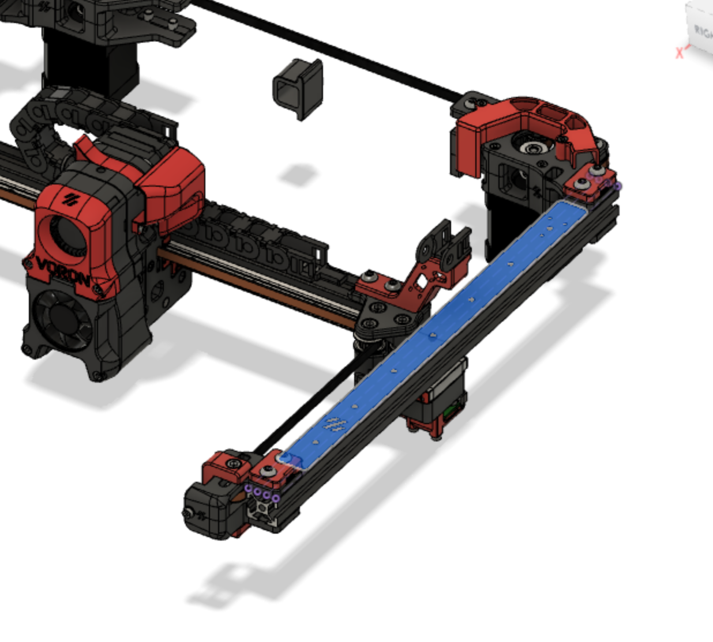

These are sized to fit along the top of the Y extrusion and on the top or back of the X extrusion, with a few mm of clearance to printed endpieces:

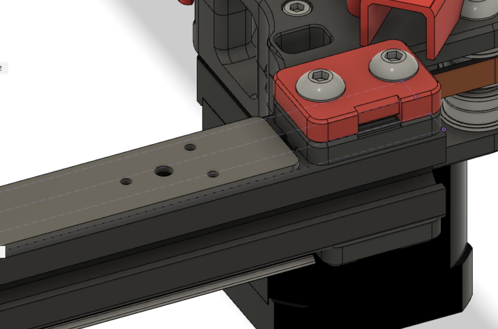

They also have pilot holes for the cable chain end link to attach. They are sized to be drilled out with a 2.5 mm bit and then M3 tapped. (Laser cutting hardens the steel at the cut, so the cut holes are undersized for drilling out to be a bit gentler on your taps.)

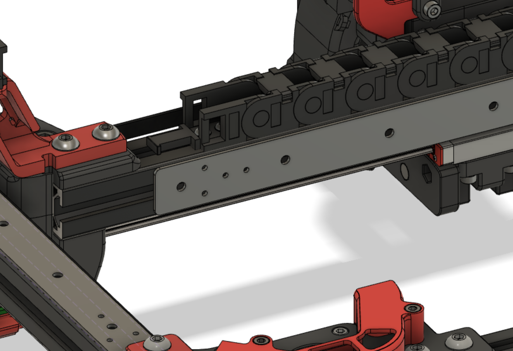

To attach them most optimally, you'll also need to countersink the holes so they can be installed with 6mm flat head M3 screws.

### Simulation results

Plugging these into the FEA model shows some serious improvements with a 1.9 mm steel backer:

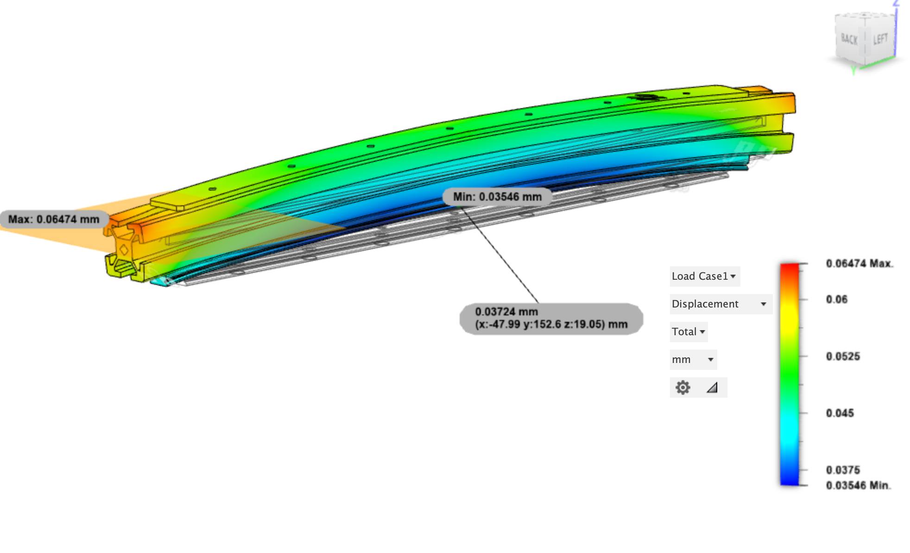

A 1.5 mm titanium backer does even better:

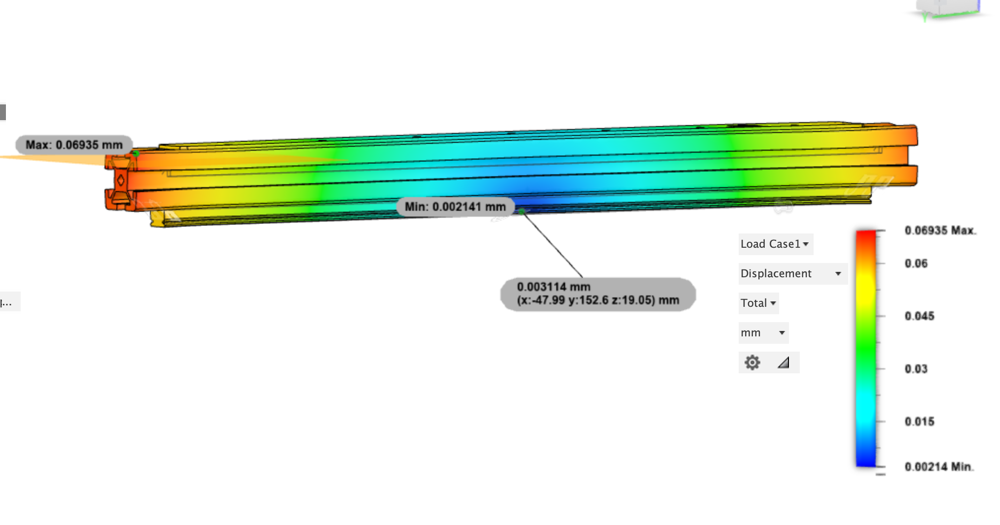

### Sourcing

A set of 3 backers in 1.9 mm steel can be bought at [SendCutSend](https://www.sendcutsend.com) for somewhere in the neighborhood of $10 (presuming you've met their minimum order of $29). 

If you're feeling spendy, even the Ti backers still cost about the same as cheapo linear rails, with a set of three costing around $60.

## The results

I put in an order for 8 sets of backers in various sizes, all of which have been sent out to people on the Voron Discord for testing. Most of these were in mild steel, but there are also a few pieces in titanium.

Results from testing are below.

### Case study 1: whoppingpochard, steel backers X and Y

After countersinking and tapping my mild steel backers, I tried hastily cold-bluing them with some gun blue. The results were decidedly mixed, and I *also* very conveniently misplaced my 3-in-1, so sadly they were a little splotchy the next morning. They installed perfectly on the machine, though, with apparently just enough clearance without modifying cable chains: 

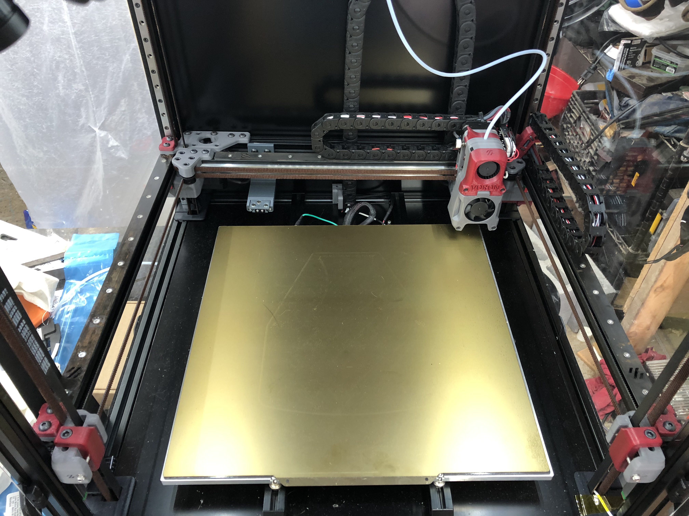

To test, I performed the following operation:
1. preheated the bed
2. took a bed mesh while bed was still hot
3. took a bed mesh after 2 hour heat soak (frame at ~35° C)
4. installed backers on each axis
5. repeated steps 1-3

This is the result:

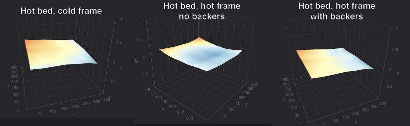

(Please ignore the odd tilt of the bed, as I think I did QGL at a non-equilibrium point.)

The hot bed appears pretty planar from the perspective of the toolhead while the frame is still cold. *Without* backers, after the frame has heatsoaked, the bed appears cupped -- presumably due to the extrusion bending upward towards the center. 

But *with* backers installed, the bed still appears planar after the heatsoak. This appears to indicate the backers are actually working!

I also developed a script to test gantry bowing in a more controlled fashion. Essentially, the script does a bed mesh while the frame is cold and then another once the frame heats up, and compares the two. As long as the bed is the same temperature for each mesh, we assume that any non-linear deviation measured is a result of flexing frame members.

Here are the results from my printer, with and without backers installed (I ran this test after swapping out the steel X backer for a titanium one):

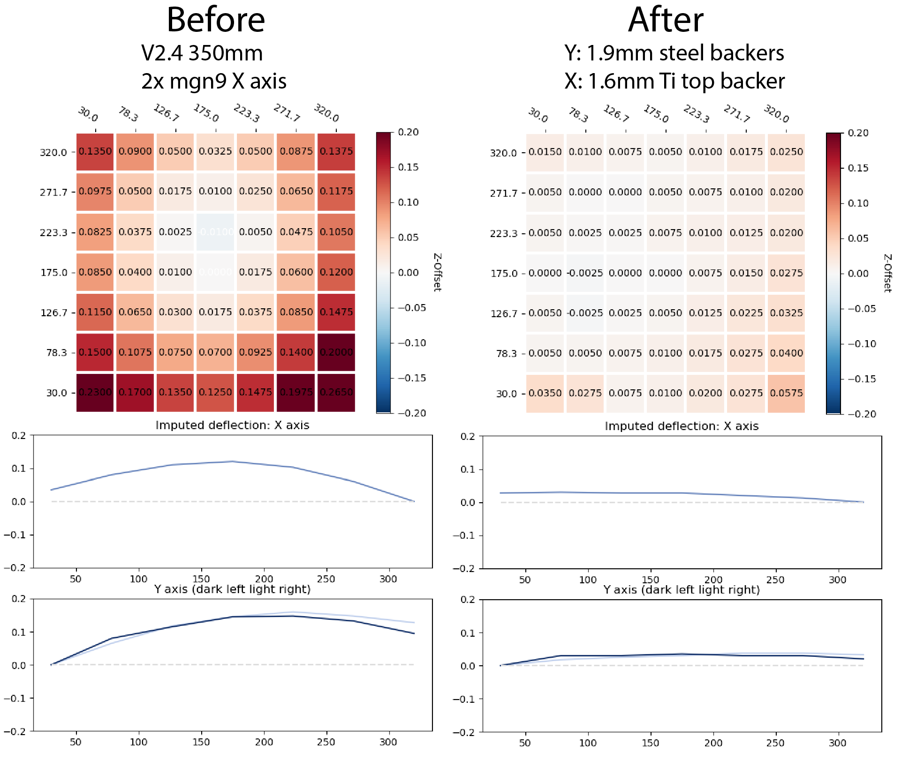

The mesh heatmap is not a measure of the bed surface itself, but rather the *difference* between the hot-frame mesh and the cold-frame mesh. It shows that, on my printer, I get more than 0.25 mm of cumulative change over the span of my bed -- more than a whole first layer thickness!

The line plot is a rough approximation of how we are inferring the gantry frame members are flexing, based on the pre- and post-heat measurements. Although not perfect, it gives us an intuitive illustration of the effect.

On the right side, you can see that installing the backers improved my measurements substantially! The titanium backer on X may indeed be doing better than the *thicker* steel backers on Y.

### Case study 2: garretwp, V2.4 300 mm

In principle, the MGN12 X-axis mod should help ameliorate the bowing problem in X as the single rail is on the front of the X extrusion, thus should not induce any bowing in that extrusion along Z.

That is what garretwp finds with his V2.4 300mm, which is running MGN12 on X. 

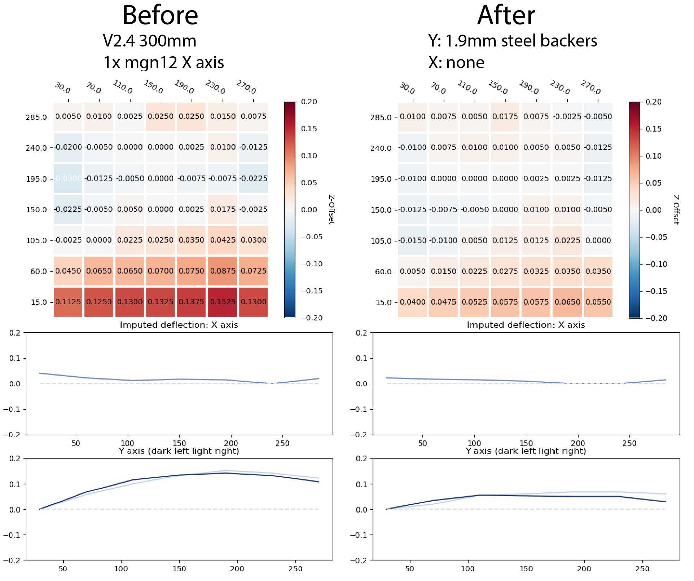

Before installing backers, he measures substantial deflection along Y, but little if any on X. After installing Y backers, the Y deflection is substantially reduced and X is unchanged.

### Case study 3: mgn9 rail as extrusion backer

bythorsthunder and BnE both are running V2.4 350mm machines with the MGN12 X-axis mod. 

bythorsthunder had his original mgn9 X-axis rails laying around, and installed them on top of the Y axis extrusions to offset bowing induced by the bottom rails.

BnE installed steel backers on Y.

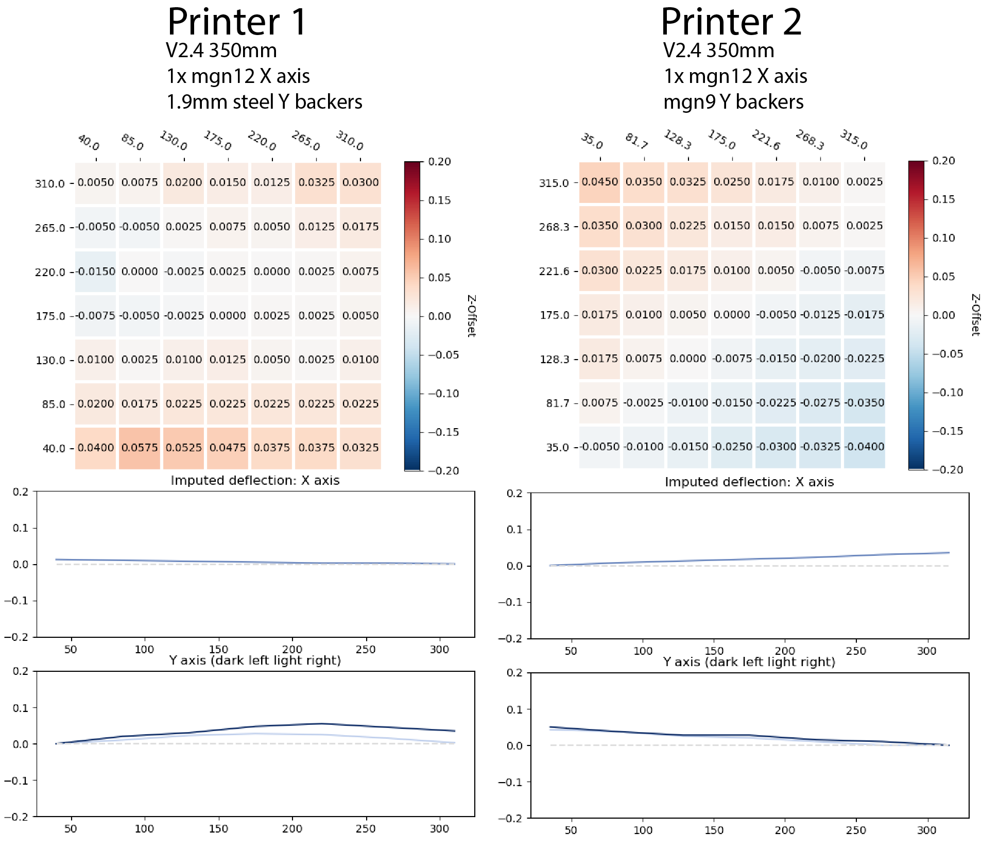

In both cases, we see very straight X axes and little deflection along Y. Although there's some as-yet unexplained overall tilt apparent in bythorsthunder's run, there is absolutely no apparent curve along Y -- indicating that the mgn9s on top of the extrusion *perfectly* offset the rails on the bottom. Although using rails as extrusion backers requires a bit of reconfiguring (especially if running cable chains), they look like a mechanically perfect solution, especially for Y where the added mass is less of a concern.

### Case study 4: V1.8s

The rail arrangement on V1s differs from on V2s, as the Y rails are on top rather than bottom of the extrusion.

In cassiespook's v1.8 (left), we can see the resulting deflection results in a sort of saddle shape, with X bowing upwards and Y downwards. 

Yeri is running a single MGN12 on X, and although there is also some unexplained overall tilt apparent in the delta cold/hot mesh, we do see that X seems to be unbowed in Z, as we saw with the MGN12 V2s.

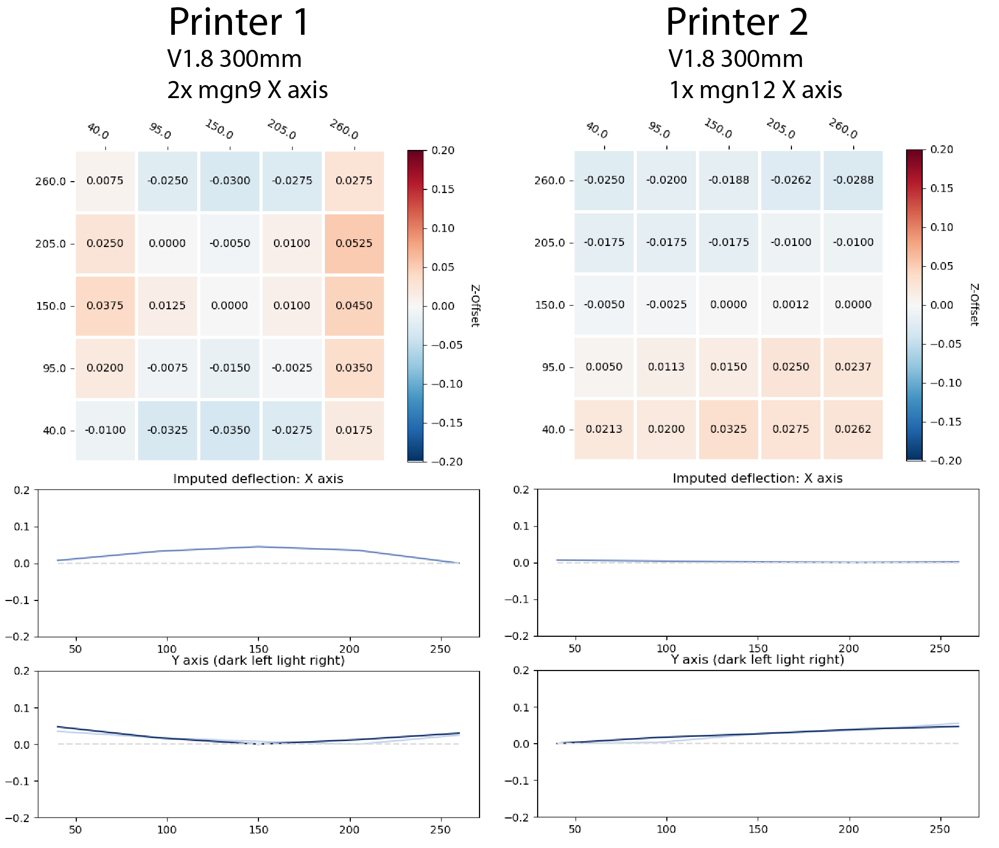
