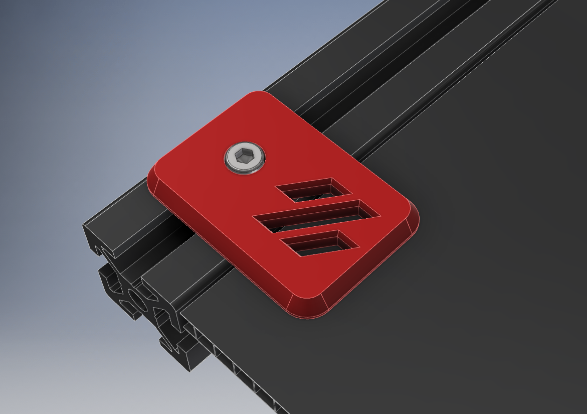
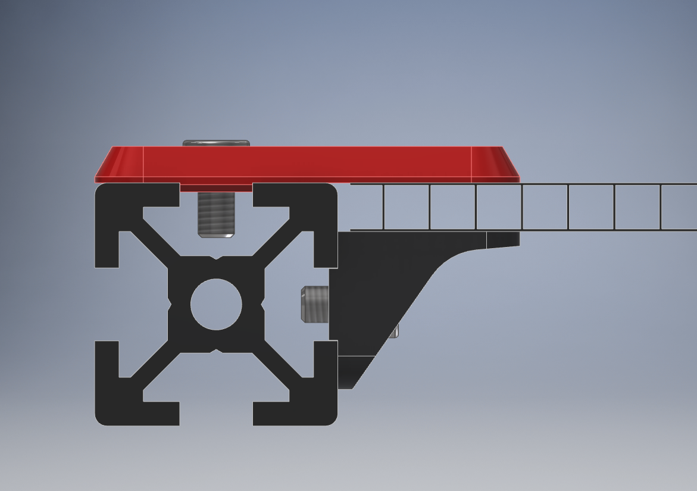
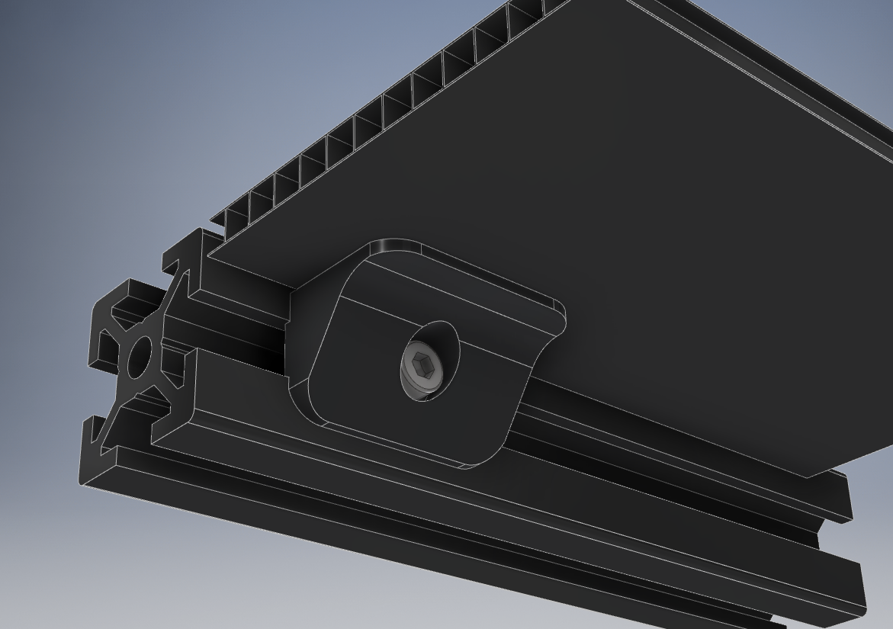
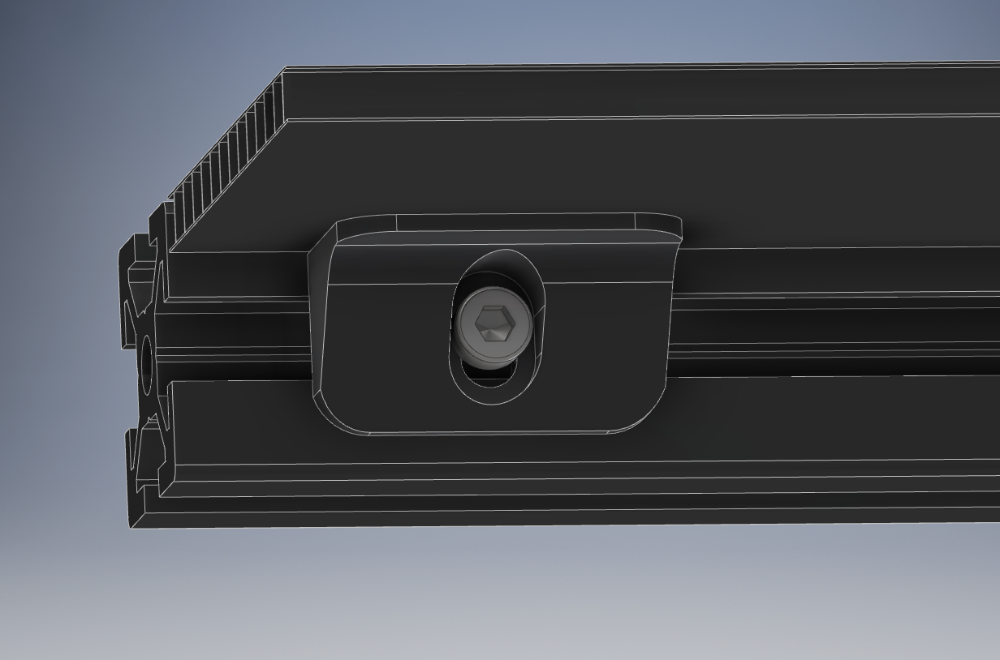

### Deck Panel Support Clips

These are simple panel support clips to help better support the lower deck panels of a V2.4 and other similar models.  They sandwich the deck sheet between an upper and lower support and are held in with M3 SHCS or M3 BHCS.

And the optional slotted lower mount to accommodate panels between 2mm and 6mm.

