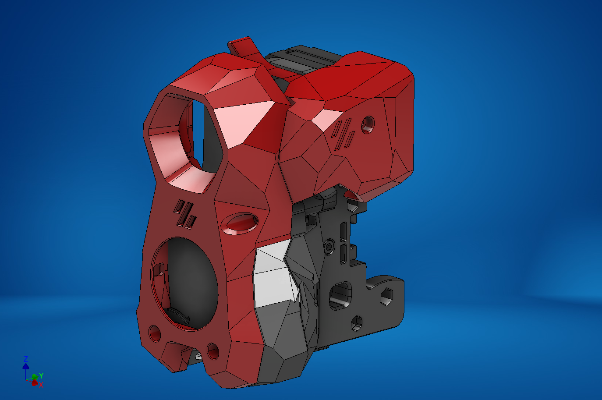
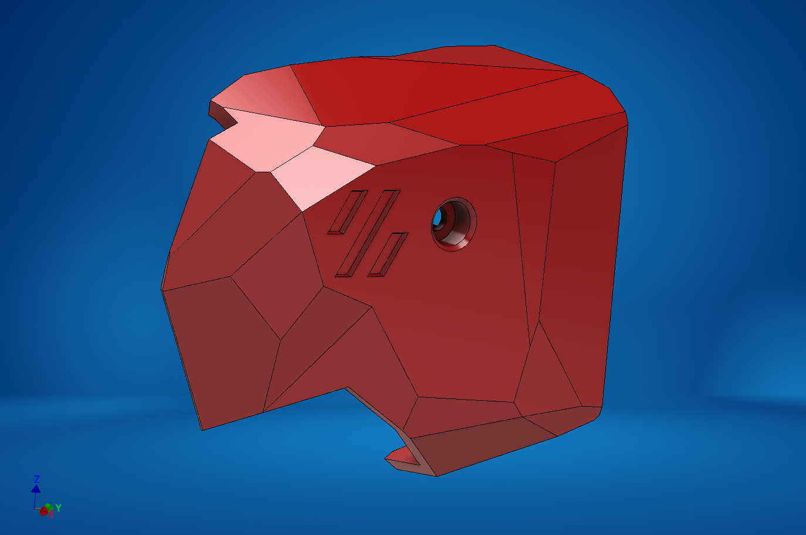
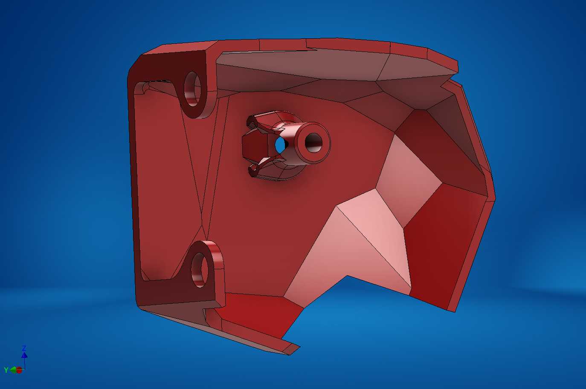

### Stealthburner + Clockwork1 + PCB Cover

I designed a cover for users who are still rocking the CW1 with Stealthburner, with the same low-poly esthetic of stealthburner.  This cover is a snug fit, so please make sure your wiring is all nice and tidy or you could have some issues.

