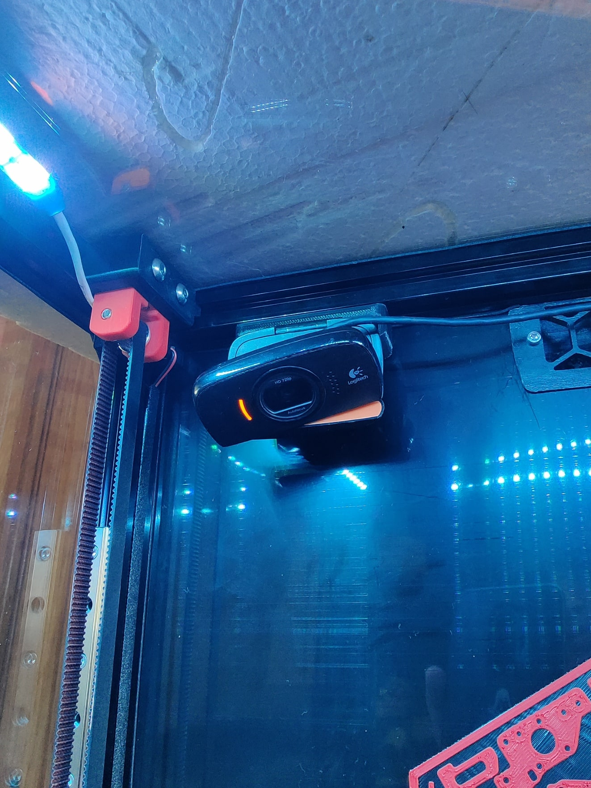

# C525 webcam holder - Voron 2.4

This is a webcam holder to attach the [Logitech C525](https://www.amazon.com/Logitech-Webcam-Portable-Calling-Autofocus/dp/B004WO8HQ4/ref=sr_1_3?crid=343YW4HG90NPC&keywords=c525&qid=1644847788&sprefix=c525%2Caps%2C288&sr=8-3) 
 to any 2020 aluminum extrusions

## Files

- [STL](./STL/camera_holder.stl)
- [Autodesk Inventor](./CAD/camera_holder.ipt)

## BOM
- 1x M3x8
- 1x M3 T-Nut

## Pïctures

