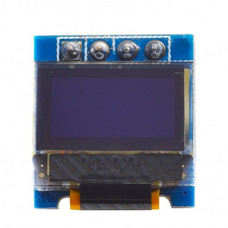
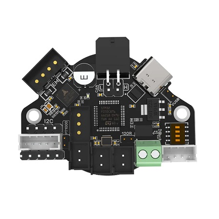
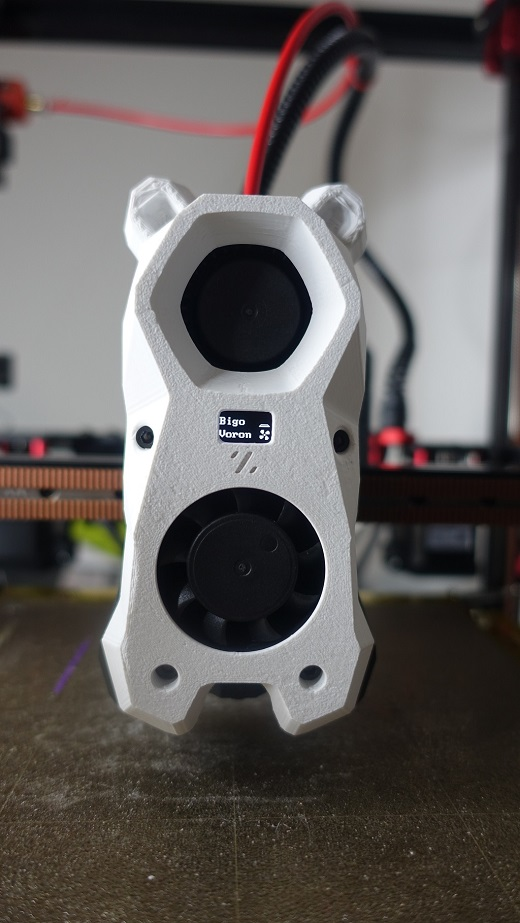
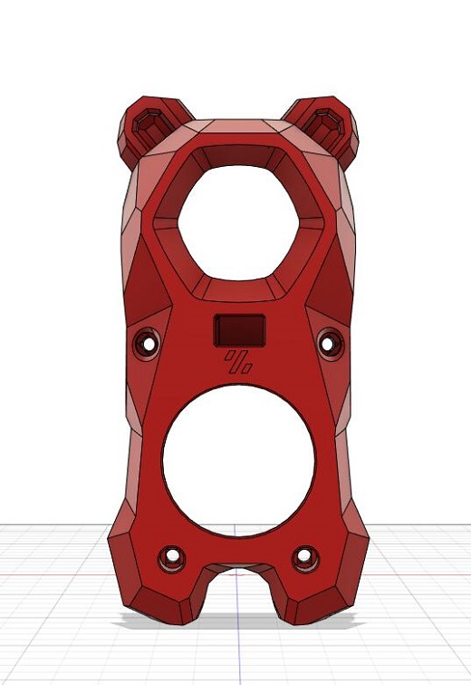

Stealthburner OLED
============

Hardware
------
- OLED Display

```
Display Size: 0.49 inch
Dimension: 15x16 mm
Display area: 11.2x5.6mm
Display Driver IC: SSD1306
Resolution： 64x32
Port: IIC
Operating Voltage: 3.3-5V
Display color: Blue or White (Optional)
```


- BIQU EBB36



Klipper Config
------

```
[display]
lcd_type: ssd1306
i2c_mcu: EBBCan
i2c_bus: i2c3_PB3_PB4
display_group: sb_oled

[display_data sb_oled x]
position: 2, 4
text: { render("_x") }

[display_data sb_oled y]
position: 3, 4
text:  { render("_y") }

[display_data sb_oled bed]
position: 2,10
text:  { render("_bed") }

[display_data sb_oled fan]
position: 3, 10
text:  { render("_fan")}


[display_template _x]
text:
  
    { printer.display_status.message }
  
    
    { "X%-4.0f" % (pos.x) }
  
    Bigo
  

[display_template _y]
text:
  
    
    { "Y%-4.0f" % (pos.y) }
  
    Voron
  

[display_template _bed]
text:
  
      
        {% set frame = (printer.toolhead.estimated_print_time|int % 2) + 1 %}
        ~bed_heat{frame}~
      
        ~bed~
      

[display_template _fan]
text:
  
    
    
      {% set frame = (printer.toolhead.estimated_print_time|int % 2) + 1 %}
      ~fan{frame}~
    
      ~fan1~
    
    { "{:>4.0%}".format(speed) }
  
```

Images
------




