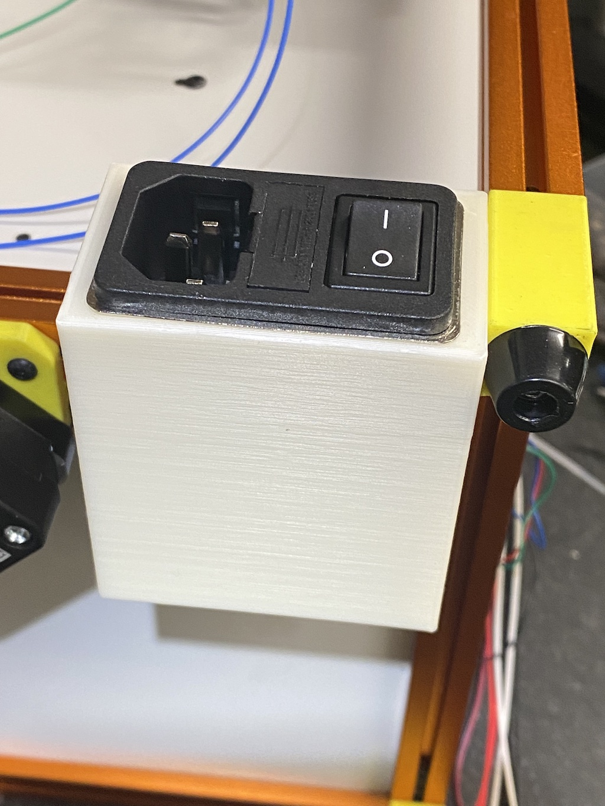
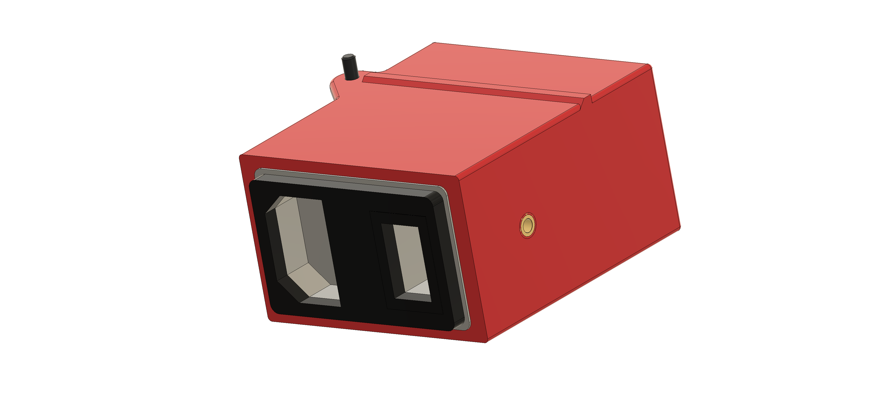
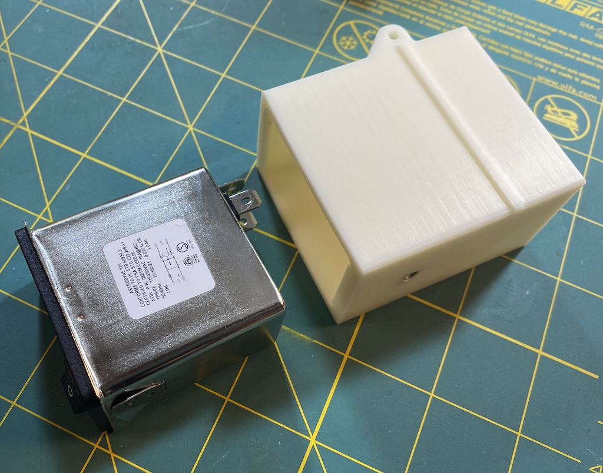
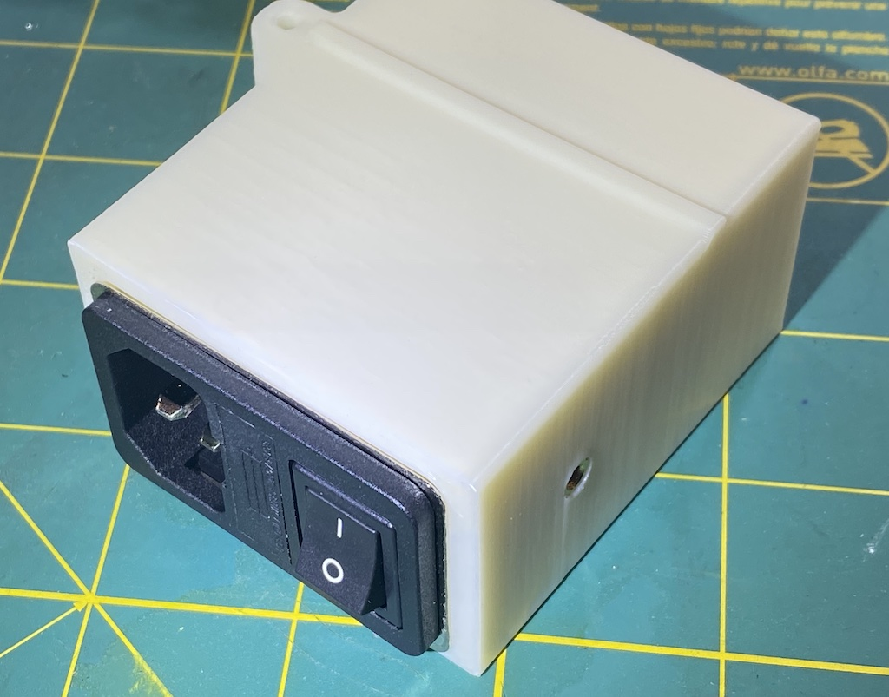
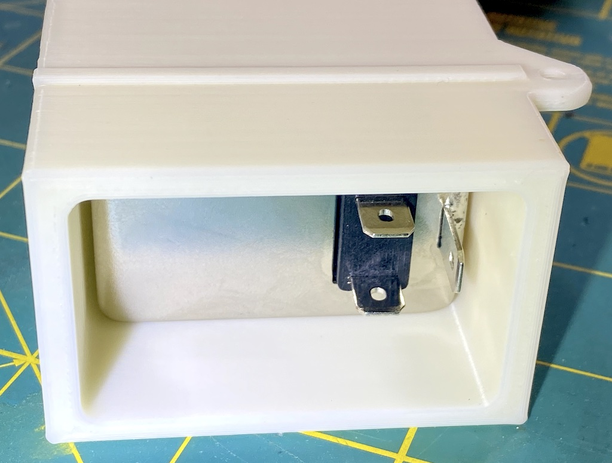
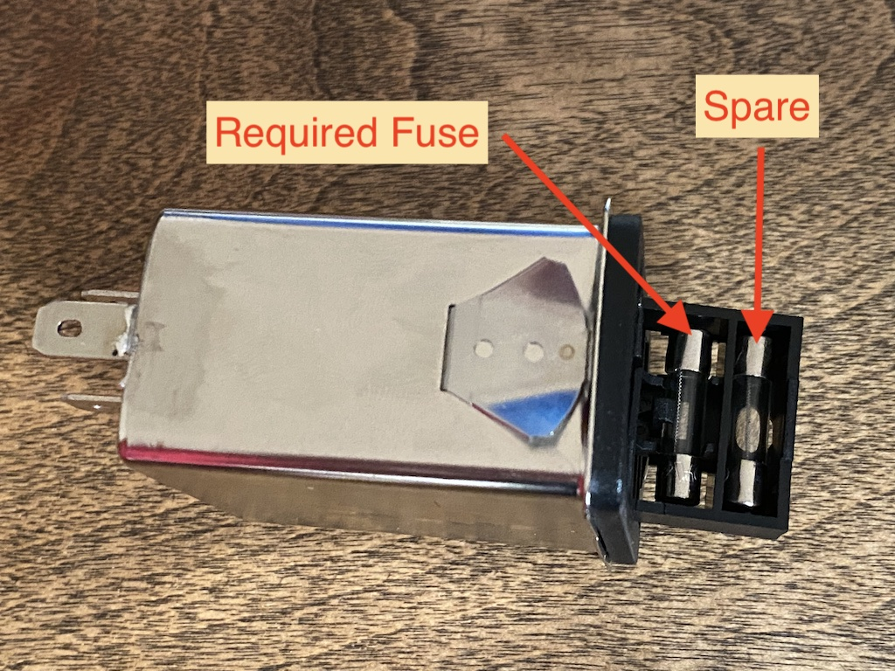
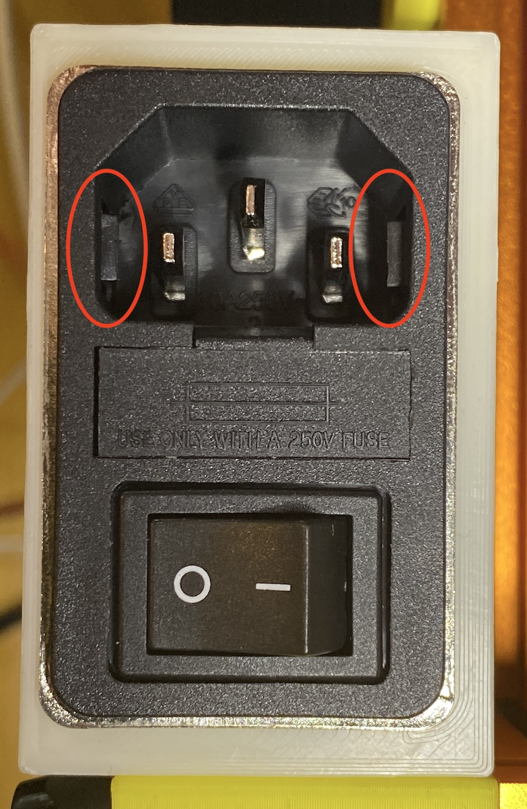

# Astrodyne IEC 320 C14 Power Inlet Housing for V0.1

This mod is a replacement housing for the stock v0.1 power inlet, replacing the
[Adam Tech
IEC-GS-1-100](https://www.digikey.com/en/products/detail/adam-tech/IEC-GS-1-100/9831135) 
(which has been on back-order at Digikey for quite a while at the time of this
writing) with an [Astrodyne/TDI
082S/082SM](https://www.mouser.com/ProductDetail/Astrodyne-TDI/082S0150000?qs=eP2BKZSCXI7jG836kH3rhw%3D%3D).

In addition to the power inlet you will also need to acquire some inexpensive 5
mm diameter X 20 mm long 250V fast-acting fuses (see the v0 sourcing guide for details).

## Files

- [STL](./STLs/astrodyne-inlet.stl)
- [STEP file](./CAD/power-inlet-astrodyne.step)
- [Fusion 360 design](./CAD/power-inlet-astrodyne.f3d)

## Assembled view

## Printed part render

## Unassembled view

## Front view

## Rear view

## Fuses

## Printing notes

Slice and print with standard Voron settings (ABS, 40% infill, 0.4mm line width,
0.2mm layer height, 5 top/bottom layers, 4 walls) but there isn't a lot of
surface area in contact with the bed, so you may struggle with warping unless
your first layer is dialed in perfectly (perhaps with a little extra squish).
There is no shame in printing this part with a brim (I've not added any fillets
to the front edge for precisely this reason).

The [STL](./STLs/astrodyne-inlet.stl) should import into your slicer with the
correct orientation. If not, ensure that the front (where the inlet is inserted)
is face down on the bed.

## Design and assembly notes

This design should be a simple drop-in replacement of the stock parts, but it's
secured at just two points: the heat-set insert in the side and the screw
through the ear on the top. 

I've used one fewer screw than the original part, but two screws on
orthogonal faces are more than rigid enough in practice.

If you've already inserted both M3 nuts, I'd recommend simply sliding one as far
to the left as possible (as you face the back of the printer) and securing it
with an M3 x 6mm screw. There will still be room for the other nut, and it beats
having to disassemble the frame (or leaving an extra nut rattling around).

The printed housing has a slightly larger panel cutout than called for in the
[Astrodyne 082S/082SM
datasheet](https://www.mouser.com/ProductDetail/astrodyne-tdi/082sm0150000/?qs=eP2BKZSCXI4KQZVxn1eqpw%3D%3D).
I just guesstimated the amount of offsets to account for part shrinkage and
printing tolerances, but my first print of the part worked perfectly: the
power-inlet snapped into place with a quite satisfying click, and felt quite
secure.

**WARNING**: Both the 082S (general purpose) and the 082SM ("M" for "medical")
models have small tabs on each side of
the inlet (**not** shown in the data-sheet). Apparently, these tabs are intended
to bend slightly when a C13 power cord is inserted
into the receptacle, taking up any side-to-side play. The tabs are
free to move on three edges and only attached at the rear-most edge. The tabs move
**very** stiffly, however, especially for the first several insertions. I found it
necessary to insert a tool (e.g. a letter opener or screwdriver) and gently bend
the tabs a bit before I could insert a cord the first time.

## View of the side tabs

## Disassembly

No.

[Just kidding. It _might_ be possible to remove the inlet from the printed
housing if you sneak a couple of butter knives or narrow putty knives down the
sides to release the clips, but I ended up just sawing off the test print I used
to check the fit.]
