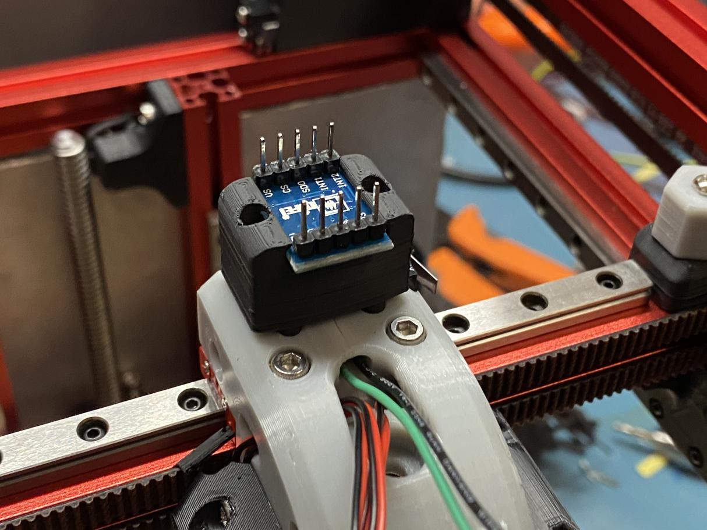

This works for this type of ADXL345 modules: https://s.click.aliexpress.com/e/_dUndeBj

Fits snugly into the 3 M2 screw holes for the X carriage. Module just slides in from the side. Attach the 2 pieces with M2 self tappers.
