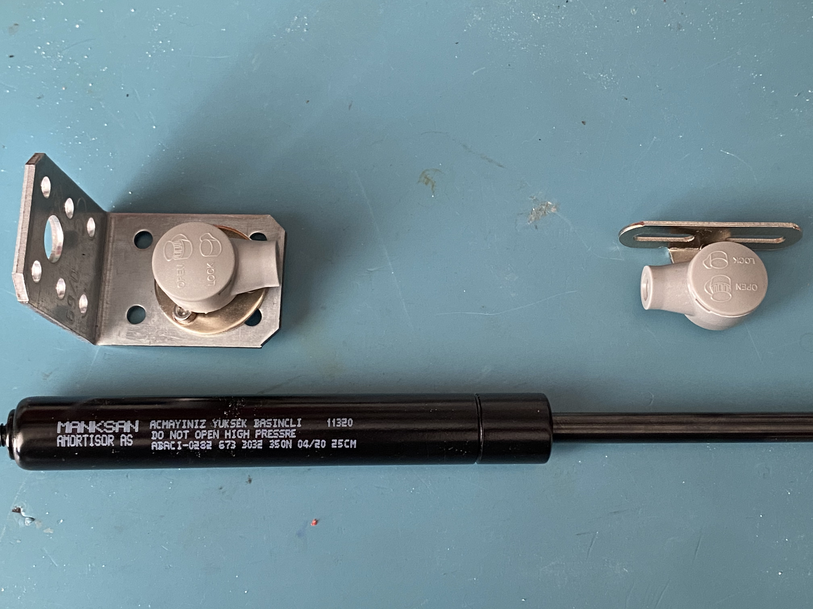

# Car Hood Style Heatbed Hinge System

## Expected schedule (no promises)
- 28 May - Written Assembly Guide
- 29 May - Assembly Guide Video
- 30 May - Pull Request Creation to Voronusers Github

## BOM & Sourcing
https://docs.google.com/spreadsheets/d/17iGjLaINq1emLhjoon75Gi_NTW4J83VRybP41qbxQuU/edit?usp=sharing

## Printed Parts
 - 6x DIN Rail Mount
 - 4x Deck Panel Holder
 - Extrusion Spacer
 - Front A
 - Front B
 
 ## Choosing The Right Gas Spring

You will need 2 80N gas springs. I couldn't get away with 1, and a strong (350N) one caused too many problems, because it was too strong (enough to bend the aluminium extrusions), and it was not balanced on 2 sides.

Please know that most gas struts aren't rated above 50C, however I don't expect any issues as chambet temps are usually much lower than bed temps, and there will be airflow near the struts as they are in the electronics chamber. However, if you are concerned, high temp ones available online, for a significant premium. I linked some in the BOM.

You will also need 2 metal corner brackets, some screws, nuts and tnuts to attach. If you don't have any buy a few different styles, they are cheap, and are useful for many applications. In the picture above you can see how I attached a corner bracket to be able to mount the gas spring.

## Instructions
Please read [MANUAL.md](./MANUAL.md) for more details.

## Youtube
Please consider subscribing to my YouTube channel for more projects like this:
[https://www.youtube.com/channel/UClAWYmCkHjsbaX9Wz1df2mg](https://www.youtube.com/channel/UClAWYmCkHjsbaX9Wz1df2mg)
