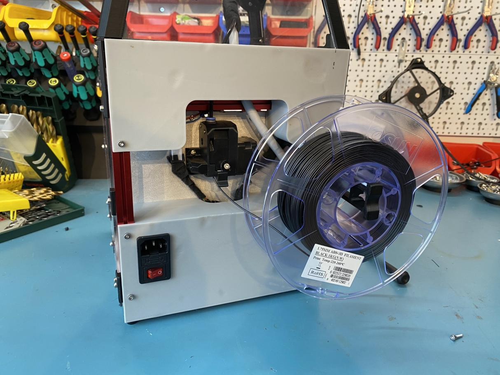

The point of these panels is to cover the mess in the rear chamber like the normal panel, but leave the extruder exposed for easy filament loading/unloading.
The design includes cutouts for the bowden tube and an umbilical cord. 
Bottom panel attaches with 4x M3*8 to the rear extrusions.
Top panel attaches with 2x M3*8 to the rear extrusions & 2x M3*any to top of bed extrusions.
