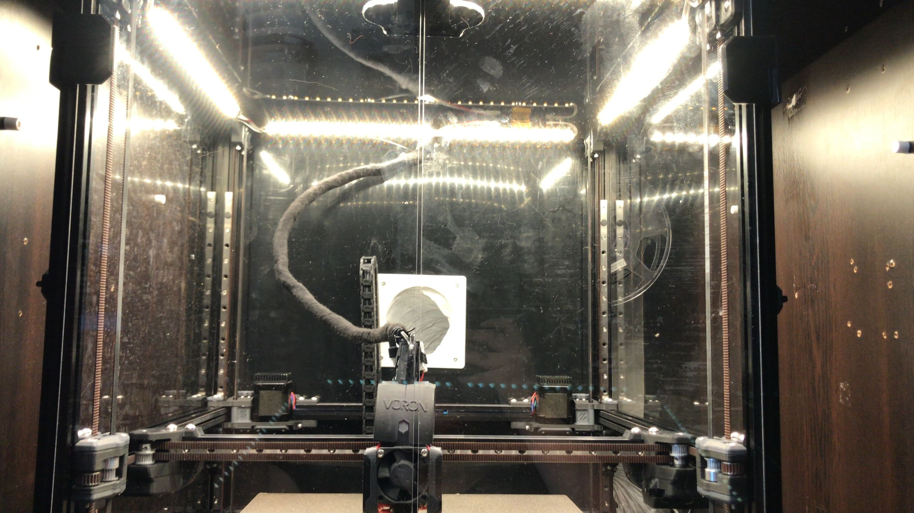

This mount is for some 50 cm PCB LEDs I found online. I have no idea if this is a common form factor or not but it is available on at least 3 stores here so I think it is.

I am using this 24V Samsung module for this purpose. [Link (in Turkish, but you can use for comparing): https://www.iled.com/urun/3000k-2835-smd-samsung-led-bar-ic-mekan-35-led-24v-50cm ]

You can cut these every 10cm, so the .stl is for just for that size. Just use multiple mounts for longer than 10cm. 

Print these in ABS, PLA warps with heat of the chamber.

On a 350 voron 2.2 on the top extrusions you can mount 14 modules at once. Reduce as you go smaller.

You will need 1 m3 screw and 1 m3 nut, along with 2 m5 screws and tnuts per module (use both holes, otherwise it may warp).
